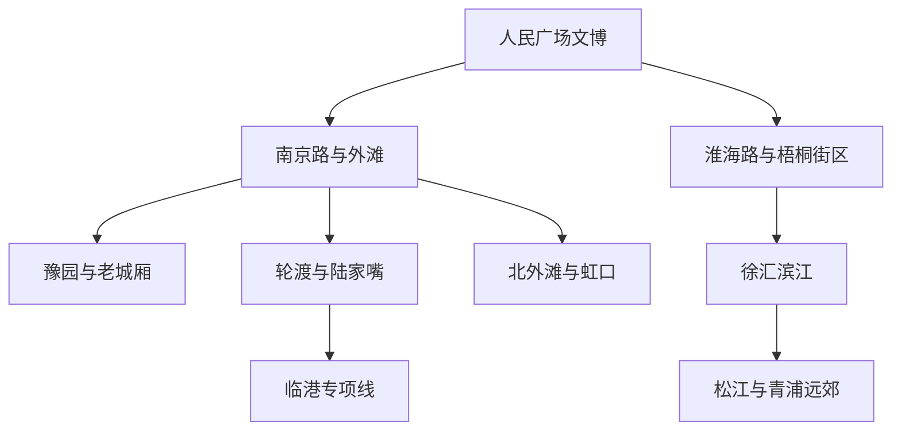
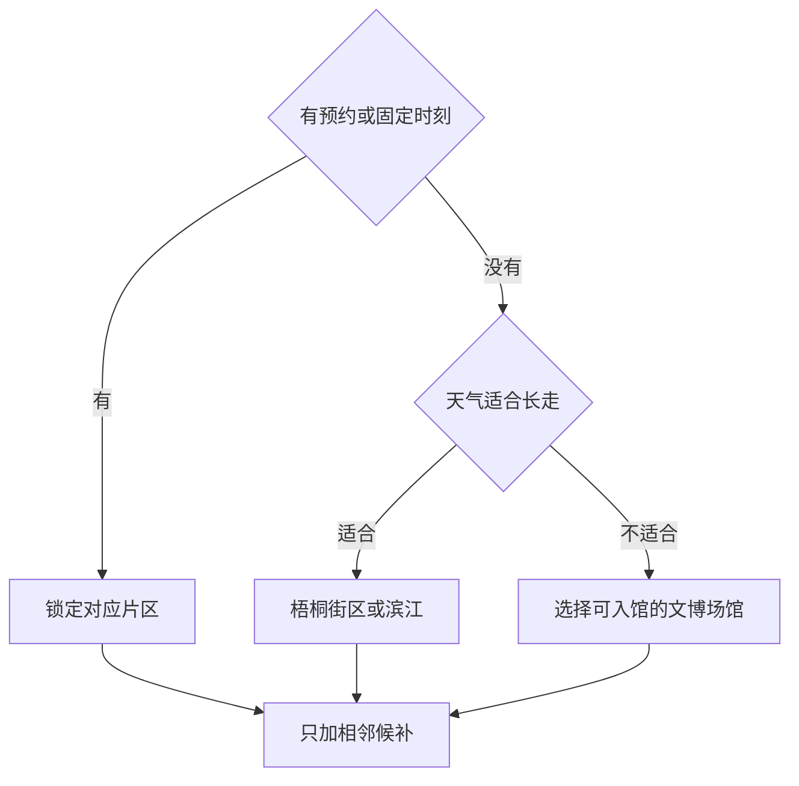

# 上海市

> 一句话定位：上海最值得体验的不是一条南京路，而是黄浦江两岸的城市天际线、老城厢与近代街区、密集文博和仍在生长的国际化日常。  
> 建议停留：外地首访 3–4 天；把街区、博物馆和一处远郊展开需 5–7 天。若以上海为生活基地，更适合按周末片区逐块清图。  
> 对用户的主要匹配：国际化与轻社交、建筑和街拍、水岸长走、博物馆、丰富一人食、路线内咖啡休息，匹配度高。  
> 本页用途：离线完成方向判断、片区选择和路线拼装；开放、预约、票务、展览、轮渡与临时管制仍在出发前复核。

## 先判断上海适不适合这次旅行

上海适合把“看景点”与“看城市怎样生活”放在一起。外滩和陆家嘴给出最直观的城市对照，原法租界及其周边适合连续步行和街头摄影，人民广场与浦东文博片区能承接雨天，老城厢则补上江南城市与上海开埠前后的历史层次。用户已经确认喜欢上海的审美、人群多样性、口语和轻社交机会，因此重游不必重复游客清单，可以用街区、展览和季节公园持续刷新。

主要摩擦也很明确：城市跨度大，跨片区“看起来只隔几站”仍会吞掉体力；节假日的外滩、豫园、热门展馆和日落观景点拥挤；梅雨、台风、高温会让纯户外长走失去舒适度。迪士尼、临港天文馆、朱家角和崇明都值得单独安排，但不应被塞进普通市中心首访。

## 城市由哪些游览片区组成

先看主干关系：黄浦江西岸的老城、外滩和梧桐街区可以串联；陆家嘴隔江相望但要通过地铁或轮渡切换；西岸、北外滩和远郊最好各自成章。

最适合连续步行的是“人民广场—南京东路—外滩”“武康路—复兴路—思南路”和各段滨江；外滩到陆家嘴应把过江本身作为体验，轮渡运行不合适时直接换地铁。梧桐街区到徐汇滨江、外滩到北外滩都能继续走，但不必为地图上的连续性硬凑全程。临港、朱家角、佘山和崇明与市中心不是同一游览片区。

## 主要景点

| 景点 | 片区 | 类型 | 为什么去 | 典型用时 | 室内外 | 预约/排队风险 | 清图层级 |
|---|---|---|---|---:|---|---|---|
| 外滩建筑群与滨江步道 | 外滩 | 建筑、水岸 | 近代建筑立面与浦东天际线同框，城市第一印象最完整 | 1.5–3 小时 | 户外 | 高：节假日、日落和活动管制 | A |
| 豫园 | 老城厢 | 江南园林 | 在高密度市中心看传统园林空间与老城文脉 | 1.5–2.5 小时 | 混合 | 高：实名购票与旺季人流需复核 | A |
| 老城厢步行片区 | 老城厢 | 历史街区 | 从城隍庙商业面继续看到街巷、城墙遗存和旧城尺度 | 1.5–3 小时 | 户外 | 中：部分街区持续更新 | A |
| 上海博物馆人民广场馆 | 人民广场 | 艺术博物馆 | 中国古代艺术体系入口，适合以常设展建立框架 | 2–4 小时 | 室内 | 高：预约、馆舍分工和特展需复核 | A |
| 上海博物馆东馆 | 浦东花木 | 艺术博物馆 | 展陈规模大，可作为完整半日文博锚点 | 3–5 小时 | 室内 | 高：预约和特展客流 | A，可与人民广场馆二选一 |
| 武康路—复兴西路—衡复风貌区 | 徐汇、长宁 | 建筑街区 | 花园住宅、街树、人群审美与咖啡休息组成高质量街拍走廊 | 3–5 小时 | 户外为主 | 高：周末热门节点拥挤 | A |
| 黄浦江轮渡与陆家嘴滨江 | 两岸 | 水上交通、城市景观 | 用低门槛过江体验完成新旧天际线切换 | 1.5–3 小时 | 户外 | 中高：天气、班次与码头调整 | A |
| 上海自然博物馆 | 静安 | 自然博物馆 | 内容密度高，雨天或高温日也能独立撑起半天 | 3–5 小时 | 室内 | 高：周末、寒暑假和实名购票 | B |
| 上海市历史博物馆 | 人民广场 | 城市史博物馆 | 补足上海城市形成、开埠与社会生活脉络 | 2–3 小时 | 室内 | 中：展览和开放安排需复核 | B |
| 中共一大纪念馆与新天地周边 | 黄浦 | 纪念馆、街区 | 近现代政治史与石库门城市更新并置 | 2–3 小时 | 混合 | 高：纪念馆预约和团队客流 | B |
| 北外滩—提篮桥—虹口历史片区 | 虹口 | 水岸、历史街区 | 视角不同的天际线、航运历史和城市记忆 | 3–5 小时 | 混合 | 中：场馆预约，沿线施工变化 | B |
| 上海犹太难民纪念馆 | 虹口 | 专题纪念馆 | 理解二战时期上海接纳犹太难民的具体城市空间 | 1.5–2.5 小时 | 室内为主 | 中高：实名购票与团队客流 | B |
| 徐汇滨江 | 徐汇 | 艺术、水岸 | 工业遗存、公共艺术与长距离步行结合，适合蓝调摄影 | 2–4 小时 | 混合 | 中：展馆各自开放 | B |
| 西岸美术馆或龙美术馆西岸馆 | 徐汇滨江 | 当代艺术 | 用一个馆给滨江长走设置室内锚点 | 2–3 小时 | 室内 | 中高：展览、票务与临时闭馆 | B |
| M50 创意园与苏州河 | 普陀、静安 | 艺术园区、水岸 | 工业建筑、画廊与苏州河散步可组合 | 2–4 小时 | 混合 | 中：画廊开放差异大 | B |
| 朱家角古镇 | 青浦 | 江南水乡 | 不出上海完成水乡古镇样本，适合与市中心形成反差 | 半天–1 天 | 户外为主 | 高：周末人流与水上项目 | C |
| 佘山与辰山植物园 | 松江 | 山地、植物园 | 城市远郊自然恢复，季节花木和温室可拍摄 | 半天–1 天 | 混合 | 中：季节、天气和园区票务 | C |
| 上海迪士尼度假区 | 浦东川沙 | 主题乐园 | 完整娱乐型目的地，不代表上海城市核心但可单独成行 | 1 天 | 混合 | 很高：日期票、项目排队与运营调整 | C |
| 上海天文馆与滴水湖 | 临港 | 科普、水岸新城 | 高质量科普场馆加新城滨水，适合专项日 | 1 天 | 混合 | 很高：天文馆名额与临港交通 | C |

父子计数规则：外滩中的单栋建筑、梧桐街区中的网红路口、老城厢中的普通街巷，不重复计为完整景点；进入一座独立收费或预约场馆才单独记一项。上海博物馆两馆是两个实际参观项目，但首访 A 级只要求任选一馆，不为清图率强迫同日连刷。

## 代表性美食与适合落脚的片区

| 食物或体验 | 为什么有代表性 | 适合片区 | 独食友好 | 常见风险与替代逻辑 |
|---|---|---|---:|---|
| 生煎馒头 | 上海高频日常点心，底脆、肉馅带汤 | 黄浦、静安、虹口居民区 | 高 | 热门店长队时换同片区老店，不为榜单排一小时 |
| 小笼馒头 | 江南面点在上海的重要分支，南翔小笼辨识度高 | 老城厢、嘉定南翔或连锁门店 | 高 | 豫园核心区可能拥挤溢价；市区分店可替代 |
| 葱油拌面与浇头面 | 低决策成本的一人食，能吃到本地酱香与浇头 | 原法租界周边、老城厢、社区街巷 | 很高 | 小店营业窗口不稳定，准备附近第二家 |
| 排骨年糕 | 年糕与炸排骨组合，适合作为小吃而非大餐 | 云南南路周边、黄浦老字号 | 高 | 网红店排队时换普通本帮面馆的年糕类 |
| 本帮菜 | 红烧、煨与咸中带甜构成本地传统味型 | 黄浦、静安、虹口、徐汇 | 中 | 许多菜份量偏合餐；独行选面、饭或半份小菜 |
| 大饼、油条、粢饭、豆浆 | “四大金刚”代表传统早餐结构 | 居民区早餐铺 | 很高 | 供应偏早；慢启动可不设为硬目标 |
| 蟹壳黄、条头糕等糕点 | 海派点心适合沿途少量补能 | 老城厢、南京西路老字号 | 很高 | 甜咸点心易重复，只挑一两样 |
| 咖啡与国际餐饮 | 上海当代国际化和街区生活的重要部分 | 衡复、静安、长乐路、愚园路 | 高 | 热门咖啡店等位不值得打断主线，沿途即选 |

独行最稳的结构是“本帮面或生煎做正餐底座＋一路一种点心＋晚餐再决定是否升级”。本帮整桌菜更适合有同行者时吃；若独行也想尝，优先找可点小份、单人套餐或一道主菜配饭的店。具体店名比菜品更易变化，本页暂不把任何餐厅写成永久答案。

## 怎样把景点串起来

当天不必从所有线路里硬选“最完整”的一条。先看有没有预约或固定时刻，再用天气决定街区、水岸还是文博线。

结果只有一个原则：先守住预约、轮渡或蓝调等真正会过期的体验，商圈和网红店随时可删。

### 首次到访主线：博物馆、外滩与过江

`上海博物馆任选一馆 → 人民广场或花木片区补充 → 南京东路只走必要段 → 外滩 → 轮渡或地铁过江 → 陆家嘴滨江`

若选人民广场馆，线路地理上更连续；若选东馆，就把浦东文博与陆家嘴合并，外滩留给另一模块。硬锚点只设“已预约的博物馆”和“想看的日落或蓝调”之一，南京东路购物段最先删。外滩人流过大时从南外滩或北外滩取景，不必执着最拥挤的平台。

### 摄影步行线：梧桐区而不是单点打卡

`武康大楼 → 武康路与支巷 → 安福路 → 复兴西路 → 复兴公园 → 思南公馆周边`

这是一条约半日的城市观察线，重点是街树、花园住宅、店面和行人，而不是在每栋“网红建筑”前排队。中途可在湖南路、淮海中路或陕西南路附近乘地铁退出；路线内找咖啡馆休息，避免回酒店后再启动。住宅街拍摄要避开门口堵塞和对居民的近距离镜头。

### 水岸长走线：从工业滨江到夜景

`龙华或西岸艺术场馆 → 徐汇滨江公共空间 → 沿江向北择段行走 → 日落或蓝调结束`

按体力只取一段，不把整条黄浦江步道当 KPI。艺术馆是高温、阵雨时的恢复点；场馆闭馆也不影响滨江主线。想继续看经典天际线，应乘地铁或轮渡切到外滩，不建议用纯步行硬连。

### 雨天或高温线：把文博当主线

`上海自然博物馆 → 上海市历史博物馆或上海博物馆 → 人民广场周边室内休息 → 雨势减弱后短走外滩`

三馆不要求全部完成，按预约和兴趣选一主一备。暴雨、台风或高温预警下取消滨江长走；若只是阵雨，把室内馆放在雨段，干窗再回到一小段街区即可。

## 清图范围怎么定

### A 级：普通外地首访的建议分母

- [ ] 外滩建筑群与滨江步道
- [ ] 豫园
- [ ] 老城厢步行片区
- [ ] 上海博物馆人民广场馆或东馆，任选一馆
- [ ] 衡复风貌区连续步行
- [ ] 黄浦江过江体验与陆家嘴滨江

完成 5 项即可视为高完成度；临时闭馆的预约场馆若已有复核记录，可从本次分母剔除。南京东路、观景台、网红路口只是上述片区的组成或候补，不单独抬高清图率。

### B 级：按兴趣补充

自然博物馆、上海市历史博物馆、一大纪念馆、北外滩与虹口、犹太难民纪念馆、徐汇滨江艺术馆、M50 与苏州河。重游时可从 B 级任选一个片区升级为当次硬锚点。

### C 级：单独半天或一天

朱家角、佘山与辰山植物园、迪士尼、临港天文馆与滴水湖、崇明各类自然目的地。C 级不进入普通市中心首访分母；选择其中一项时，另建“专项日”清单。

## 慢启动、高巡航怎么用在上海

- 中午出门也能成立：预约馆尽量选下午窗口，上午只放酒店附近早餐或咖啡，不设远距离奖励项。
- 每次只锁一个片区和一个硬锚点；同片区准备 2–4 个馆、街道或滨江段，刷得快再加。
- 把轮渡、日落、演出这类固定时刻设为双提醒；普通商圈和网红店不占硬锚点名额。
- 衡复、苏州河和各段滨江适合高巡航，跨江、跨远郊则直接用公共交通，不为“连续走”浪费脚力。
- 路线内咖啡馆、商场、艺术馆就是恢复节点。若回酒店，默认接受 60–90 分钟重启成本。
- 上海独食选择很多；热门餐厅排队超过预设上限就换，不让一顿饭挤掉蓝调或已预约场馆。

## 出发前只复核这些

- [ ] 上海博物馆两馆、自然博物馆、一大纪念馆、犹太难民纪念馆等是否预约，馆舍和特展在哪一馆；
- [ ] 豫园、观景台、迪士尼、天文馆等实名购票与当日余量；
- [ ] 黄浦江轮渡所选码头、运营时段、停航和临时交通管制；
- [ ] 外滩、滨江、公园在节庆、台风、暴雨或大型活动期间是否限流；
- [ ] 艺术馆当前展览、休馆日和最后入场安排；
- [ ] 朱家角、佘山、临港、崇明等远郊往返交通与末班衔接；
- [ ] 想去的具体餐厅是否仍营业、是否搬店、是否线上取号；
- [ ] 本页研究日期之后发生的重大场馆改造或交通变化。

## 来源

- [上海市文化和旅游局：2025 年度博物馆名单](https://whlyj.sh.gov.cn/bwg/20260106/265b828de4394054bdc2e61e1599ed4c.html)：核对上海博物馆、历史博物馆、自然博物馆、豫园、外滩历史纪念馆等机构归属与地址；核验日期 2026-07-30。
- [上海市文化和旅游局：文旅场所预约与实名购票分类](https://whlyj.sh.gov.cn/wlyw/20240609/715719df29ac4b009bb5504139156ab1.html)：确认预约和实名购票属于会调整的执行规则，并识别高风险场馆；核验日期 2026-07-30。该通知发布于 2024 年，仅作风险提示，出发前仍查最新公告。
- [上海市文化和旅游局：5A 级旅游景区名录](https://whlyj.sh.gov.cn/5ajjq/20191008/0022-29706.html)：核对东方明珠、上海野生动物园等官方景区名录，不据此机械决定清图层级；核验日期 2026-07-30。
- [上海市文化和旅游局：上海博物馆介绍](https://whlyj.sh.gov.cn/zsdw/20151113/0022-30180.html)：核对上博馆藏定位与多馆发展格局；核验日期 2026-07-30。
- [上海文旅推广平台：上海概况与本帮饮食](https://cmp.whlyj.sh.gov.cn/CMP/sho_init.ac?type=5)：支持本帮菜、传统早餐和南翔小笼等饮食背景；核验日期 2026-07-30。

本页没有固化门票金额和逐日营业时间。所有动态安排以景区、场馆、交通运营方在实际出发日发布的信息为准。
