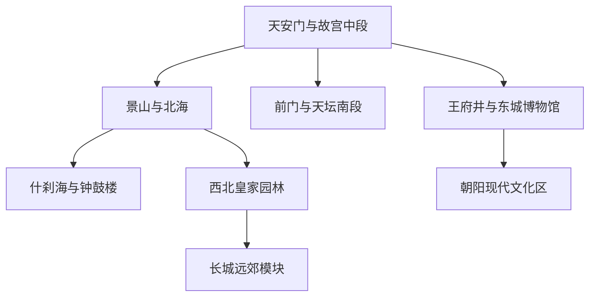
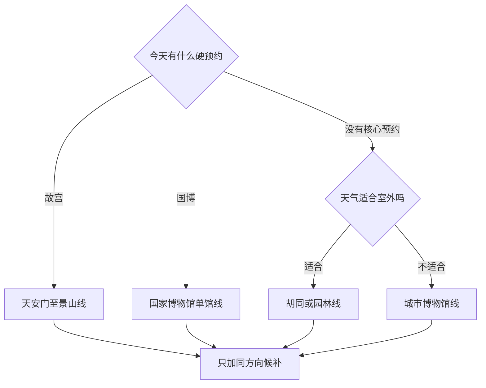

# 北京市

> 一句话定位：北京最值得为“在一座仍然运转的超大城市里，连续读懂帝都规划、国家叙事、胡同生活与长城地理”而去。  
> 建议停留：首访 5–7 天；加入多个博物馆、园林和远郊后 8–12 天。  
> 对用户的主要匹配：历史与博物馆信息密度、建筑摄影、可拆分的城市走廊、国际化大城市内容；主要摩擦是干燥、灰沉感、长距离通勤和高预约强度。  
> 本页用途：先离线决定片区与清图分母；票务、安检、预约和临时闭馆必须在出发前按机构分别复核。

## 先判断北京适不适合这次旅行

北京的**旅行价值很高**，但这不等于它适合用户长期生活。用户已有北京实习样本：职业机会强，却对干燥、找房、灰沉感和压迫感反馈较差。短途旅行可以把这些生活摩擦压缩掉，集中读取它无可替代的古都、博物馆和国家级文化资源；同时要为干眼、暴晒、冬季寒风和超长步行留出恢复空间。

它最适合以下旅行：

- 愿意用半天完整看一个重磅场馆，而不是只在门口拍照；
- 能接受“每天一个预约硬锚点＋一条附近走廊”，不追求一天横跨四个方向；
- 喜欢建筑秩序、城市史、展览和胡同肌理；
- 能把长城、颐和园等当独立模块，而非市中心顺路加项。

它不适合“到北京再现搜、热门景点全靠当日票”的玩法。故宫、天安门广场、国家博物馆、毛主席纪念堂等是不同管理主体，预约不能互相替代。北京虽已取消多数景区的强制预约要求，但核心高热度场馆仍保留严格实名预约；一张截图不能代表整条中轴线都能进。

## 城市由哪些游览片区组成

北京应按历史轴线和跨区成本来拆，而不是按行政区平铺。老城中轴线可再分北、中、南三段；颐和园在西北，798 与朝阳现代城市在东侧，长城则是完整远郊日。

故宫只能午门进、神武门或东华门出，天然把路线从天安门一带推向景山和北城。天坛—前门属于南段，可另开一天；什刹海—钟鼓楼适合傍晚连续步行。颐和园、圆明园即使都在西北，也足以消耗大半天以上。朝阳、798、奥林匹克公园与老城并非“附近”，除非它们是当天主线，否则不要临时跨区。

## 主要景点

表中用时为规划估算。预约规则是 2026-07-30 核验结果，但北京核心区政策和安检可能随重大活动调整。

| 景点 | 片区 | 类型 | 为什么去 | 典型用时 | 室内外 / 天气 | 预约 / 排队 | 清图层级 |
|---|---|---|---|---:|---|---|---|
| 故宫博物院 | 中轴中段 | 宫殿建筑 / 博物馆 | 北京古都秩序的核心实物，也是建筑、宫廷史和文物的复合场馆 | 核心 3–4 小时；深看 5–7 小时 | 混合；暴晒、寒风敏感 | **强预约**；官方小程序，提前 7 日 20:00 放票，不售当日票；午门单向进入 | A |
| 天安门广场 | 中轴中段 | 城市广场 / 国家礼仪空间 | 理解近现代国家空间及中轴线公众化转变 | 1–2 小时 | 室外；暴晒、严寒敏感 | **单独预约与安检**；升旗也需按平台预约 | A |
| 中国国家博物馆 | 天安门东侧 | 国家级综合博物馆 | “古代中国”等常设展适合建立长时段文明框架 | 核心 3–4 小时；全日 | 室内 | **强预约**；当前可提前 7 日，17:00 放最新日期，分时入馆 | A |
| 景山公园 | 故宫北侧 | 皇家园林 / 城市观景 | 用高处视角把故宫、中轴线和老城尺度一次看明白 | 1–1.5 小时 | 室外；台阶、能见度敏感 | 常规购票；节假日限流复核 | A |
| 天坛公园 | 中轴南段 | 皇家祭祀建筑 / 公园 | 建筑声学、礼制空间和古柏共同构成，不只是祈年殿单点 | 2.5–4 小时 | 室外为主 | 联票、园中园开放及停止入园时间复核 | A |
| 颐和园 | 西北园林 | 皇家园林 / 湖山 | 昆明湖、万寿山与长廊组成完整山水秩序，适合半日步行摄影 | 4–6 小时 | 室外为主；酷暑、冰雪敏感 | 购票及园中园开放复核 | A |
| 什刹海—钟鼓楼片区 | 北中轴 | 湖区 / 胡同 / 城楼 | 水面、胡同肌理和古代报时中心能连续步行阅读 | 2.5–4 小时 | 混合 | 湖区开放；钟鼓楼、故居各自购票或预约 | A |
| 北海公园 | 景山西侧 | 皇家园林 / 湖区 | 与景山、什刹海相连，白塔和水面适合摄影 | 2–3 小时 | 室外为主 | 园中园与游船季节性变化 | B |
| 前门—大栅栏 | 中轴南段 | 历史商业街区 | 正阳门、老字号与南城街巷的交界，适合作为天坛线收尾 | 1.5–3 小时 | 混合 | 正阳门箭楼开放和实名预约单查 | B |
| 先农坛 / 北京古代建筑博物馆 | 中轴南段 | 坛庙 / 建筑博物馆 | 适合把斗拱、藻井和皇家祭祀空间读细 | 2–3 小时 | 混合 | 场馆开放、预约、庆成宫或神仓开放范围复核 | B |
| 恭王府博物馆 | 什刹海西侧 | 王府 / 园林 | 在胡同片区补足清代王府尺度 | 2–3 小时 | 混合 | 热门时段预约与排队明显 | B |
| 雍和宫—国子监—孔庙 | 东北老城 | 寺庙 / 教育史 / 街区 | 宗教、礼制教育与成贤街可组成紧凑半日线 | 3–4 小时 | 混合 | 雍和宫购票安检；孔庙国子监开放另查 | B |
| 首都博物馆 | 西长安街 | 城市博物馆 | 比国博更聚焦北京城市史与京味民俗，适合重访或雨天 | 2.5–4 小时 | 室内 | 免费预约及临展另查 | B |
| 中国美术馆 | 东城 | 美术馆 | 适合按当前展览加入，不以建筑打卡替代看展 | 1.5–3 小时 | 室内 | 预约与临展更换快 | B |
| 圆明园遗址公园 | 西北园林 | 遗址 / 公园 | 适合理解皇家园林毁损史，与颐和园形成对照 | 3–4 小时 | 室外为主 | 购票、展馆开放和季节景观复核 | B |
| 798 艺术区 | 朝阳东北 | 艺术区 / 工业遗产 | 当代艺术、工业空间与街头摄影，内容取决于当期展览 | 2.5–4 小时 | 混合 | 街区开放；各展馆票务独立 | B |
| 奥林匹克公园 | 北中轴延长线 | 现代建筑 / 公园 | 鸟巢、水立方和中轴延长线，适合夜景或现代建筑主题 | 2–3 小时 | 室外为主 | 场馆内部、演出和赛事单独预约 | B |
| 慕田峪或八达岭长城 | 北部远郊 | 世界遗产 / 山地 | 用山势理解长城防御体系；两处首访选一即可 | 1 天含往返 | 室外；风、雨雪、酷暑敏感 | **远郊强规划**；门票、接驳、索道及末班复核 | C |
| 明十三陵 | 昌平远郊 | 帝陵群 | 适合明确对明代陵寝制度有兴趣者，与长城同日会很赶 | 半天至 1 天 | 混合 | 开放陵区、交通和票务各自变化 | C |
| 香山公园 | 西郊 | 山地 / 园林 | 秋色或登高主题明显，普通季节不必挤进首访核心 | 半天 | 室外；季节和体力敏感 | 红叶季拥挤与交通管制复核 | C |
| 北京环球度假区 | 通州 | 主题乐园 | 适合明确的影视娱乐主题，不属于历史北京清图 | 1 天 | 混合 | 票价、项目检修和客流强时变 | C |

### 父子景点和预约怎样计数

- 故宫本体按 1 项计数；珍宝馆、钟表馆是园内加项，不再同时把它们计作完整城市景点。
- 天安门广场、故宫、国博各按 1 项，因为入口、预约、内容和用时均独立；“中轴线”是路线关系，不替代三项完成记录。
- 什刹海—钟鼓楼按 1 个街区模块计；若专门进钟楼、鼓楼或恭王府，可在深度清单另记。
- 长城首访只把“完成一个正式开放段”计 1 项，慕田峪与八达岭不重复进入同一趟旅行的核心分母。

## 代表性美食与一人食

| 食物或体验 | 为什么有代表性 | 适合在哪个片区吃 | 独食友好 | 常见风险与替代 |
|---|---|---|---:|---|
| 炸酱面 | 家常主食，最适合做独行稳定餐 | 老城各片区 | 高 | 网红店排队时换居民区面馆；不必追一家“唯一正宗” |
| 门钉肉饼 / 牛肉饼 | 胡同早餐与清真饮食常见，单份好控制 | 西四、牛街、北城胡同 | 高 | 汤汁烫；热门小店饭点排队，错峰或外带 |
| 护国寺小吃组合 | 豆汁、焦圈、豌豆黄、驴打滚等可小份认识京味 | 护国寺、什刹海周边 | 高 | 豆汁风味门槛高，只点小份试味，不把整顿饭押上 |
| 北京烤鸭 | 城市名菜与片鸭技艺 | 前门、王府井、老城及连锁门店 | 中低 | 独行容易量大价高；找半只、单人套餐或与同行共享 |
| 铜锅涮肉 | 清真与北方冬季饮食体验 | 牛街、什刹海、东城 | 中 | 一人锅或半份肉优先；传统店晚餐长队 |
| 卤煮 / 炒肝 | 南城重口味小吃，可理解市井饮食 | 前门、天桥一带 | 高 | 内脏、油盐较重；先点小份，不适合连吃多顿 |
| 京味点心与宫廷奶品 | 豌豆黄、芸豆卷、奶卷等可作路线补给 | 西城、前门、老字号门店 | 高 | 甜度与保存期；伴手礼看日期和配料 |
| 北京家常菜 / 鲁菜老字号 | 比单一小吃更接近城市正餐传统 | 老城 | 中 | 菜量偏大；独行选午市、小份或一菜一汤 |

用户在意当地特色，但不值得为了“名店”牺牲一个预约馆。北京最稳的独食结构是“炸酱面 / 肉饼 / 小吃拼盘作为快速正餐＋一顿有计划的烤鸭或涮肉升级餐”。干燥和高步行量下主动补水；豆汁、卤煮和连续重油餐都只做尝试，不用完成清单式进食。

## 怎样把景点串起来

北京的路线选择先看“已经抢到哪张票”，再看天气和体力。没有预约时，不要把故宫、国博写成现场候补。

### 首次到访主线：天安门—故宫—景山

`天安门广场 → 午门进入故宫 → 神武门离开 → 路线内补水休息 → 景山万春亭`

故宫票是当天硬锚点，天安门广场预约是另一张门槛。故宫内部按“中轴建筑核心版”或“中轴＋东西六宫 / 专馆全量版”二选一；用户看展和读字速度较快，可备全量版，但仍不建议同日再把国博当作必做。故宫出口正对景山，光线和体力允许再登高；若天气灰、干眼或脚力下降，就删景山，不跨去天坛。

### 北中轴摄影与胡同线

`钟鼓楼 → 万宁桥 → 什刹海湖岸 → 胡同慢走 → 咖啡或茶馆休息 → 北海公园或景山外围`

这是北京少数能把水面、街巷和城楼连续放在步行中的路线，适合用户“移动也是体验”的偏好。不要只沿最拥挤的商业胡同走；以湖岸和公共街巷为主，不进入居民私宅、不接受无明确价格的人力车推销。北海是高精力加项，恭王府是预约型替代，两者不必都开。

### 南中轴建筑线

`天坛 → 先农坛 / 古代建筑博物馆 → 路线内午晚餐 → 前门—大栅栏 → 正阳门外观或已预约入内`

天坛和先农坛用来读礼制建筑，前门负责把路线落到城市商业与饮食。若从中午才开始，天坛与先农坛二选一，避免在园门关闭前赶路。前门商业感强，适合吃饭和短看，不需要为每家老字号排队。

### 西北皇家园林线

`颐和园 → 湖边或园内休息 → 圆明园候补`

颐和园本身足以构成半天至大半天。用户高巡航时可追加圆明园，但两园之间是交通连接，不是全程景观步行。酷暑、寒风或雪后路滑时只留颐和园核心；摄影重点放在昆明湖岸、长廊外景和山湖关系，不为清图把每处园中园都走完。

### 雨天、高温或空气不佳线

`中国国家博物馆或首都博物馆 → 馆内 / 附近午餐 → 中国美术馆或书店咖啡 → 提前收缩`

国博是全日级内容，不与首博并列硬塞。首博更适合城市史；中国美术馆取决于当前展览。室内日仍要考虑进馆安检和地铁步行，干眼不适时减少屏幕和强空调暴露，补人工泪液与饮水。

### 长城远郊线

`市区出发 → 慕田峪或八达岭二选一 → 正式步道与观景 → 景区内休息 → 原路返回`

慕田峪官网目前实行实名预约，可提前 30 天，门票、摆渡车、索道和缆车不是同一票种。无论选哪段，都把往返、接驳和排队视为完整一天；不跟“回城后再刷两个博物馆”的计划绑定。雨雪、大风、雷电、高温预警或路面结冰时取消，不走未开放野长城。

## 清图范围怎么定

### 首访城市核心分母

- A 级共 7 项：故宫、天安门广场、国博、景山、天坛、颐和园、什刹海—钟鼓楼。
- B 级为兴趣补充：北海、前门—大栅栏、先农坛、恭王府、雍和宫—国子监、首博、中国美术馆、圆明园、798、奥林匹克公园。
- C 级单独开分母：长城、明十三陵、香山、环球度假区及北京行政区域内其他远端景区。
- 不计入：地铁站、火车站、普通商场、餐厅、酒店、纯换乘广场；王府井若只购物，也不作为景点。

中轴线是一个 7.8 公里、含 15 处遗产构成要素的整体世界遗产，但旅行清图不能把每座门、桥和道路遗存都机械计一项。首次旅行采用“故宫、天安门广场、景山、天坛、什刹海—钟鼓楼”等可独立体验单元；若以后专做中轴线主题，再另建 15 处遗产点子清单。

## 对用户旅行方式的适配

- **慢启动与预约冲突**：故宫、国博等预约时段可能迫使上午启动。这类日子前一晚不安排深夜项目；其他天继续以中午主线为默认。
- **高巡航**：每个重馆准备“核心版、全量版、提前结束后的同片区候补”。故宫提前结束只开景山或北海，不跨去颐和园。
- **路线内休息**：老城用茶馆、咖啡馆、书店或公园坐点恢复。预约日若回酒店，60–90 分钟重启成本很可能让下一项失效。
- **摄影**：景山看轴线、什刹海看水与胡同、颐和园看山湖、798 看工业空间。长安街、天安门周边拍摄与携带器材要服从现场安保要求。
- **干眼与气候**：秋冬防风、加湿和人工泪液不是小事；春季关注大风和沙尘，夏季关注暴晒与雷雨。把室内馆和公园线做成可交换模块。
- **独食**：快速餐不排队；烤鸭、铜锅涮肉作为唯一升级餐并提前决定份量。最后一天不现场盲排老字号。
- **跨度控制**：每天只在老城一段、西北园林、朝阳或远郊中选一个主方向。北京的主要失败不是景点少，而是把地图距离看小。

## 出发前只复核这些

- [ ] 故宫官方小程序的放票日期、时段、珍宝馆 / 钟表馆加票与临时闭馆；
- [ ] 天安门广场、升旗、国博、毛主席纪念堂分别是否预约成功，证件与入场口是否匹配；
- [ ] 重大活动期间老城安检、交通管制、地铁封站和单向通行；
- [ ] 天坛、颐和园、北海等园中园和游船的季节开放、停止入园时间；
- [ ] 长城门票、接驳、索道、末班交通及大风、雷雨、结冰预警；
- [ ] 博物馆周一闭馆、临展换展、免费票预约与爽约规则；
- [ ] 目标餐厅营业、线上取号、半份 / 单人套餐与零等待替代；
- [ ] 空气质量、沙尘、大风、高温、降雪和干眼用品；
- [ ] 本页 2026-07-30 之后的重大变化。

## 来源

- [故宫博物院参观须知](https://www.dpm.org.cn/singles_detail/259831.html) — 核验官方渠道、提前 7 日 20:00 放票、不售当日票、实名预约与午门入口；核验日期：2026-07-30。
- [故宫博物院导览](https://www.dpm.org.cn/Visit.html) — 核验淡旺季开放框架、周一闭馆及午门进、神武门 / 东华门出的单向关系；核验日期：2026-07-30。
- [中国国家博物馆预约系统](https://pcticket.chnmuseum.cn/) — 核验实名预约、提前 7 日、17:00 放票、分时入馆及当前开放安排；核验日期：2026-07-30。
- [北京市文化和旅游局：天安门地区预约提示](https://whlyj.beijing.gov.cn/zwgk/xwzx/hycz/202304/t20230410_2993970.html) — 支持天安门广场、故宫、国博、毛主席纪念堂分别通过指定渠道预约；具体窗口临行再核；核验日期：2026-07-30。
- [首都之窗：北京中轴线](https://www.beijing.gov.cn/renwen/zt/pwzz/) — 支持中轴线 7.8 公里、15 处遗产构成要素及 2024 年列入世界遗产；核验日期：2026-07-30。
- [UNESCO：Beijing Central Axis](https://whc.unesco.org/en/list/1714/) — 核验世界遗产范围、价值与列入年份；核验日期：2026-07-30。
- [北京旅游网：中轴线深度游](https://www.visitbeijing.com.cn/article/4Cktw75f0qr) — 支持北、中、南段的空间串联思路；核验日期：2026-07-30。
- [什刹海风景区官方旅游条目](https://s.visitbeijing.com.cn/attraction/117800) — 支持前海、后海、西海与胡同片区的关系；核验日期：2026-07-30。
- [慕田峪长城官网](https://mutianyugreatwall.com/en) — 核验实名预约、票务咨询与分季开放框架；核验日期：2026-07-30。
- [首都之窗：西城市井烟火线路](https://www.beijing.gov.cn/renwen/rwzyd/xltj/202602/t20260222_4532496.html) — 支持护国寺小吃、胡同餐饮与京味小吃结构；核验日期：2026-07-30。
- [[个人画像体系/旅行与城市偏好画像/旅行与城市偏好画像|旅行与城市偏好画像]] — 支持北京生活样本中的气候、干眼和城市体感，以及慢启动、高巡航、模块化路线等个人适配判断；非官方事实。

