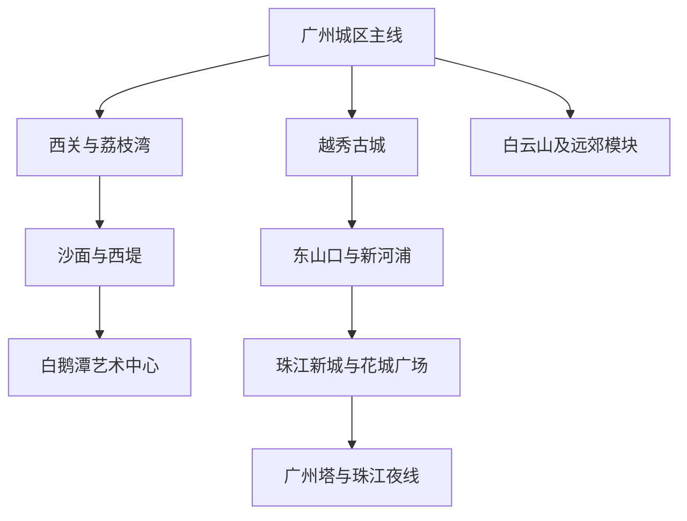
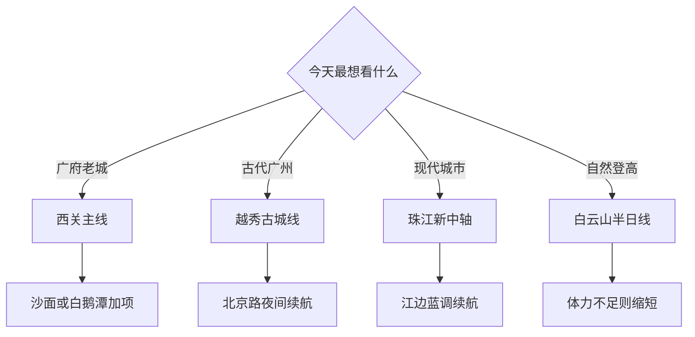

# 广州市

> 一句话定位：广州最值得为“西关生活肌理＋两千年古城遗址＋珠江现代天际线＋系统性的粤菜”而去，它不是靠一处地标取胜，而是越走越有层次。  
> 建议停留：首访 **2–3 天**；加入白云山、黄埔或长隆时 **4–5 天**。  
> 对用户的主要匹配：美食强、片区可连续步行、水岸夜景、岭南建筑、博物馆密度高；与华南气候和饮食有熟悉感。  
> 本页用途：先离线判断去哪里、怎样串联；票价、开闭馆、预约、游船和天气只在出发前复核。

## 先判断广州适不适合这次旅行

广州对你的价值不应只概括为“去吃东西”。最强的一次首访，是白天在西关或古城看建筑与历史，傍晚转到珠江边，途中不断插入早茶、糖水、云吞面或烧味等低门槛补给。这样的城市结构很适合“慢启动、高巡航”：上午不必赶很多点，只固定一个会闭馆的场馆；出馆后仍有成片街区、江岸和夜景可继续。

| 你这次最在意什么 | 广州的匹配 | 需要接受的代价 |
|---|---|---|
| 老城、建筑、街头摄影 | 很高；西关、沙面、西堤、北京路和东山口各有不同年代 | 老城并非处处精修，商业街和生活巷道会交错 |
| 美食与一人食 | 很高；粉面、粥、肠粉、烧味饭、糖水都适合独食 | 早茶和整只鸡、海鲜更适合两人以上，独行时品类会少 |
| 水岸与夜景 | 高；珠江两岸可步行，也可临时选择游船 | 夜游码头、班次和灯光活动属于时变信息 |
| 自然与登高 | 中高；白云山体量足，但会吃掉半天以上 | 炎热、雷雨和高湿会明显放大体力成本 |
| 高完成率首访 | 高；核心片区能拆成三个紧凑模块 | 全市尺度很大，黄埔、番禺、从化不应塞进城区清图分母 |

如果只有一天，优先西关，不要为了“地标齐全”在陈家祠、广州塔、白云山和长隆之间来回跨城。若天气闷热或暴雨，广州反而有很强的室内替代能力，广东省博物馆、南越王博物院、陈家祠与白鹅潭大湾区艺术中心都能成为硬锚点。

## 城市由哪些游览片区组成

先看三条主脉：西关负责广府生活与近代商埠，越秀古城负责城市时间纵深，珠江新城负责当代广州。白云山和远郊内容应单独成行。

- **西关连续线**：陈家祠与永庆坊之间适合短途公共交通衔接；永庆坊、恩宁路、荔枝湾可连续步行。沙面、西堤、白鹅潭位于更南侧，可接着走，但不必强求全程纯步行。
- **古城连续线**：越秀公园、南越王博物院王墓展区、中山纪念堂是一组；王宫展区、北京路古道遗址、天字码头是另一组。两组之间短途地铁或步行均可。
- **新中轴连续线**：广东省博物馆、花城广场、海心沙与广州塔隔江相望，适合从室内一直过渡到蓝调与夜景。
- **必须跨区**：白云山、黄埔古港、长洲岛等远郊内容不在广州核心步行圈；长隆更是独立整日项目。

## 主要景点

表中的用时是“正常看懂并留出拍照”的区间，不是规定课表。预约和排队栏只描述风险类型，实际规则以出发前官方页面为准。

| 景点或游览单元 | 片区 | 类型 | 为什么去 | 典型用时 | 室内外 | 预约/排队 | 清图层级 |
|---|---|---|---|---:|---|---|---|
| 陈家祠（广东民间工艺博物馆） | 西关北部 | 岭南建筑、工艺博物馆 | 集中看木雕、石雕、砖雕、陶塑等建筑装饰，辨识度极高 | 1.5–2 小时 | 室内外混合 | 热门时段入口会排队；闭馆日、票务需复核 | A |
| 永庆坊—恩宁路—荔枝湾 | 西关 | 历史街区、水系、生活方式 | 骑楼、西关大屋语境、粤剧与河涌共同构成广州生活切片 | 2–4 小时 | 以室外为主 | 街区免预约；内部场馆另查 | A |
| 沙面—西堤历史建筑群 | 珠江西岸 | 近代建筑、水岸步行 | 树荫、建筑立面、粤海关与邮政等近代商埠遗存适合摄影 | 2–3 小时 | 室外为主 | 周末沙面人多；小馆开放各异 | A |
| 南越王博物院王墓展区 | 越秀 | 考古遗址博物馆 | 墓室本体与出土文物直接建立岭南秦汉史框架 | 2–3 小时 | 室内为主 | 常规参观与墓室下层规则不同；后者当前限流预约 | A |
| 南越王博物院王宫展区 | 北京路 | 考古遗址博物馆 | 宫苑、曲流石渠和历代遗迹把北京路从商业街还原为古城中轴 | 1.5–2.5 小时 | 室内外混合 | 当前需从官方渠道免费预约；规则复核 | A |
| 北京路古城中轴 | 越秀 | 遗址、街区、商业 | 古道路遗址、城隍庙周边与骑楼可串成晚间仍能继续的主线 | 1.5–3 小时 | 室外为主 | 节假日客流大；不把普通商场计入清图 | A |
| 越秀公园 | 越秀 | 城市山地公园、古迹 | 五羊石像、镇海楼、古城墙等把城市象征与传统中轴放在一起 | 2–3 小时 | 以室外为主 | 公园与内部场馆开放并不完全相同 | A |
| 广东省博物馆 | 珠江新城 | 综合博物馆 | 广东历史、自然与艺术展陈适合快速建立全省背景 | 2–4 小时 | 室内 | 当前实行分时实名预约，周末和展览期有约满风险 | A |
| 花城广场—海心沙—广州塔外观 | 珠江新城 | 城市广场、水岸、地标 | 一次完成广州现代城市尺度、珠江界面和天际线摄影 | 2–3 小时 | 室外 | 广场无需预约；登塔、海心桥等具体规则另查 | A |
| 中山纪念堂 | 越秀 | 纪念建筑 | 适合作为王墓展区与越秀公园之间的建筑补点 | 1–1.5 小时 | 室内外混合 | 演出、活动可能改变参观范围 | B |
| 东山口—新河浦 | 越秀东部 | 近代住宅、街区漫游 | 红砖洋楼、树荫街巷与当代小店适合轻量摄影和路线内休息 | 2–3 小时 | 室外为主 | 周末热门店排队，不必把消费当景点 | B |
| 白鹅潭大湾区艺术中心 | 白鹅潭 | 美术、非遗、文学场馆群 | 三馆合一，适合雨天、看展和建筑摄影 | 3–6 小时 | 室内为主 | 当前分馆分时实名预约；临展另有规则 | B |
| 广州市文化馆新馆 | 海珠湖 | 岭南园林、公共文化 | 建筑本身与园林空间适合高温或雨天的半室内替代 | 2–3 小时 | 室内外混合 | 当前参观通常需官方渠道预约，活动另报 | B |
| 白云山核心线 | 白云 | 山地自然、城市眺望 | 补足广州的自然维度，可看城景与岭南山林 | 4–7 小时 | 室外 | 索道、观光车、园中园和天气均需复核 | C |
| 黄埔古港—黄埔村 | 海珠东部 | 海丝遗存、古村 | 适合对海上贸易史和生活型古村有兴趣的重游 | 3–4 小时 | 室外为主 | 与城区核心跨区；内部小馆开闭不稳定 | C |
| 长洲岛与黄埔军校旧址 | 黄埔 | 近代史、岛屿 | 内容价值高，但交通与参观规则足以占据独立半日 | 4–6 小时 | 室内外混合 | 轮渡、场馆预约与开放范围均需复核 | C |
| 长隆旅游度假区 | 番禺 | 主题公园群 | 若明确想看动物或主题娱乐，可独立成整日 | 1–2 天 | 室内外混合 | 票务、园区日历和客流高度时变 | C |

父子计数规则：陈家祠与馆内展览只算一项；越秀公园内五羊石像、镇海楼和古城墙是子点；花城广场、海心沙与广州塔外观合为一个“新中轴”单元，付费登塔是加项。南越王博物院两个展区相距较远、遗址内容不同，允许分别计数。

## 代表性美食与独食策略

广州餐饮最容易出现的误区，是为了“老字号”在单一网红分店排很久。长期可复用的是菜品和片区，不是某家店永远营业、永远好吃。独行时先用小份主食完成代表性，再把早茶或整桌粤菜留给同行场景。

| 食物或体验 | 为什么有代表性 | 适合在哪个片区吃 | 独食友好 | 常见风险与替代 |
|---|---|---|---:|---|
| 广式早茶 | 虾饺、烧卖、叉烧包等点心与“叹茶”本身共同构成生活文化 | 西关、越秀、天河均可 | 中 | 一个人难多点；选可单点、小份的茶楼，不为名店等两小时 |
| 布拉肠粉 | 米浆现蒸，是低成本、高频率的本地早餐与正餐补位 | 老城居民区、北京路外围 | 高 | 高峰出餐慢；邻近街坊店可替代网红店 |
| 云吞面或竹升面 | 面、汤、云吞组合体现广府面食技艺 | 西关、越秀 | 高 | 小碗分量有限，巡航日可加一份净云吞 |
| 牛杂 | 街头感强，萝卜与内脏卤味适合边走边补给 | 西关、北京路周边 | 高 | 注意卫生与口味偏重；不适应内脏可换萝卜或面食 |
| 烧鹅、叉烧或烧肉饭 | 烧味是最容易独食化的粤菜入口 | 各生活片区 | 高 | 不必点整例；用单拼或双拼饭控制分量 |
| 白切鸡 | 看鸡种、火候与蘸料，属于粤菜基本功 | 老字号粤菜馆 | 低至中 | 一人份不易点；可找例牌、小份或与同行共享 |
| 艇仔粥、及第粥或生滚粥 | 珠江水乡与广府粥文化的直接表达 | 西关、荔湾 | 高 | 宵夜时段可能排队，附近粥粉面店即可替代 |
| 煲仔饭 | 锅巴、腊味与酱汁构成完整一人正餐 | 越秀、荔湾居民区 | 高 | 现做等待时间长；下单前先问预计时长 |
| 双皮奶、姜撞奶、芝麻糊 | 适合放在路线内恢复，不用回酒店 | 西关、北京路 | 高 | 甜度高，可只选一种，不逐店打卡 |
| 泮塘水乡小吃 | 马蹄糕、莲藕等与荔枝湾水乡环境相连 | 泮塘、荔枝湾 | 高 | 季节与店铺供应会变，看到合适再吃 |

一人吃广州的低决策顺序可直接保存：`肠粉或云吞面 → 烧味饭或煲仔饭 → 粥 → 糖水休息`。想认真体验早茶时，最好找一位食量与节奏合拍的人；若独行，只点两笼点心加茶，别为了覆盖率造成浪费。

## 怎样把景点串起来

选择路线时只先回答“今天要老城、现代城市还是自然”，再放入一个会闭馆的硬锚点。其余内容沿线增删。

这张图的重点是：广州各模块内部很密，但模块之间并不都适合步行。先选主线，再加一个邻近尾段，比从景点榜单随机抽点更省体力。

### 首次到访主线：先完成西关，再看古今两条轴

**西关模块**：`陈家祠 → 恩宁路与永庆坊 → 荔枝湾或粤剧艺术博物馆 → 沙面 → 西堤江岸`

- 硬锚点是陈家祠；其余街区即使晚启动也能顺次推进。
- 体力充沛就从沙面继续走到西堤、粤海关旧址一带；炎热或已走累，则从永庆坊直接去沙面，不强收荔枝湾每条支巷。
- 路线内休息优先糖水铺、茶楼或沙面树荫，不回酒店重启。

**古城与新中轴模块**：`南越王博物院王墓展区 → 中山纪念堂或越秀公园 → 王宫展区与北京路 → 广东省博物馆 → 花城广场与广州塔外观`

- 同一天只把王墓或广东省博物馆中的一个设为“全量看展”，另一个用核心版；否则晚间水岸会被挤掉。
- 若中午才出门，删中山纪念堂或越秀公园的一个，不删已经预约的场馆。
- 新中轴最好放在傍晚以后，自然接蓝调和灯光，不必付费登塔才算完成。

### 摄影连续步行线：沙面走到长堤

`沙面树荫街区 → 白天鹅沿江 → 人民桥视角 → 西堤建筑群 → 粤海关旧址 → 广州邮政博览馆外观 → 长堤与海珠广场`

- 约 5–7 公里，可按支路增减；建筑、榕树、骑楼和珠江界面连续出现，移动本身就是体验。
- 下午后段到蓝调更容易兼得立面与江景。夏季不要顶着正午走完整线。
- 退出点很多，沙面、西堤和海珠广场附近均可转公共交通；体力下降时在西堤结束即可。
- 商业拍摄、三脚架和场馆内拍摄规则出发前另查，普通街拍也应避免影响居民和通行。

### 雨天或高温线：把展馆当主轴

优先二选一，不把所有馆堆在同一天：

1. `广东省博物馆 → 花城汇室内休息 → 雨势减弱后花城广场短走`；
2. `白鹅潭大湾区艺术中心三馆择二 → 馆内休息 → 雨停后白鹅潭江岸`。

若两处约满，用 `南越王博物院王墓展区 → 中山纪念堂 → 陈家祠` 的公共交通串联线。雷雨时不去白云山，也不要把海心桥、游船或长距离江岸步行当硬任务。

### 自然半日线：白云山只选一条穿越方向

常规思路是从南侧进入鸣春谷、山顶公园和摩星岭，再按体力决定原路返回还是向明珠楼方向穿越。白云山内部景点多，第一次按“完成一条主线”计数，不把每个园中园都加入分母。雷雨、森林防火管制、索道或观光车停运时，直接改城区模块。

## 清图范围怎么定

### 首访 A 级分母：8 项

1. 陈家祠；
2. 永庆坊—恩宁路—荔枝湾单元；
3. 沙面—西堤单元；
4. 南越王博物院王墓展区；
5. 南越王博物院王宫展区—北京路单元；
6. 越秀公园；
7. 广东省博物馆；
8. 花城广场—海心沙—广州塔外观单元。

2–3 天首访完成其中 **6 项**，并至少覆盖“西关、古城、新中轴”三个片区，即可算核心框架完成；不应为了 8/8 在同一天跨城补点。

### B 级与 C 级怎样处理

- **B 级**：中山纪念堂、东山口、白鹅潭大湾区艺术中心、广州市文化馆。它们用于重游或天气替换，不自动进入首访分母。
- **C 级**：白云山、黄埔古港、长洲岛、长隆，以及从化、增城的山水温泉线。每项至少占半天，只有本次明确选择才进入分母。
- **不计入**：地铁站、码头、普通商场、网红餐厅、只用于休息的咖啡馆，以及珠江游船的某个具体班次。
- **临时关闭**：若已在出发前冻结分母，因官方临时闭馆而无法进入的项目从分母剔除，不算个人遗漏。

## 对你的旅行方式怎样适配

- **慢启动**：把第一个硬锚点设在午后仍能入场的博物馆；早茶若会迫使早起，可以改为午市点心，不必把“早”当成体验真实性。
- **高巡航**：西关与古城都要准备两层候补。看展提前结束，就补相邻小馆或街巷；看展超时，则直接删支线，不跨区追回。
- **路线内休息**：广州最适合用糖水、茶楼、骑楼下的简餐完成 30–60 分钟恢复。回酒店通常不如原地坐下。
- **单人旅行**：粉面、粥、烧味饭和糖水几乎没有拼桌压力；整桌粤菜、早茶多品类和海鲜留给结伴。
- **摄影**：西关拍建筑细部，沙面与西堤拍树影和近代立面，新中轴拍尺度与蓝调。为日落或亮灯设置“最晚离开上一站”，不要只写一个模糊的傍晚。
- **舒适与安全**：盛夏高湿比纯高温更消耗体力；午后强对流时先进入场馆。深夜走老城生活巷道，以有人流、照明好的主路为主，不因一段短视频路线牺牲体感。

## 出发前只复核这些

- [ ] 陈家祠、南越王博物院、广东省博物馆、白鹅潭大湾区艺术中心的开闭馆日、预约与临展规则；
- [ ] 南越王墓室下层是否仍需单独预约，以及是否开放；
- [ ] 广州塔登塔、海心桥、珠江游船的实名、班次、码头与退改规则；
- [ ] 白云山索道、观光车、园中园开放及森林防火、雷雨提示；
- [ ] 台风、暴雨、高温和珠江水上项目停航信息；
- [ ] 想去的具体茶楼或餐厅是否仍营业、是否可线上取号，以及分店是否正确；
- [ ] 大型展会、演唱会、广交会等是否显著推高住宿和核心区交通压力；
- [ ] 本页 2026-07-30 核验之后发生的重大场馆或交通变化。

## 来源

以下链接用于建立长期结构；精确时刻和票价不固化在正文。

- [广州市政府：西关 Citywalk](https://www.gz.gov.cn/zt/jrshts/2026n/nwzgz/nwgz/content/post_10686807.html)：核验陈家祠—永庆坊—沙面—白鹅潭的官方推荐串联关系，2026-07-30。
- [广州市文旅局：传统中轴线](https://wglj.gz.gov.cn/attachment/7/7114/7114501/8334607.pdf)：核验王宫展区、北京路古道、文明路至天字码头的古城步行逻辑，2026-07-30。
- [南越王博物院参观指南](https://www.nywmuseum.org.cn/News/VisitIndex/Visit)：核验两展区定位、官方预约渠道及墓室下层需单独关注的规则，2026-07-30。
- [广东民间工艺博物馆（陈家祠）](https://www.gzcjc.com.cn/)：核验场馆身份、参观公告与票务入口，2026-07-30。
- [广东省博物馆预约须知](https://www.gdmuseum.com/col88/index)：核验当前分时实名预约、官方渠道和开放公告入口，2026-07-30。
- [广州市政府：越秀公园](https://www.gz.gov.cn/zlgz/gzly/wzgz/ylgy/content/mpost_9500464.html)：核验公园与传统中轴、镇海楼、古城墙和五羊石像的关系，2026-07-30。
- [广州市文旅局：广州塔](https://wglj.gz.gov.cn/ztmb/gzhyn/ajjq/4a/content/post_8928935.html)：核验广州塔位于新中轴与珠江景观轴交汇处，2026-07-30。
- [广东美术馆：白鹅潭大湾区艺术中心预约须知](https://www.gdmoa.org/Media_Center/Notice/202501/t20250122_17967.html)：核验当前分馆、分时实名预约框架，2026-07-30。
- [白云山风景区官网：景区导览](https://www.baiyunshan.com.cn/bys/jqzn/jqzn.shtml)：核验鸣春谷、摩星岭、明珠楼等分区和官方游览线，2026-07-30。
- [白云山风景区官网：游客提示](https://www.baiyunshan.com.cn/bys/lkts/list_tt.shtml)：核验雷雨、防滑和森林防火风险，2026-07-30。
- [广州市政府：广州早茶](https://www.gz.gov.cn/zt/jrshts/2026n/nwzgz/nwgz/content/post_10689712.html)与[广州市级非遗饮食项目](https://www.gz.gov.cn/zlgz/wlzx/content/post_8610554.html)：核验早茶、肠粉、白切鸡、云吞面、竹升面、牛杂与广式甜品的代表性，2026-07-30。
