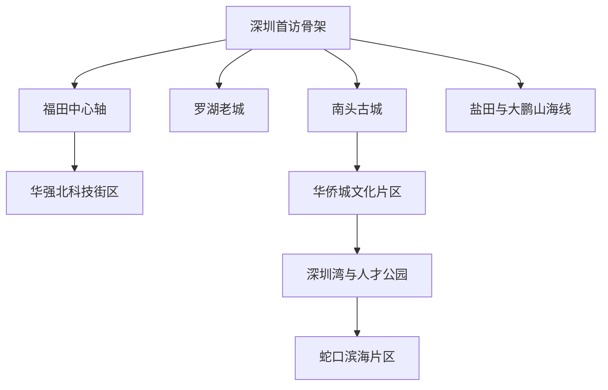
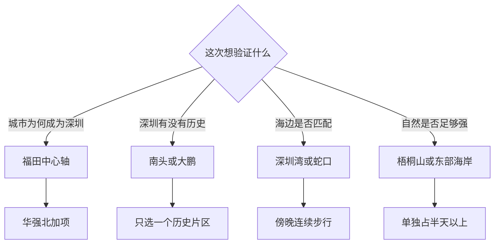

# 深圳市

> 一句话定位：深圳不是传统古都型目的地，真正值得看的组合是“改革开放城市样本＋连续滨海公园＋移民城市生活＋被高楼遮住的岭南海防与客家历史”。  
> 建议停留：首次验证 **2–3 天**；加入梧桐山、盐田或大鹏 **4–5 天**。  
> 对用户的主要匹配：大城市能量、海边、现代建筑、连续步行、摄影、公共空间、国际化；历史密度和传统旅游感弱于广州与厦门。  
> 本页用途：帮助你重新判断深圳是否只是“人造感强”，并离线拼出真正有城市逻辑的路线；开放、预约、海边交通和天气临行再核。

## 先判断深圳值不值得再给一次机会

你此前只是路过，印象不深，觉得自然和历史景点少、人造感强。这个判断抓住了深圳的表层：地标新、城市扩张快、传统古城不在中心。但如果把深圳当成“寻找古迹最多的城市”，体验很容易失焦；把它看成一座能同时观察改革开放、超高密度现代城区、山海公园系统与移民日常的城市，内容会清晰得多。

| 想验证的方向 | 深圳能提供什么 | 可能仍不匹配的地方 |
|---|---|---|
| 大城市与职业能量 | 福田中心轴、华强北、后海与蛇口都能看到产业和城市变化 | 城市尺度大，通勤型空间多，街头历史连续性弱 |
| 海边与水岸步行 | 深圳湾公园、人才公园、蛇口西段形成长距离慢行系统 | 部分岸段遮阴少，正午与台风天体验差 |
| 历史内容 | 南头古城、大鹏所城、客家围屋和深圳博物馆能纠正“无历史”印象 | 历史点分散，城区首访无法同时清完 |
| 摄影与随机发现 | 天际线、滨海步道、工业遗存、城中村界面丰富 | 精修公共空间与普通城市界面反差大 |
| 一人旅行 | 地铁、商场、单人餐饮和夜间活动都方便 | 大鹏海鲜、盆菜、椰子鸡等多人餐独食效率一般 |

若只有一天，优先“深圳博物馆＋市民中心＋莲花山”，先理解城市；若只有一个傍晚，走人才公园或蛇口海岸。第一次不建议把世界之窗、欢乐谷、东部华侨城等主题项目自动列为必去，它们应由明确兴趣决定，而不是用来证明“来过深圳”。

## 城市由哪些游览片区组成

深圳的核心不是一个老城圆心，而是一条从罗湖向福田、南山、蛇口展开的东西向城市带；自然内容再向盐田和大鹏延伸。

- **福田中心轴**：深圳博物馆金田路馆、市民中心、当代艺术与城市规划馆、中心书城和莲花山公园相邻，最适合做“理解深圳”的第一模块。
- **南山西行线**：南头古城、华侨城创意文化街区、深圳湾、后海与蛇口大体沿东西方向展开，但片区之间仍需地铁，不应幻想全程步行。
- **深圳湾连续线**：人才公园与深圳湾滨海休闲带相接。沿海岸可走很远，真正规划时只选一段，不以 13 公里或更长全线作为默认 KPI。
- **东部山海线**：梧桐山、盐田、大梅沙和大鹏属于另一趟旅行尺度；周末道路、预约和天气风险显著高于城区。

## 主要景点

| 景点或游览单元 | 片区 | 类型 | 为什么去 | 典型用时 | 室内外 | 预约/排队 | 清图层级 |
|---|---|---|---|---:|---|---|---|
| 深圳博物馆金田路馆 | 福田中心轴 | 城市史、民俗博物馆 | 用古代深圳、近现代与民俗展建立整座城市的背景 | 2–4 小时 | 室内 | 官方当前称常规入馆免预约，但临时闭展与馆址状态须复核 | A |
| 市民中心—中心书城—中轴公共空间 | 福田中心轴 | 现代建筑、城市公共空间 | 观察深圳的行政、文化和公共生活尺度 | 1.5–2.5 小时 | 室内外混合 | 公共空间通常无需预约；内部场馆各自管理 | A |
| 莲花山公园 | 福田中心轴 | 城市公园、观景 | 山顶广场看中心区天际线，且与博物馆片区自然串联 | 1.5–2.5 小时 | 室外 | 花展与节假日客流高；恶劣天气按公园公告 | A |
| 南头古城与古城博物馆 | 南山 | 历史街区、城市史 | 看深圳并非从经济特区才开始，也看微更新后的新旧叠加 | 2–3.5 小时 | 室内外混合 | 街区开放；博物馆闭馆日和停止入馆时间需复核 | A |
| 华侨城创意文化街区—何香凝美术馆 | 华侨城 | 艺术、工业更新、街区 | 适合看展、建筑摄影和咖啡休息，可与现代深圳形成对照 | 3–4 小时 | 室内外混合 | 美术馆、OCAT 等场馆状态与临展规则分别核验 | A |
| 深圳湾公园—人才公园精选段 | 后海、深圳湾 | 滨海公园、城市天际线 | 海、候鸟环境、桥与高楼同框，是用户偏好的景观走廊 | 3–5 小时 | 室外 | 无需把全线走完；活动、骑行与极端天气另查 | A |
| 蛇口海上世界—文化艺术中心—南海意库 | 蛇口 | 改革开放史、滨海、艺术街区 | 工业区转型、国际化生活与滨海公共空间集中出现 | 3–5 小时 | 室内外混合 | 展览可能收费或预约；商业活动客流时变 | A |
| 华强北科技时尚街区 | 福田东部 | 科技商业、城市观察 | 不只是购物，可观察电子产业链与高密度商业城市 | 2–3 小时 | 室内外混合 | 市场营业日、楼层和品类变化快；不把购物楼逐个计数 | B |
| 罗湖老街—东门—深圳站城市界面 | 罗湖 | 老城、商业、口岸城市 | 观察特区早期城市记忆与当代生活密度 | 2–3 小时 | 室外为主 | 人流大，商业更替快；夜间注意个人物品 | B |
| 深圳改革开放展览馆 | 福田中心轴 | 改革开放史 | 与深圳博物馆互补，适合对城市制度与建设史有兴趣时加入 | 1.5–2.5 小时 | 室内 | 官方页面曾有闭展或入馆规则调整，出发前必须查当前状态 | B |
| 大芬油画村 | 龙岗 | 艺术生产街区 | 看商品油画、工作室和城中村式产业空间 | 2–3 小时 | 室内外混合 | 画廊与场馆开放各异；跨区时间较长 | B |
| 梧桐山核心登山线 | 罗湖、盐田 | 山地自然、观海观城 | 深圳代表性的滨海山地，补足纯现代城市印象 | 5–8 小时 | 室外 | 台风、雷雨、山火、步道管制会直接改变计划 | C |
| 大梅沙与盐田海滨栈道精选段 | 盐田 | 海滨公园、栈道 | 山海贴近、公共交通可达，比大鹏更适合半日试水 | 4–6 小时 | 室外 | 沙滩入园、栈道开放与节假日交通均需复核 | C |
| 大鹏所城—较场尾 | 大鹏 | 海防古城、海滨村落 | 一次串联明代海防史与海边住宿区，纠正“深圳无古城”印象 | 6–9 小时 | 室内外混合 | 周末交通拥堵；古城内小馆、海上项目另核 | C |
| 杨梅坑—鹿嘴山海线 | 大鹏 | 海岸、徒步、观光接驳 | 山海摄影潜力强，移动本身是体验 | 6–9 小时 | 室外 | 接驳、道路、海况和台风高度时变 | C |
| 西涌—天文台方向 | 大鹏 | 沙滩、海岸步道、观星 | 适合明确想看开阔海岸或天文体验时单独安排 | 1 天 | 室外 | 天文台、步道与沙滩常有独立预约或管控 | C |
| 观澜版画村或甘坑客家小镇 | 龙华、龙岗 | 客家文化、艺术村落 | 作为深圳地方文化与客家聚落的重游补充 | 4–6 小时 | 室内外混合 | 距核心区远，活动和场馆规则另查 | C |

父子计数规则：市民中心、中心书城和中轴广场合为一个公共空间单元；人才公园与深圳湾只按“本次选定的一段走廊”计一项；蛇口海上世界、文化艺术中心和南海意库合为蛇口单元；南头古城街区与古城博物馆合计一项。主题公园内部项目不拆成城市清图项。

## 代表性美食与独食策略

深圳是移民城市，不必强行寻找一套像广州那样完整、统一的“本帮菜”。更有用的吃法是：先尝本地有明确地理来源的乳鸽、蚝、海鲜与客家菜，再把潮汕、广府、湖南、东北、东南亚等移民餐饮当作城市气质的一部分。

| 食物或体验 | 为什么有代表性 | 适合在哪个片区吃 | 独食友好 | 常见风险与替代 |
|---|---|---|---:|---|
| 光明乳鸽 | 深圳辨识度最高的地方菜之一，皮脆肉嫩，单只可完成 | 光明；城区有分店 | 高 | 专程去光明路程长；首访可在可靠城区分店吃 |
| 公明烧鹅 | 光明、公明一带的传统烧味 | 光明或烧味店 | 高 | 用烧鹅饭或小例代替整份 |
| 沙井蚝 | 与宝安沙井的滨海生产史相连 | 宝安、粤菜馆 | 中 | 来源、季节和烹饪卫生比“名店”更重要 |
| 南澳海胆炒饭 | 大鹏南澳的海鲜型代表菜，适合与东部行程绑定 | 南澳、大鹏 | 高 | 海胆供应有季节与品质差异，菜单没有就不强求 |
| 盐田海鲜或大鹏海鲜 | 体现深圳东部海岸生活 | 盐田、大鹏 | 低至中 | 一人难控品种与重量；优先明码标价套餐或单份主食 |
| 客家酿豆腐 | 龙岗等客家文化的重要日常菜 | 龙岗、客家菜馆 | 高 | 一人点小份，避免同时点多道大盘菜 |
| 下沙大盆菜 | 深圳本地节庆与宗族饮食代表 | 福田下沙及节庆活动 | 低 | 本质适合多人，不列为独旅必吃 |
| 椰子鸡 | 现代深圳高普及度餐饮，清爽且符合华南气候 | 福田、南山等 | 中 | 通常按锅计，独行先找单人套餐或放弃 |
| 猪肚鸡 | 移民城市常见的暖胃火锅型餐饮 | 全市 | 中 | 与椰子鸡二选一，不把连锁普及度误当古老传统 |
| 海鲜濑粉、烧鹅濑粉或汤粉 | 可把地方口味压缩成一人主食 | 大鹏、光明及社区店 | 高 | 最适合高巡航日，店铺排队过长就近替代 |

一人食默认顺序：`乳鸽或烧鹅饭 → 客家酿豆腐套餐 → 汤粉或濑粉 → 商场内稳定简餐`。去大鹏时，先看单人海胆炒饭、濑粉或窑鸡小份，再决定是否吃海鲜；不要因已经走远，就接受不透明称重和过量点餐。

## 怎样把景点串起来

深圳的选择关键不是一天塞多少，而是先决定本次要验证哪一种城市印象。

这张图给出的边界是：南头和大鹏虽然都能回答“深圳有没有历史”，却不应在同一天并收；深圳湾、蛇口和大鹏也都是海边，但分别属于城市岸线、工业港区转型和远郊山海三种体验。

### 首次到访主线：先理解城市，再去海边

**城市理解模块**：`深圳博物馆金田路馆 → 市民中心中轴 → 中心书城或路线内休息 → 莲花山公园`

- 博物馆是唯一硬锚点；如果当前闭馆或展陈调整，就换改革开放展览馆或同心路馆，但先核验具体馆址。
- 莲花山放在后段，天气好时看天际线，雷雨或高温则删登顶，只走中轴公共空间。
- 看展提前完成可加华强北；看展超时不必跨区，留在福田吃饭即可。

**历史到滨海模块**：`南头古城 → 地铁转蛇口 → 南海意库 → 海上世界文化艺术中心 → 女娲滨海公园或灯塔方向`

- 这条线从老县城、工业更新走到当代滨海，时间跨度比单拍地标更能解释深圳。
- 南头古城商业化明显，但古城博物馆和街巷尺度仍值得看；不必逐家店消费。
- 蛇口段适合延续到晚间，艺术中心闭馆后仍有滨海公共空间，不需要赶回市中心找夜生活。

### 摄影连续步行线：人才公园接深圳湾

`人才公园内湖 → 后海天际线视角 → 深圳湾体育中心外沿 → 流花山或日出剧场 → 深圳湾大桥远景`

- 按选择的起止点约 5–10 公里，不默认走完整海岸线。人、海鸟、草坡、桥和高楼会持续变化，符合“移动过程也值得拍”的偏好。
- 下午后段至蓝调最适合；日出则必须单独为早起付出睡眠成本，不与默认慢启动日混用。
- 人才公园、体育中心和深圳湾公园有多个公共交通退出点。走累就结束，不为“走到某个公园名”继续晒。
- 观鸟季尊重保护边界，不追逐、投喂或用近距离动作换照片。

### 雨天或高温线：留在福田文化场馆群

`深圳博物馆金田路馆 → 当代艺术与城市规划馆择展 → 中心书城 → 商场或书店内休息 → 雨停后市民中心短走`

- 每次只设一个全量看展馆，另一个为提前刷完后的候补。
- 深圳博物馆不同馆址、改革开放展览馆和当代艺术与城市规划馆不是同一入口，出发前把预约与闭展公告逐馆确认。
- 若全部临时闭馆，华强北大型电子市场和商业空间可作城市观察备选，但它不是博物馆替代品，也不计入 A 级核心。

### 山海单日线：大鹏只选一组

- **历史＋轻海边**：`大鹏所城 → 东山寺可选 → 较场尾短走`；
- **纯山海摄影**：`杨梅坑 → 鹿嘴方向`，不再加所城；
- **沙滩＋天文主题**：`西涌 → 天文台方向`，预约成功后才成立。

三组不要叠加。它们都可能受周末拥堵、台风、海况、接驳变化影响，返程留足缓冲；真正出发前必须重新查官方交通与开放公告。

## 清图范围怎么定

### 首访 A 级分母：7 项

1. 深圳博物馆金田路馆；
2. 市民中心—中心书城—莲花山单元；
3. 南头古城与古城博物馆；
4. 华侨城创意文化街区—何香凝美术馆单元；
5. 深圳湾—人才公园选定步行段；
6. 蛇口海上世界—文化艺术中心—南海意库单元；
7. 华强北科技时尚街区。

2–3 天完成其中 **5 项**，且至少包含“城市史、滨海、现代城市”三类，就足以形成可靠判断。华强北若没有科技商业兴趣，可在出发前从分母换成罗湖老城，而不是旅行后临时改口径。

### B 级与 C 级怎样处理

- **B 级**：罗湖老城、改革开放展览馆、大芬油画村，以及首访 A 级片区中的额外小馆。
- **C 级**：梧桐山、盐田海岸、大鹏所城—较场尾、杨梅坑—鹿嘴、西涌—天文台、观澜版画村、甘坑客家小镇和各主题公园。每组独立占半天至一天。
- **不计入**：口岸、火车站、普通商场、写字楼、仅作交通的公园入口和某家网红咖啡店。
- **自然线失败口径**：台风、雷暴、山火管制或海岸封闭时，从本次分母剔除；不靠违规进入完成 KPI。

## 对你的旅行方式怎样适配

- **慢启动**：深圳大部分城市公共空间适合傍晚续航。中午用一个博物馆启动，出馆后再走莲花山或海边，比强迫早起更稳。
- **高巡航**：福田中心轴、南头和蛇口各自都有相邻候补。提前看完就顺路加，不用临场搜索“附近还有什么”。
- **路线内休息**：人才公园书吧、蛇口艺术中心公共区、华侨城咖啡店和中心书城都能承担恢复；海岸走累时就近休息，不回酒店。
- **单人旅行**：交通、场馆和商业配套都很友好。餐饮优先乳鸽、烧味饭、汤粉、客家单人套餐；火锅和海鲜留给同行。
- **摄影**：城市中心适合拍轴线与高楼，南头拍新旧叠加，蛇口拍工业转型，深圳湾拍海岸与天际线。相比孤立打卡，连续步行更可能改变你对深圳“全是人造景点”的判断。
- **舒适底盘**：住宿放在福田或南山地铁站附近，优先减少跨城；若主攻大鹏，可在那里住一晚，不从市中心连续往返。

## 出发前只复核这些

- [ ] 深圳博物馆各馆址、改革开放展览馆、何香凝美术馆及相关场馆是否开放，当前是否预约；
- [ ] 深圳湾、人才公园、莲花山的活动管控、骑行分流和临时关闭；
- [ ] 梧桐山、海滨栈道、沙滩与大鹏各景区的台风、雷雨、山火和步道公告；
- [ ] 大鹏周末专线、预约通行、接驳车与返程末班；
- [ ] 西涌天文台、杨梅坑—鹿嘴等具体项目是否需要预约，开放范围是否变化；
- [ ] 具体餐厅是否仍营业，海鲜是否明码标价，单人套餐是否存在；
- [ ] 演唱会、展会和大型活动对福田、后海、深圳湾住宿与交通的影响；
- [ ] 本页 2026-07-30 核验之后的重大变化。

## 来源

- [深圳博物馆参观指南](https://shenzhenmuseum.com/guide)：核验各馆址定位、常规参观用时建议及当前免预约框架；具体临时公告优先，2026-07-30。
- [深圳市政府：南头古城博物馆](https://www.sz.gov.cn/szzt2010/szwtt/wtcg/whcg/content/post_11132704.html)：核验古城博物馆内容、地址与官方参观信息入口，2026-07-30。
- [深圳市文旅局：十大特色文化街区](https://wtl.sz.gov.cn/xxgk/qt/gzdt/content/post_11440212.html)：核验南头、大鹏、蛇口、华侨城、华强北、大芬和观澜等城市文化片区，2026-07-30。
- [深圳市城管局：莲花山公园](https://cgj.sz.gov.cn/xsmh/gysz/twf/etly/content/post_10841730.html)：核验公园定位、中心区关系与服务公告入口，2026-07-30。
- [深圳市城管局：深圳湾公园](https://cgj.sz.gov.cn/xsmh/gysz/twf/zpq/content/post_10841192.html)：核验约 13 公里岸线、14 个主题区及步行骑行系统，2026-07-30。
- [深圳市城管局：深圳人才公园](https://cgj.sz.gov.cn/xsmh/gysz/twf/bhxx/content/post_10841318.html)：核验人才公园与深圳湾相连、书吧可作路线内休息，2026-07-30。
- [深圳市城管局：深圳湾滨海休闲带西段](https://cgj.sz.gov.cn/xsmh/gysz/csgy/content/post_10774674.html)：核验蛇口方向滨海节点与灯塔、渔海栈道的连续关系，2026-07-30。
- [深圳市政府：蛇口海上世界文化艺术中心](https://www.sz.gov.cn/szzt2010/szwtt/wtcg/whcg/content/mpost_11131232.html)：核验场馆构成、滨海位置与官方服务信息入口，2026-07-30。
- [深圳市城管局：梧桐山风景名胜区](https://cgj.sz.gov.cn/xsmh/gysz/zrgy/content/post_10775158.html)：核验滨海山地属性、主要景区与自然教育信息，2026-07-30。
- [大鹏新区政府：大鹏所城](https://www.dpxq.gov.cn/ztzl/pyxsj/wzdp/zjd/content/post_11551556.html)、[较场尾](https://www.dpxq.gov.cn/ztzl/pyxsj/wzdp/zjd/content/post_11566977.html)及[大鹏半岛游线](https://www.dpxq.gov.cn/ztzl/pyxsj/)：核验所城海防史、较场尾相邻关系和东部山海模块，2026-07-30。
- [深圳市市场监管局：深圳特色美食图鉴](https://amr.sz.gov.cn/hdjlpt/yjzj/answer/mobile/21547)与[深圳市政府：特色粤菜](https://www.sz.gov.cn/ztfw/jylyfwzt/wyk_184808/content/post_11293260.html)：核验光明乳鸽、公明烧鹅、沙井蚝、南澳海胆炒饭等代表性，2026-07-30。

