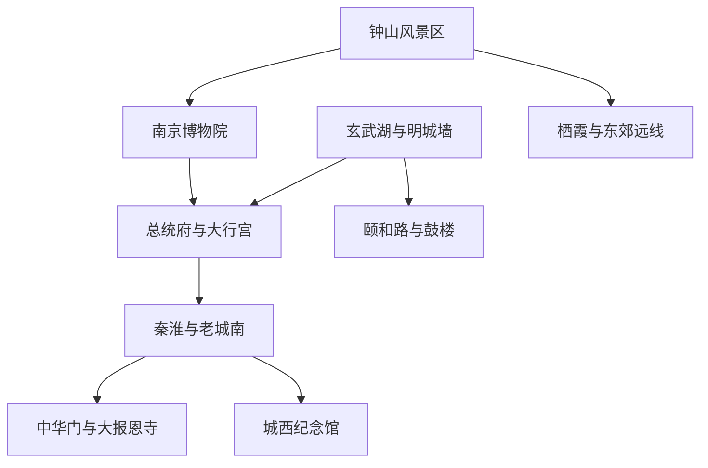
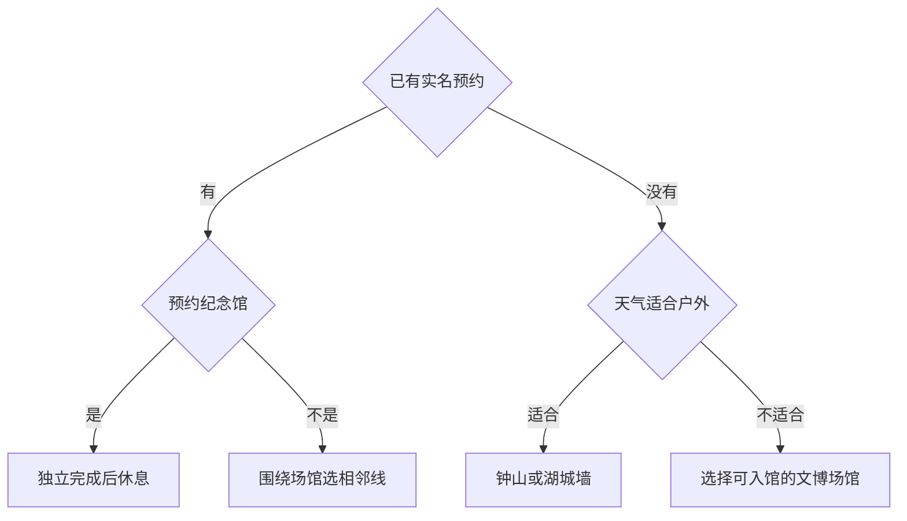

# 南京市

> 一句话定位：南京最值得的是在山、湖、城墙与博物馆之间看见六朝、明代、近代中国和战争记忆怎样叠在同一座城市里。  
> 建议停留：首访 3–4 天；加入远郊或专题博物馆需 5–6 天。  
> 对用户的主要匹配：历史密度、城墙和湖山长走、建筑摄影、博物馆、街区串联、一人食，匹配度高；夏季湿热与热门预约是主要阻力。  
> 本页用途：先离线选择一条历史主线和相邻候补；出发前再核验预约、陵园交通、城墙开放和极端天气。

## 先判断南京适不适合这次旅行

南京不是靠单一古城或一座宫殿成立，而是靠多层历史并存：紫金山有明孝陵和中山陵，中山东路串起南京博物院与总统府，明城墙把玄武湖和老城南框在一起，秦淮片区同时有科举、城门、寺塔和商业夜游，城西的纪念馆保存着必须被认真对待的战争记忆。对用户而言，最有价值的是“内容型场馆＋可走的城市景观”，而不是只在夫子庙吃喝。

最大摩擦是内容过密且片区分散。钟山内部就足够走半天到一天；南京博物院和纪念馆都可能占用较长阅读时间；盛夏高温会显著降低陵园和城墙长走质量。南京适合多次去，不适合用一日把每个时代都刷一遍。

## 城市由哪些游览片区组成

图中最重要的边界是：钟山必须单独留出大块时间；中山东路文博线可以用地铁串联；玄武湖城墙和秦淮老城南分别适合连续步行。

钟山的明孝陵、中山陵、音乐台和灵谷景区看似都在一片山里，内部移动和爬坡仍有成本。南京博物院到总统府沿中山东路可用地铁切换；玄武湖、台城、鸡鸣寺适合步行；夫子庙、中华门、老门东与城墙博物馆可另成南城线。纪念馆位于城西，内容沉重，建议作为独立硬锚点而非夜游前的匆忙加项。

## 主要景点

| 景点 | 片区 | 类型 | 为什么去 | 典型用时 | 室内外 | 预约/排队风险 | 清图层级 |
|---|---|---|---|---:|---|---|---|
| 明孝陵 | 紫金山 | 世界遗产、陵寝、山林 | 明初帝陵格局、神道石刻与自然地形结合，是理解明代南京的核心 | 2.5–4 小时 | 户外为主 | 高：实名购票、梅花季和节假日 | A |
| 中山陵 | 紫金山 | 纪念建筑、山地 | 近代国家记忆、轴线空间与紫金山景观集中 | 1.5–3 小时 | 户外为主 | 很高：实名预约、台阶与客流 | A |
| 南京博物院 | 中山东路 | 综合博物院 | 从江苏古代文明、艺术到民国社会建立大框架 | 3–5 小时 | 室内 | 很高：预约与节假日名额 | A |
| 南京总统府 | 大行宫 | 近代史遗址、园林 | 清代衙署、太平天国与民国政治史在同一建筑群叠合 | 2.5–4 小时 | 混合 | 很高：实名购票、团队客流 | A |
| 玄武湖—台城明城墙 | 玄武门、鸡鸣寺 | 湖泊、城墙、城市景观 | 湖、山、城墙与城市天际线同框，适合连续摄影长走 | 3–5 小时 | 户外 | 高：花季、夜游和城墙分段开放 | A |
| 夫子庙—秦淮河—中国科举博物馆 | 老城南 | 历史街区、博物馆、水岸 | 科举文化与秦淮城市空间比单纯商业夜市更值得看 | 2.5–4 小时 | 混合 | 很高：夜间和节假日人流 | A |
| 侵华日军南京大屠杀遇难同胞纪念馆 | 河西、云锦路 | 遗址型纪念馆 | 以史实、遗址和幸存者记忆理解战争与和平，必须保持严肃参观边界 | 2.5–4 小时 | 室内为主 | 很高：分馆分时预约，现场无额外名额风险高 | A |
| 灵谷景区与音乐台 | 紫金山 | 山林、纪念建筑 | 延长钟山线，林荫和建筑适合摄影与恢复 | 2–4 小时 | 户外为主 | 高：景交、演出或季节客流 | B |
| 六朝博物馆 | 大行宫 | 城市考古博物馆 | 补足六朝都城、城墙和城市生活，体量适合与总统府二选一 | 1.5–2.5 小时 | 室内 | 中：展览与闭馆日 | B |
| 鸡鸣寺 | 玄武湖东南 | 寺院 | 与台城、玄武湖构成紧凑城市景观节点 | 1–1.5 小时 | 混合 | 很高：樱花季和节假日 | B |
| 中华门瓮城与南京城墙博物馆 | 老城南 | 城门、专题博物馆 | 从真实城门结构进入明城墙营造、军防与城市史 | 2.5–4 小时 | 混合 | 高：分项票务、城墙开放和预约 | B |
| 大报恩寺遗址景区 | 老城南 | 遗址、博物馆 | 以考古和数字展示补充南京佛教与明代城市史 | 2–3 小时 | 室内为主 | 中高：购票与团队客流 | B |
| 颐和路历史文化街区 | 鼓楼 | 民国建筑街区 | 低商业化的近代住宅与行道树，适合安静建筑漫步 | 2–3 小时 | 户外 | 中：住宅边界与局部修缮 | B |
| 南京长江大桥南堡或滨江视角 | 鼓楼、浦口 | 工业与交通遗产 | 看长江、桥梁工程和现代城市记忆 | 2–3 小时 | 户外为主 | 中高：开放区域和交通组织 | B |
| 牛首山文化旅游区 | 江宁 | 当代宗教建筑、山地 | 视觉冲击强的现代佛教文化景区，与古都主线性质不同 | 半天–1 天 | 混合 | 很高：票务、接驳与节假日 | C |
| 栖霞山与栖霞寺 | 城东远郊 | 山地、寺院、石刻 | 秋色、佛教史与山林长走组合 | 半天–1 天 | 户外为主 | 很高：红叶季、山路与交通 | C |
| 汤山温泉与考古遗址 | 江宁远郊 | 温泉、史前遗址 | 适合恢复型短住或专题行程，不属于古城核心 | 半天–1 天 | 混合 | 高：具体场所运营与交通 | C |

父子计数规则：明孝陵与中山陵可分别记录实际参观，但首访清图中合称“钟山核心线”一项，避免因同一山地内部多点重复抬高分母；音乐台、梅花山、神道等是钟山线内部节点。夫子庙、秦淮河和科举博物馆按一个片区计一项。中华门与城墙博物馆按一次连续城墙主题计一项。

## 代表性美食与适合片区

| 食物或体验 | 为什么有代表性 | 适合片区 | 独食友好 | 常见风险与替代逻辑 |
|---|---|---|---:|---|
| 盐水鸭 | 南京最稳定的城市味觉符号，强调咸鲜与鸭肉本味 | 水西门、科巷、居民区熟食店 | 高 | 整只不适合独行，按四分之一或小份称重 |
| 鸭血粉丝汤 | 把南京“食鸭”传统变成高效率一人食 | 新街口、科巷、老城南、社区店 | 很高 | 商业街门店品质不一，换本地连锁或社区店 |
| 牛肉锅贴 | 清真饮食与南京小吃的重要组成，适合单人一份 | 七家湾、水西门、老城南 | 很高 | 热门老店排队时找同片区清真馆 |
| 小笼包或鸡鸣汤包 | 南京面点代表，适合作为汤或鸭类之外的补充 | 老城南、鼓楼、科巷 | 很高 | 小心汤汁烫口；不必追单店 |
| 鸭油酥烧饼 | 适合城墙或湖岸长走中的咸香补能 | 老城南、夫子庙外围 | 很高 | 景区摊位易同质化，现烤优先 |
| 赤豆元宵、桂花糖芋苗 | 秦淮甜食代表，适合两人分食或少量收尾 | 夫子庙外围、老城南 | 很高 | 甜度高，两种选一 |
| 皮肚面 | 南京市井面食，配料丰富且单人友好 | 城南、鼓楼、居民区 | 很高 | 份量常较大，少加配料 |
| 金陵菜 | 炖生敲、狮子头等呈现更完整的地方菜传统 | 正规金陵菜馆 | 中 | 多为合餐菜；独行选午市套餐或一道菜配饭 |

夫子庙适合认识小吃名称，却不是唯一吃法。独行可用鸭血粉丝汤、皮肚面、锅贴解决高效正餐，再在水西门、科巷或普通居民区买小份盐水鸭。纪念馆参观前后不要安排“打卡式狂吃”作为紧邻环节，给情绪和注意力留出缓冲。

## 怎样把景点串起来

南京的换挡优先级是预约、严肃历史边界和天气。先确定这三件事，再决定走山、城墙还是文博线。

纪念馆分支不再接夜游；其他分支也只开一个相邻模块，避免在同一天横跨紫金山、河西与老城南。

### 首次到访主线：把两天拆成三个模块

`钟山核心线 → 南京博物院与总统府择一主馆 → 秦淮老城南夜间短走`

这不是一日课表，而是首访优先顺序。钟山至少占一个大模块；南京博物院和总统府都想深看时分到不同天；秦淮可作为其中一天的夜间候补。硬锚点只设中山陵预约或主馆预约，不为夫子庙灯光压缩白天阅读。

### 摄影步行线：湖、城墙与城市屋顶

`玄武门 → 玄武湖选一段 → 台城明城墙 → 鸡鸣寺外围 → 东南大学四牌楼周边 → 大行宫退出`

按选路约 6–9 公里，前半段看湖与城墙，后半段看寺院、校园建筑与城市街景。台城或鸡鸣寺附近可直接退出；樱花季人流过密时跳过鸡鸣寺窄路，从玄武湖转地铁。高校是否允许入校必须另查，默认只走公共道路和开放区域。

### 城墙与老城南线：白天看结构，晚上看秦淮

`中华门瓮城 → 南京城墙博物馆 → 老门东只作休息补餐 → 夫子庙与科举博物馆 → 秦淮河岸`

中华门和城墙博物馆是内容锚点，老门东是路线内配套，不单独追店。若博物馆读得久，就删大报恩寺和商业街；若傍晚人流过大，在秦淮河外围走一段即可，不必挤进核心桥面。

### 雨天或高温线：沿中山东路刷馆

`南京博物院 → 地铁换区 → 六朝博物馆或总统府二选一 → 新街口或大行宫室内休息`

主馆只选一个完整看，第二馆是高巡航候补。总统府有室外庭院，暴雨时优先六朝博物馆；南京博物院若预约不到，就以六朝博物馆加城墙博物馆替代，不现场寻找非官方名额。

### 严肃历史线：纪念馆单独留出余量

`侵华日军南京大屠杀遇难同胞纪念馆 → 安静休息或云锦相关室内点 → 结束本模块`

纪念馆是独立硬锚点，参观后不紧接高噪声娱乐项目。三个展区并非一个预约自动通用，按官方当期规则选择；没有名额时不购买第三方所谓代约，改去其他城市史场馆并留待下次。

## 清图范围怎么定

### A 级：首访建议分母

- [ ] 钟山核心线，完成明孝陵和中山陵中的至少一处，并理解两者关系
- [ ] 南京博物院
- [ ] 南京总统府
- [ ] 玄武湖—台城明城墙
- [ ] 夫子庙—秦淮河—科举博物馆片区
- [ ] 侵华日军南京大屠杀遇难同胞纪念馆

完成 5 项可视为首访高完成度。纪念馆若无官方名额，可在出发前冻结时从本次分母剔除；也可基于旅行主题与心理承受主动不纳入，但需明确记录，而不是把“没约到”伪装为已完成。钟山内部不按每座亭、神道和音乐台重复计数。

### B 级：同城补充

灵谷景区与音乐台、六朝博物馆、鸡鸣寺、中华门与城墙博物馆、大报恩寺、颐和路、长江大桥滨江视角。历史兴趣强时，中华门城墙主题可升为 A，并相应减少商业性更强的秦淮夜游权重。

### C 级：远郊专项日

牛首山、栖霞山、汤山。它们各自足以占半天到一天，不进入普通古城首访分母；秋季红叶主题行程可把栖霞山单独设为核心。

## 慢启动、高巡航怎么用在南京

- 钟山日允许晚一点出门，但不要晚到再同时追明孝陵、中山陵、灵谷寺和音乐台；先完成预约点，再按体力扩展。
- 南京博物院、纪念馆和总统府都可能读得比预计久，主馆准备“核心版”和“全量版”，附近候补只在提前结束时开启。
- 湖岸、城墙和颐和路属于景观步行；钟山到老城南、河西到大行宫属于交通段，直接乘地铁或短程打车。
- 夏季把户外长走放在较晚时段，白天用博物馆承接；高温红色预警、雷暴或城墙湿滑时取消长走。
- 咖啡馆、面馆和商场作为路线内休息点。固定夜游前不回酒店，否则默认损失 60–90 分钟重启时间。
- 热门鸭子店与汤包店不占硬锚点，独行有大量同类兜底；排队超过上限就换。

## 出发前只复核这些

- [ ] 中山陵预约、明孝陵与灵谷景区票务、钟山景交和临时交通管制；
- [ ] 南京博物院、纪念馆各展区、总统府、六朝博物馆的预约与闭馆日；
- [ ] 纪念馆是否仍为官方微信公众号唯一预约渠道，三个展区是否分别预约；
- [ ] 南京城墙开放段、登城口、夜游、雨雪或高温关闭情况；
- [ ] 玄武湖、秦淮河游船和大型节庆活动的客流管制；
- [ ] 樱花、梅花、红叶等季节景观的实际花期或叶色，不按往年日期保证；
- [ ] 牛首山、栖霞山、汤山等远郊交通与返程；
- [ ] 餐厅是否仍营业、是否线上排号，以及盐水鸭真空携带条件；
- [ ] 本页研究日期后的重大场馆或交通变化。

## 来源

- [南京市文化和旅游局](https://wlj.nanjing.gov.cn/)：城市文旅公告、博物馆与景区信息的官方总入口；核验日期 2026-07-30。
- [南京市中山陵园管理局：风景名胜与服务](https://zschina.nanjing.gov.cn/fjms/)：核对明孝陵、中山陵、灵谷等钟山片区关系及票务预约入口；核验日期 2026-07-30。
- [南京市中山陵园管理局：预约和购票提示](https://zschina.nanjing.gov.cn/fjms/fwzn/mpxx/)：支持中山陵预约、景区票务和交通均属出发前复核项；核验日期 2026-07-30。
- [南京博物院官方预约入口](https://ticket.njmuseum.com.cn/reservation/home.jsp)：核对南京博物院预约渠道与地址；核验日期 2026-07-30。
- [南京总统府景区官网](https://www.njztf.cn/index.sh)：核对近代史遗址定位、票务预约与临时开放公告入口；核验日期 2026-07-30。
- [侵华日军南京大屠杀遇难同胞纪念馆参观指南](https://www.19371213.com.cn/guide/how/)：核对实名分时预约、分馆预约和参观边界；核验日期 2026-07-30。
- [纪念馆 2026 年预约提醒](https://www.19371213.com.cn/information/notices/202607/t20260707_5872161.html)：确认暑期客流高、官方名额与现场无额外名额等时效风险；核验日期 2026-07-30。具体规则不固化，出发前重查。
- [南京市文化和旅游局：南京城墙博物馆](https://wlj.nanjing.gov.cn/whcg/bwg/cqbwg/201807/t20180731_1078639.html)：支持中华门旁城墙专题馆的定位；核验日期 2026-07-30。
- [UNESCO：明清皇家陵寝](https://whc.unesco.org/en/list/1004)：核对明孝陵作为世界遗产组成及其陵寝格局价值；核验日期 2026-07-30。
- [南京市政府：城市传统与饮食文化](https://www.nanjing.gov.cn/zzb/njgl/csgk/ctwh_72674/202509/t20250919_5653080.html)：支持食鸭传统、盐水鸭与秦淮小吃背景；核验日期 2026-07-30。

本页不固化门票金额和日常开闭馆时刻。预约放票、花期、陵园景交、城墙开放与大型活动管制均以实际出发日前官方公告为准。
