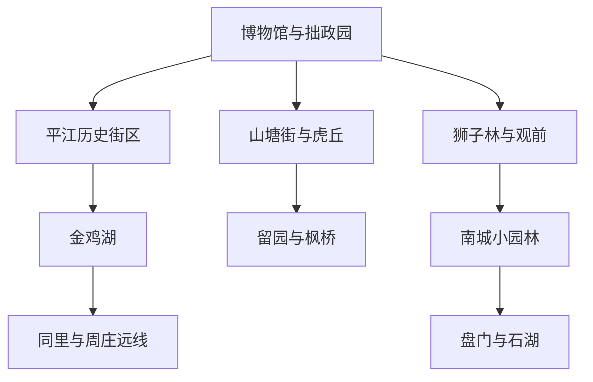
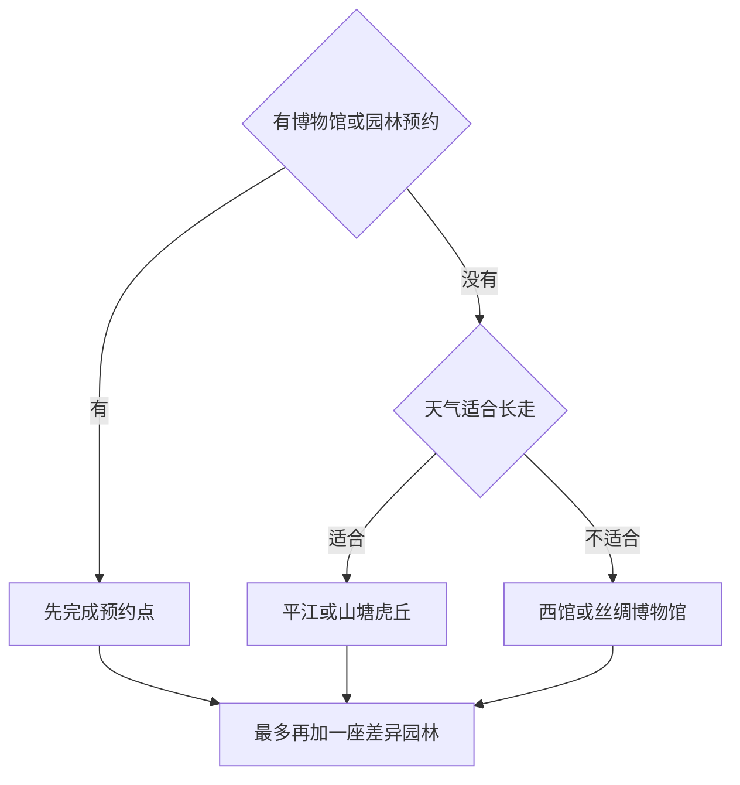

# 苏州市

> 一句话定位：苏州最值得的不是把园林逐个盖章，而是从两三座有差异的园林走进河街并行的古城，再沿山塘水路抵达虎丘。  
> 建议停留：首访 2–3 天；增加小园林、金鸡湖或一座水乡古镇需 4–5 天。  
> 对用户的主要匹配：江南水系、古城和建筑、连续街区摄影、博物馆、苏式面一人食，匹配度高；节假日客流、园林审美疲劳和湿热是主要摩擦。  
> 本页用途：先离线选“东北古城核心＋西北山塘虎丘＋一条南城或雨天线”，出发前再核验预约、园林票务、演出和水乡交通。

## 先判断苏州适不适合这次旅行

苏州的强项正好对应用户喜欢的“移动本身有内容”：平江历史街区保留河街相邻的城市格局，山塘到虎丘是一条从市井走向名胜的水陆走廊，园林则在很小空间中用水、石、植物和建筑制造不断变化的视线。它适合慢启动后连续走，也适合在茶馆、面馆、评弹书场和博物馆里恢复。

主要风险是把同类内容排得太满。拙政园、留园、狮子林、网师园各有差异，但连续一天看三四座，注意力很容易钝化；平江路和山塘街核心段在节假日会高度商业化、拥挤。周庄、同里、太湖东山西山都属大苏州，却需要独立半天到一天，不是古城漏项。

## 城市由哪些游览片区组成

先看古城内部的四个方向：东北是首访密度最高的园林与博物馆核心，西北用山塘连接虎丘，南部适合小园林和城门，西部是留园与枫桥；金鸡湖和水乡另算。

苏州博物馆、拙政园、狮子林和平江路彼此很近，但前三者都可能预约或排队，不能因为地图紧凑就默认全部塞进半天。山塘到虎丘适合走一段水路长线；留园到枫桥需用公交、地铁或短程打车辅助。沧浪亭、网师园、十全街和盘门可以组成南城模块。金鸡湖是现代城市反差，不属于古城步行延伸。

## 主要景点

| 景点 | 片区 | 类型 | 为什么去 | 典型用时 | 室内外 | 预约/排队风险 | 清图层级 |
|---|---|---|---|---:|---|---|---|
| 拙政园 | 东北古城 | 世界遗产、古典园林 | 水面尺度和分区最能建立苏州园林第一印象 | 2–3 小时 | 户外为主 | 很高：分时预约购票与团队客流 | A |
| 苏州博物馆本馆与忠王府 | 东北古城 | 博物馆、历史建筑 | 贝聿铭建筑、吴地文物与太平天国遗存同处一馆区 | 2.5–4 小时 | 室内为主 | 很高：全预约、节假日名额 | A |
| 平江历史文化街区 | 古城东部 | 水巷、居民街区 | 看“水陆并行、河街相邻”怎样延续为真实城市生活 | 2.5–4 小时 | 户外为主 | 很高：主街客流与商业化 | A |
| 留园 | 古城西部 | 世界遗产、古典园林 | 以建筑空间、廊道和峰石与拙政园形成清晰对比 | 1.5–2.5 小时 | 户外为主 | 很高：分时预约购票 | A |
| 山塘历史街区 | 阊门至虎丘 | 水巷、历史街区 | 从城门商业、市井河道逐渐走向虎丘 | 2–3 小时 | 户外 | 很高：夜间和节假日客流 | A |
| 虎丘山风景名胜区 | 古城西北 | 山地、历史名胜 | 云岩寺塔、吴地传说与山塘水路共同构成城外名胜 | 2.5–4 小时 | 户外为主 | 很高：预约购票、节假日与坡路 | A |
| 狮子林 | 东北古城 | 世界遗产、园林 | 假山洞壑与曲折路径辨识度强，适合对园林空间感兴趣者 | 1–1.5 小时 | 户外为主 | 很高：空间窄、团队集中 | B |
| 耦园 | 平江东侧 | 世界遗产、园林宅院 | 与平江水巷关系紧密，规模较小、生活感更强 | 1–1.5 小时 | 混合 | 中高：容量有限与临时活动 | B |
| 网师园 | 南城 | 世界遗产、园林 | 小尺度中视线组织精密，可与大型园林对照 | 1–1.5 小时 | 混合 | 高：夜游、演出与预约规则变化 | B |
| 沧浪亭与可园 | 南城 | 世界遗产、园林 | 借外部水面和古朴空间形成不同于拙政园的气质 | 1.5–2.5 小时 | 混合 | 中高：分项票务与开放 | B |
| 盘门景区 | 古城西南 | 水陆城门、园林 | 认识苏州水城防御与古城边界 | 2–3 小时 | 户外为主 | 中高：登临和夜游安排 | B |
| 枫桥与寒山寺 | 古城西部 | 古桥、寺院、运河 | 诗歌意象、大运河与寺院空间组合 | 2–3 小时 | 混合 | 高：节假日与钟声活动 | B |
| 苏州丝绸博物馆 | 北寺塔附近 | 专题博物馆 | 从蚕桑、织造和服饰理解苏州工艺基础 | 1.5–2.5 小时 | 室内 | 中：展览和闭馆日 | B |
| 苏州博物馆西馆 | 狮山 | 综合博物馆 | 体量更大、适合雨天，也可看现代苏州公共文化空间 | 2.5–4 小时 | 室内 | 中高：特展与节假日客流 | B |
| 金鸡湖 | 工业园区 | 现代水岸、城市景观 | 用开阔湖岸和现代天际线与姑苏古城形成反差 | 2–4 小时 | 户外为主 | 高：活动、夜间和节假日客流 | B |
| 同里古镇 | 吴江 | 水乡古镇、世界遗产园林 | 退思园与水乡街巷可组成完整古镇日 | 半天–1 天 | 混合 | 很高：票务、节假日与交通 | C |
| 周庄古镇 | 昆山 | 水乡古镇 | 水巷、桥梁与商业成熟度高，适合第一次看大型江南古镇 | 1 天 | 户外为主 | 很高：长途交通与节假日客流 | C |
| 太湖东山或西山 | 吴中 | 湖泊、古村、山地 | 湖山、果园和古村提供与古城不同的江南尺度 | 1 天 | 户外为主 | 很高：目的地分散、季节和返程 | C |
| 天平山 | 高新区 | 山地、历史景观 | 秋季红枫最有辨识度，其他季节优先级下降 | 半天 | 户外 | 很高：红叶季、山路和交通 | C |

父子计数规则：拙政园、留园、狮子林等每座世界遗产园林都是独立参观项目；但首访不以“九座遗产园林全刷”为分母。平江路上的桥、巷、评弹馆和普通故居属于街区内部节点；山塘街和虎丘因空间体验与票务独立，可各记一项。同里和周庄一次只选一座，不把未选古镇算作苏州古城漏项。

## 代表性美食与适合片区

| 食物或体验 | 为什么有代表性 | 适合片区 | 独食友好 | 常见风险与替代逻辑 |
|---|---|---|---:|---|
| 苏式汤面 | 红汤或白汤加丰富浇头，是最稳定的苏州一人食 | 观前外围、十全街、居民区、山塘外围 | 很高 | 老字号早餐高峰排队，换同片区面馆即可 |
| 焖肉面、爆鳝面等常规浇头 | 用一碗面尝到苏帮菜的酱香与火候 | 各社区面馆 | 很高 | 浇头过多会变成高价大份，选一个主浇头 |
| 三虾面等时令面 | 将虾籽、虾脑、虾仁等季节食材集中，仪式感强 | 正规苏式面馆 | 高 | 强季节、高价格、供应不稳定；不是全年必吃 |
| 松鼠鳜鱼 | 刀工、炸制和糖醋味型的苏帮名菜 | 观前、十全街、正规苏帮菜馆 | 低 | 按整鱼上桌且价格高，独行不必硬点 |
| 响油鳝糊或油爆虾 | 江南河鲜与热油香气的代表 | 苏帮菜馆 | 中 | 更适合共享；先问份量和时价 |
| 藏书羊肉 | 苏州冬季地方风味，可做羊汤或羊肉面 | 藏书镇或市区专门店 | 高 | 季节性强；盛夏优先级低 |
| 苏式糕团、青团 | 糯米、豆沙和季节草木香，适合少量尝鲜 | 观前、山塘、社区糕团店 | 很高 | 甜糯易饱，一次选一两块 |
| 鸡头米、糖粥等甜品 | 水乡物产与苏式甜味，鸡头米尤其看产季 | 平江外围、十全街、传统甜品店 | 高 | 鸡头米季节和价格波动大，非产季不追 |

独行首选苏式面：一碗就能完成本地味觉，不需要为合餐菜找搭子。同行时再安排松鼠鳜鱼、鳝糊等整桌苏帮菜。平江和山塘主街适合补点心，不宜把所有正餐都锁在最拥挤水岸；向观前外围、十全街或普通居民区移动，通常更容易找到短队伍。

## 怎样把景点串起来

苏州当天选线先守预约，再判断石板路和园林是否适合长走。没有预约时，不在热门园林门口消耗半天。

“差异园林”指空间体验不同的下一座，例如拙政园之后选网师园，而不是把相邻大园林连续刷满。

### 首次到访主线：园林、博物馆与水巷

`苏州博物馆本馆 → 拙政园 → 平江历史街区 → 耦园或评弹体验作为候补`

博物馆预约是唯一硬锚点，拙政园按分时票务复核；两者都深看时，平江路只走主街加一两条支巷。狮子林很近，但它是高巡航候补，不是默认第三个硬项目。平江主街过挤时转入大儒巷、钮家巷等公共支巷，注意居民生活边界。

### 摄影长走线：沿山塘水路去虎丘

`阊门 → 山塘街核心段 → 继续沿河向西北 → 虎丘外围 → 虎丘山`

从商业密集的“七里山塘”入口逐渐走向安静河段，移动过程本身比乘车直达更有价值。按选路约 5–8 公里；在山塘街中段或轨道站点可退出。日落后才到虎丘时不要赌最后入园，改看水巷蓝调，把虎丘留到下一次。

### 园林对比线：用小园林避免审美重复

`沧浪亭与可园 → 十全街路线内补餐 → 网师园 → 盘门或古城河结束`

这条线的重点是比较借景、小尺度庭院和城门水系，而不是追数量。沧浪亭与网师园二选一也能成立；夜游或演出若已预约才设为硬锚点。南城段约 4–7 公里，十全街和带城桥附近都可退出。

### 雨天或高温线：馆群优先

`苏州博物馆本馆 → 忠王府 → 苏州园林博物馆 → 平江路只走短段`

这几处集中在东北古城，能用较少交通完成文博主线。若本馆无预约，直接切换苏州博物馆西馆作为完整半日，不在门口等候非官方名额。大雨时园林石路湿滑，拙政园和狮子林降为天气转好后的候补。

### 现代反差线：重游时换一张城市面孔

`苏州博物馆西馆 → 狮山城市空间 → 轨道交通 → 金鸡湖选一段水岸 → 蓝调结束`

这条线不承担古城清图，而是给重游、雨后或想看当代苏州时使用。金鸡湖面积大，只选文化艺术中心、东方之门或其他一个湖岸段，不以绕湖为目标。

## 清图范围怎么定

### A 级：普通首访分母

- [ ] 拙政园
- [ ] 苏州博物馆本馆与忠王府
- [ ] 平江历史文化街区
- [ ] 留园
- [ ] 山塘历史街区
- [ ] 虎丘山风景名胜区

完成 5 项可视为首访高完成度。苏州博物馆无名额且已提前复核时，可用苏州博物馆西馆替代；园林临时关闭则从当次分母剔除。主街上的桥、店、评弹小馆和网红机位不重复计数。

### B 级：按园林类型和兴趣补充

狮子林、耦园、网师园、沧浪亭与可园、盘门、枫桥寒山寺、丝绸博物馆、苏州博物馆西馆、金鸡湖。一次最多追加一座与当日主园林差异明显的小园林，避免为了数字连刷。

### C 级：水乡、太湖与季节山线

同里、周庄、太湖东山或西山、天平山。它们不进入姑苏古城清图分母；同里和周庄首访只选其一，未来若做“苏州大市水乡专题”再单独建分母。

## 慢启动、高巡航怎么用在苏州

- 下午预约苏州博物馆或一座主园林，上午只放酒店附近苏式面，不为传统面馆被迫早起。
- 一天最多设“一馆＋一主园林”两个硬锚点；平江、山塘和小园林都作为同片区扩展。
- 平江支巷、山塘后半段和南城园林线属于景观步行；古城到金鸡湖、水乡、太湖属于交通段。
- 园林阅读和摄影比看地图慢。提前刷完时再加狮子林或耦园，未刷完就删商业街和网红店。
- 评弹、园林夜游、钟声和演出按固定时刻双提醒；没有确认当期演出，不把它写成必然可用的夜间项目。
- 苏式面是独食稳定底盘，热门苏帮菜整桌属于同行升级餐。排队超过上限就换同类，不让餐厅吞掉入园窗口。
- 夏季把园林和水巷放在较凉时段，白天用博物馆恢复；暴雨时不走湿滑假山和长距离石板路。

## 出发前只复核这些

- [ ] 苏州博物馆本馆分时预约、西馆和其他馆舍的当期入馆政策；
- [ ] 拙政园、留园、狮子林、虎丘、网师园等是否实名预约购票，旺淡季与夜游规则；
- [ ] 园林修缮、容量限制、暴雨或高温下的临时关闭；
- [ ] 平江路、山塘街、虎丘在节假日的交通换乘与人流管制；
- [ ] 评弹、昆曲、园林夜游和寒山寺活动的具体日期、场次与正规购票渠道；
- [ ] 同里、周庄、太湖东山西山的往返交通、末班车船和住宿需求；
- [ ] 三虾面、鸡头米、藏书羊肉、碧螺春等是否处于真实产季；
- [ ] 具体面馆、糕团店和苏帮菜馆是否仍营业、是否排号；
- [ ] 本页研究日期之后的地铁、场馆与景区规则变化。

## 来源

- [UNESCO：苏州古典园林](https://whc.unesco.org/en/list/813/)：核对九座世界遗产园林及“小中见大”的园林价值；核验日期 2026-07-30。
- [苏州市园林和绿化管理局：园林概览](https://ylj.suzhou.gov.cn/szsylj/ylgk/nav_wztt.shtml)：核对拙政园、留园、狮子林、虎丘、网师园等官方管理与园林体系；核验日期 2026-07-30。
- [苏州市园林和绿化管理局：入园须知](https://ylj.suzhou.gov.cn/szsylj/ryxz/nav_list.shtml)：作为主要园林和虎丘预约、票务、游览限制的出发前复核入口；核验日期 2026-07-30。
- [苏州市政府：苏州博物馆 2026 年假期开放公告](https://www.suzhou.gov.cn/szsrmzf/mszx/202604/3c3c5288f66d4d91859d80abe1d6e30e.shtml)：核对本馆、西馆、民俗馆及本馆全预约机制；核验日期 2026-07-30。假期时刻仅说明规则易变，不作为永久时间。
- [苏州市地方志办公室：平江历史街区概况](https://dfzb.suzhou.gov.cn/dfzb/szdq/201606/ebcb2291909b45a09e0e1142af036d31.shtml)：支持平江水陆并行、河街相邻、园林与居民生活共存的空间定位；核验日期 2026-07-30。
- [苏州市政府：平江历史文化街区管理办法](https://www.suzhou.gov.cn/szsrmzf/gbzfgfxwj/202306/c5968539b3bf4952bb72ec2700ba28c3.shtml)：确认平江首先是文商旅居复合的生活街区，支持尊重居民边界；核验日期 2026-07-30。
- [苏州市公安局：古城旅游交通提示](https://gonganju.suzhou.gov.cn/gaj/jfts/202505/ac86ffa3735a4ab6867fb5e5d817da2c.shtml)：支持虎丘、苏州博物馆、拙政园、狮子林、平江路、十全街、网师园与金鸡湖的轨道串联关系；核验日期 2026-07-30。
- [苏州市政府：第八批市级非遗名录](https://www.suzhou.gov.cn/szsrmzf/gbzfgfxwj/202408/e5af8d42299245b9aee3e5ef6b4c8f40.shtml)：支持苏帮菜与苏式面制作技艺的地方文化属性；核验日期 2026-07-30。

本页不固化票价、营业时间、夜游场次或时令食材价格。预约、修缮、人流管制、演出与季节风物均以实际出发日前官方信息为准。
