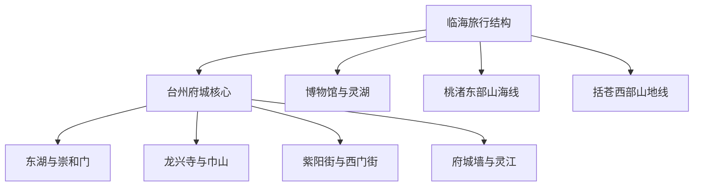
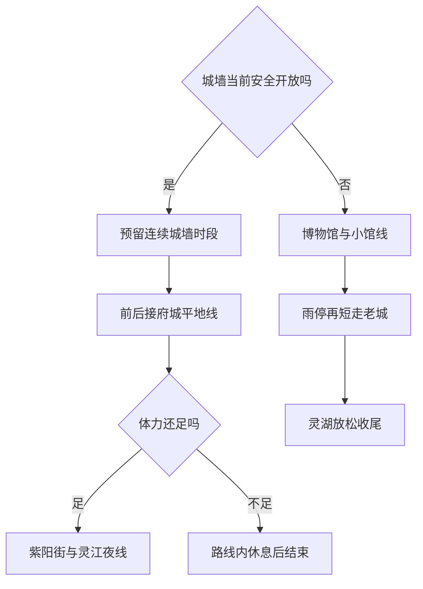

# 临海市

> 一句话定位：临海最值得为“能完整行走的山城墙＋仍有生活的台州府城＋密集小吃＋博物馆与湖岸新城”而去，是很适合上海周末独旅的小尺度历史城市。  
> 建议停留：城区首访 **2 天**；加入桃渚或括苍山 **3–4 天以上**。  
> 对用户的主要匹配：古城、连续步行、摄影、单人小吃、高清图率和临场增删都很强；城墙对天气和膝踝要求高。  
> 本页用途：保留既有临海两日计划中可长期复用的城市结构，剥离车次、酒店、店铺营业、票价与分钟级时间表。

## 先判断临海适不适合这次旅行

临海城区的核心非常集中：东湖、城墙、巾山、龙兴寺、紫阳街、西门街和灵江在同一个古城系统内；博物馆与灵湖则组成另一段安静的新城半日线。它特别适合你用“一个硬锚点＋连续步行＋路上小吃＋相邻小馆”完成高密度探索，而不必从早到晚服从课表。

| 你这次最在意什么 | 临海的匹配 | 需要接受的代价 |
|---|---|---|
| 古城与历史建筑 | 很高；城墙、园林、寺塔、街巷年代层次完整 | 小馆规模普遍不大，开放稳定性低于大城市博物馆 |
| 长距离摄影步行 | 很高；城墙曲线、古城屋顶、灵江和老街连续 | 台阶、坡度、暴晒和湿滑构成真实体力成本 |
| 独食与路线补给 | 很高；麦虾、麦饼、扁食、姜汤面等都适合一人 | 甜糯与面食密度高，容易重复摄入 |
| 慢启动、高巡航 | 高；老城夜间仍可继续 | 城墙和博物馆会闭馆，至少要保留一个明确入场窗口 |
| 清图率 | 很高；城区父级核心可压缩为 7 项 | 桃渚、括苍山和东矶列岛不能假装是“附近顺路” |

明显短板是城区核心体量不大、远郊交通分散，且城墙几乎无法在强降雨、雷暴或极端高温下被室内项目等价替代。如果天气预报持续恶劣，临海核心价值会明显下降，可以改期，而不是用商业街打卡补一个虚高完成率。

## 城市由哪些游览片区组成

临海官方规划中的“一心两翼”很适合作为旅行知识结构：一心是府城与灵湖，东翼是桃渚及海岛，西翼是括苍山与山地溪谷。

- **府城平地线**：东湖、崇和门、巾山、龙兴寺、兴善门、紫阳街、西门街与灵江可以连续步行。小馆散落其中，适合门开就进、门关就继续。
- **城墙山脊线**：台州府城墙本身需要连续 2.5–3.5 小时。兴善门、朝天门、揽胜门等是入口、出口或子节点，实际开放关系须当天确认。
- **新城半日线**：临海市博物馆与灵湖相邻，适合放在另一半天，也适合雨天或古城小馆闭馆时承接内容。
- **东翼与西翼**：桃渚、东矶列岛、括苍山、安基山、尤溪等至少占半天至两天，不进入普通城区两日的清图分母。

## 主要景点

| 景点或游览单元 | 片区 | 类型 | 为什么去 | 典型用时 | 室内外 | 预约/排队 | 清图层级 |
|---|---|---|---|---:|---|---|---|
| 台州府城墙 | 府城、北固山 | 城墙、山地、历史景观 | 看江南山城防御体系、城墙曲线、古城屋顶与灵江关系 | 2.5–3.5 小时 | 户外 | 台风、雷雨、暴雨、高温会影响开放；入口、票务和出口另查 | A |
| 东湖 | 府城东部 | 古典园林、水岸 | 与城墙、揽胜门相邻，是进入府城空间的柔和起点 | 45–90 分钟 | 户外为主 | 当前免费政策与具体开放均需复核；恶劣天气可能闭园 | A |
| 紫阳街—西门街—老城巷道 | 府城 | 历史街区、生活、商业 | 看老城肌理、街屋、生活与小吃，不只是一条商业步行街 | 2–4 小时 | 室外为主 | 周末餐时拥挤；商户和活动高度时变 | A |
| 龙兴寺—千佛塔—巾山塔群 | 巾山、兴善门 | 佛寺、古塔、城市地标 | 唐宋以来寺塔与山城关系紧密，适合外观摄影与短停 | 1.5–2.5 小时 | 室内外混合 | 塔以外观为主；寺院、小场馆开放需现场确认 | A |
| 灵江沿岸—望江门一带 | 府城南部 | 江岸、城门、夜景 | 把城墙、古街与江景连成夜间仍能继续的平地线 | 1–2 小时 | 户外 | 中津浮桥有汛期拆装和维护，不作为固定过江点 | A |
| 临海市博物馆 | 新城 | 城市史、综合博物馆 | 系统建立临海、台州府与地方文化背景，适合高吞吐看展 | 1.5–3 小时 | 室内 | 当前常规免费开放；闭馆、停止入馆和寄存规则复核 | A |
| 灵湖 | 新城 | 城市湖岸、公园 | 作为博物馆后的放松与当代临海样本，适合傍晚散步 | 1.5–2.5 小时 | 户外 | 公园与内部商业、灯光、水上项目不是同一开放规则 | A |
| 台州府文庙—郑广文祠 | 府城 | 文教史、小型场馆 | 呼应临海“小邹鲁”与府学传统，适合老城补漏 | 单馆 20–45 分钟 | 室内外混合 | 开放窗口可能分段或临时闭馆 | B，古城小馆子项 |
| 戚公祠—府城墙博物馆 | 府城 | 抗倭史、城防史 | 为城墙补足人物与防御制度背景 | 单馆 30–60 分钟 | 室内 | 开放与展陈调整需复核 | B，古城小馆子项 |
| 朱自清纪念馆—恩泽医局旧址—人民银行旧址 | 府城 | 名人、医疗与近代建筑 | 用短小场馆补足近现代临海，不必逐馆设硬时间 | 合计 1–2 小时 | 室内外混合 | 门开即看、门关略过；不作为首访硬分母 | B，古城小馆子项 |
| 桃渚军事古城—桃江十三渚—武坑峰林 | 东翼 | 海防古城、湿地、地质 | 明代海防、田园水网与火山地貌形成独立主题 | 1 整天 | 户外为主 | 交通、日晒、步道和天气需单独核验 | C |
| 括苍山或安基山 | 西翼 | 高山、日出、户外 | 山地视野和云海潜力强，与府城体验完全不同 | 1 天或过夜 | 户外 | 山路、强风、云雾、森林防火与日出可见度高度时变 | C |
| 尤溪—江南大峡谷方向 | 西翼 | 溪谷、亲水、户外 | 适合夏季山水或活动型旅行，不是古城附属小点 | 半天至 1 天 | 户外 | 水量、漂流等项目与雨后安全随季节变化 | C |
| 羊岩山茶文化园 | 西部 | 茶园、山地 | 明确想看茶文化或季节景观时加入 | 半天 | 户外为主 | 茶季、活动与交通时变 | C |
| 东矶列岛 | 东部海域 | 海岛、海上交通 | 适合愿意单独做海岛过夜或海钓主题时研究 | 1–2 天 | 户外 | 船班、海况、接待散客与住宿必须逐次核验 | C |

父子计数规则：兴善门、揽胜门与其他城门归入城墙，不另计；龙兴寺、千佛塔和巾山塔群合为一个紧凑文化单元；紫阳街、西门街与相邻巷道合为一个历史街区父项；望江门、中津浮桥和江岸夜景归入灵江单元；古城小馆只记录子项完成度。

## 代表性美食与独食策略

临海的优势是“小吃能直接组成完整独旅餐饮”，不需要为了地方性去点一桌大菜。长期知识库记录菜品和替代逻辑；具体店名、营业、售罄与排队只放到某次行程。

| 食物或体验 | 为什么有代表性 | 适合在哪个片区吃 | 独食友好 | 常见风险与替代 |
|---|---|---|---:|---|
| 麦虾 | 面糊削入汤中，并非海鲜虾，是临海辨识度很高的主食 | 紫阳街外围、老城 | 高 | 名字易误解；一碗即可作正餐，不再叠多个面食 |
| 麦饼 | 可包肉、菜或海味，携带和独食都方便 | 老城、社区店 | 高 | 现烤等待时先问时间，赶车前不押热门店 |
| 麦油脂 | 薄皮卷入多种菜料，体现台州地方家常饮食 | 老城 | 高 | 供应未必全天稳定，有单份再点 |
| 临海扁食 | 皮薄馅鲜，适合轻餐或与汤面搭配 | 老城 | 高 | 与馄饨类近似，和麦虾二选主食即可 |
| 姜汤面 | 姜汤与海味、面条结合，风味明确 | 老城 | 高 | 姜味强，不适应可换豆面碎或扁食 |
| 豆面碎 | 豆面与汤料构成的本地小吃 | 老城、生活区 | 高 | 分量和配料差异大，先点基础版 |
| 海苔饼 | 咸香烘烤小吃，适合路线补给 | 紫阳街及周边 | 高 | 单店长队就换同类，不把品牌当景点 |
| 蛋清羊尾 | 蛋清裹豆沙油炸，名字与羊无关，辨识度高 | 紫阳街、老城 | 中 | 甜且油，少量尝味，不为清图吃整大份 |
| 糟羹 | 元宵前后文化属性尤其强，咸甜做法反映地方节令 | 老城 | 高 | 季节供应可能变化，未遇到不算遗漏 |
| 乌饭麻糍 | 糯食与地方植物饮食传统结合 | 老城小吃店 | 高 | 与梅花糕、海苔饼只选一两样，避免全是碳水 |
| 梅花糕或青草糊 | 适合夜游时的小甜口和降温补给 | 紫阳街、府城夜线 | 高 | 商户营业时变，顺路才吃 |
| 白水洋豆腐 | 临海乡镇地方食材，可作为正餐菜 | 地方菜馆、白水洋方向 | 中 | 城区不必专程追；一人先问小份 |

一人食可直接按 `麦虾或姜汤面作主餐 → 海苔饼或乌饭麻糍二选一 → 蛋清羊尾少量 → 青草糊收尾`。两天再补麦饼、麦油脂、扁食即可，不把十几种小吃一次吃完当 KPI。

需要纠偏：**嵌糕属于台州地域食物，但温岭辨识度更高**，不放入临海核心美食分母。若某次行程刚好遇到可以吃，但更稳的临海早餐是麦饼、麦油脂、扁食或豆面碎。

## 怎样把景点串起来

临海先判断城墙是否安全可走。城墙成立，再围绕它拼府城；城墙不成立，就把博物馆、小馆和灵湖作为替换，而不是冒险追回完成率。

“景区开放”不等于“适合走完全线”。石阶积水、雷电、持续暴晒或膝踝不适时，即使入口开放也应缩短或放弃。

### 首次到访主线：府城一天，新城半天

**府城平地模块**：`东湖 → 崇和门 → 巾山与龙兴寺 → 兴善门 → 紫阳街 → 西门街 → 灵江沿岸`

- 这条线可以从中午启动，寺塔、小馆和食物都在相邻范围内；开馆就进，关闭就继续。
- 东湖与巾山可按天气缩短，紫阳街与灵江可延续到晚间。
- 想认真走城墙时，将城墙作为当天唯一硬锚点，不让小馆拖延入墙。

**城墙模块**：完整线通常需 2.5–3.5 小时。若现场确认兴善门方向可进、揽胜门方向可出，可减少把揽胜门长台阶作为上行的负担；实际入口、中途出口、停止入园和重复入园规则必须当天查。途中不为全线完成冒险，身体或天气不适就从开放出口下墙。

**新城模块**：`临海市博物馆 → 灵湖精选水岸`

- 博物馆全量看展与灵湖放松天然互补，适合第二天下午或雨天。
- 若博物馆提前看完，增加灵湖距离；若看展超时，只走一段湖岸，不赶完整环湖。
- 行李寄存和返程交通属于具体行程问题，出发前确认，不在长期文件里承诺。

### 摄影连续步行线：古城屋顶到灵江夜色

**含城墙版本**：`东湖 → 揽胜门或已开放入口 → 北固山城墙曲线 → 古城屋顶视角 → 兴善门 → 巾山塔群 → 紫阳街 → 灵江`

**平地版本**：`东湖 → 崇和门 → 龙兴寺与千佛塔 → 兴善门 → 紫阳街支巷 → 西门街 → 望江门与灵江`

- 城墙版体力成本高，需预留 3 小时以上；平地版可按小馆和食物自由伸缩。
- 上午光线适合东湖与墙体，傍晚适合兴善门、巾山轮廓和灵江。若真正在意蓝调，为离开上一站设置提醒。
- 中津浮桥只在官方确认安装并开放时作为季节性拍摄节点，永远不作为固定过江或返程通道。

### 雨天或高温线：先保内容，不保城墙 KPI

`临海市博物馆 → 灵湖附近室内休息 → 返回府城开放的小馆 → 雨停后紫阳街与灵江短走`

- 雷雨或持续强降雨直接取消城墙；出现明确、足够长的干窗后再评估，不靠雨衣解决雷电和湿滑。
- 高温天把博物馆、小馆、正餐与咖啡休息放在日照最强时段；城墙只放到较温和且仍符合官方入园要求的窗口。
- 雨天的古城小馆并不保证全部开放，因此博物馆是更稳定的硬锚点，小馆只作沿线碰到就进的候补。

### 远郊怎样选：东部历史山海或西部高山二选一

- **东部整日**：桃渚军事古城为历史锚点，再按交通与天气选择桃江十三渚或地质景观；
- **西部整日或过夜**：括苍山、安基山择一，以高山、日出或户外为主题；
- **海岛一至两日**：东矶列岛只有船班、天气、住宿和散客接待全部确认后才成立。

任何一组都不是府城第二天“顺便加”的尾项。远郊应另建当次行程，单独冻结清图范围。

## 清图范围怎么定

### 临海城区 A 级分母：7 项

1. 台州府城墙；
2. 东湖；
3. 紫阳街—西门街历史街区；
4. 龙兴寺—千佛塔—巾山塔群；
5. 灵江沿岸；
6. 临海市博物馆；
7. 灵湖。

两天完成 **6/7** 可视为城区高完成率。城墙因官方停园或天气不安全、博物馆因临时闭馆不可用时，从可用分母剔除；不要用“到兴善门＋走城墙＋到揽胜门”拆成三项虚高完成率。

### B 级与 C 级怎样处理

- **B 级**：文庙、郑广文祠、戚公祠、朱自清纪念馆、恩泽医局旧址、人民银行旧址、府城墙博物馆等统称“古城小馆组”。可记录进入了几馆，但整个组只算一个可选模块。
- **C 级**：桃渚、括苍山或安基山、尤溪、羊岩山、东矶列岛分别是远郊父级包。一次旅行选中哪包，才为它建立自己的分母。
- **不计入**：城门入口、车站、游客中心、普通商业店铺、餐厅、咖啡馆、临时市集和仅作过江的浮桥。
- **季节活动**：东湖夜游、府城演出、茶季、漂流等只在活动确认存在时作为奖励项，不进入通年核心。

## 对你的旅行方式怎样适配

- **慢启动**：平地府城可以中午启动；但城墙要反推官方停止入园、天气和完整步行余量，不能靠“到时再说”消化三小时山路。
- **高巡航**：老城小馆数量足，提前完成主点后直接逐馆补；无需现场搜索。每馆 20–45 分钟，关闭就跳过。
- **路线内休息**：紫阳街、东湖或崇和门附近坐下补水，比回酒店躺下更不破坏晚间古城续航。
- **单人旅行**：主食和小吃几乎都能单点，是临海的明显优势。用“一主食＋一咸或糯小吃＋一甜口”控制重复和浪费。
- **摄影**：城墙曲线、巾山塔群、兴善门和灵江最有时间敏感性；普通小馆可以为光线让路。设置日落或蓝调的离开提醒。
- **舒适底盘**：住宿放在崇和门、东湖或府城步行圈仍是合理选择，但隔音、寄存、取消与真实价格属于每次预订的时变项。

## 出发前只复核这些

- [ ] 台州府城官网的城墙、东湖与小馆停复园公告；
- [ ] 城墙实际开放入口、出口、中途下墙点、停止入园、票务与重复入园规则；
- [ ] 东湖当前开放、游船或夜游状态，以及恶劣天气闭园；
- [ ] 中津浮桥是否安装、开放，是否允许通行；
- [ ] 临海市博物馆闭馆日、停止入馆、证件、行李寄存和无障碍服务；
- [ ] 古城小馆逐馆开放，不批量假设同一时间全开；
- [ ] 桃渚、括苍山、尤溪的公共交通、自驾山路、天气与森林防火；
- [ ] 东矶列岛船班、海况、住宿与散客接待；
- [ ] 临海站、临海南站、城区公交和网约车的当次交通时间；
- [ ] 具体店铺是否仍营业，以及本页 2026-07-30 之后的重大变化。

## 来源

- [台州府城文化旅游区官网](https://lhtzfc.com/)：核验 3.12 平方公里父级范围、城墙、紫阳街、东湖、巾山组成及官方停复园公告入口；官网在核验日已列出 2026-07-13 恢复正常运营通知，2026-07-30。
- [临海市“十四五”规划](https://www.linhai.gov.cn/art/2021/11/26/art_1229547956_3757215.html)：核验以府城、灵湖为中心，桃渚与东矶为东翼、括苍与安基为西翼的全域结构，2026-07-30。
- [临海市全域幸福河湖建设规划](https://www.linhai.gov.cn/module/download/downfile.jsp?classid=0&filename=d24a00c1f43041c89e1667eeae779f44.pdf)：核验东湖、灵湖、城墙、巾山、龙兴寺的中心关系与东西两翼边界，2026-07-30。
- [临海市博物馆参观须知](https://www.linhai.gov.cn/col/col1512658/index.html)：核验基本陈列免费、当前参观规则、咨询入口、轮椅等服务；具体时刻视为时变，2026-07-30。
- [临海市文化和旅游发展规划](https://www.linhai.gov.cn/module/download/downfile.jsp?classid=0&filename=8e489fe34caa42d9ac4eb76887413177.pdf)：核验府城博物馆群、紫阳街、西门街和灵湖文创街区的父子关系，2026-07-30。
- [临海市夜间经济发展规划](https://www.linhai.gov.cn/module/download/downfile.jsp?classid=0&filename=a079236cb8834fde9384188ffeaf801b.pdf)：核验紫阳街、灵湖夜间片区及蛋清羊尾、白水洋豆腐、海苔饼、乌饭麻糍、麦虾、扁食、麦油脂、梅花糕、青草糊等代表食物，2026-07-30。
- [浙江在线：临海东湖 2026 年起免费开放](https://zjnews.zjol.com.cn/zjnews/202601/t20260109_31446373.shtml)：核验当前免费政策；天气停园仍以府城官网为准，2026-07-30。
- [浙江在线：临海非遗糟羹](https://tz.zjol.com.cn/tzxw/202603/t20260303_31531646_ext.shtml)：核验糟羹的临海地域与节令文化，2026-07-30。
- [浙江省文化广电和旅游厅：临海户外与地方美食](https://ct.zj.gov.cn/art/2025/6/24/art_1652992_59027005.html)：补充核验临海山地户外与地方饮食主题，2026-07-30。

