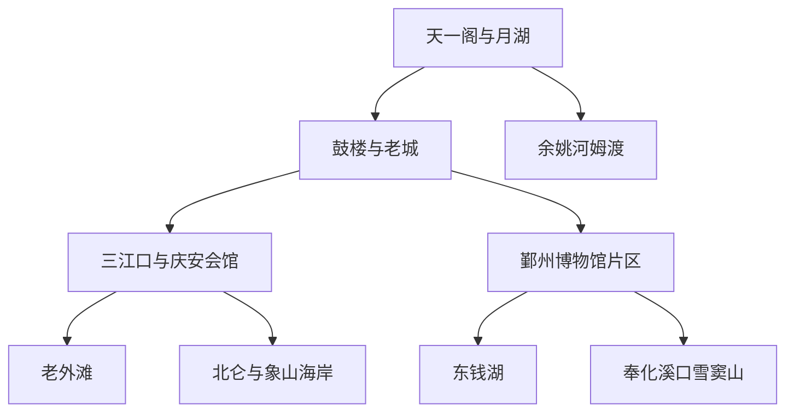
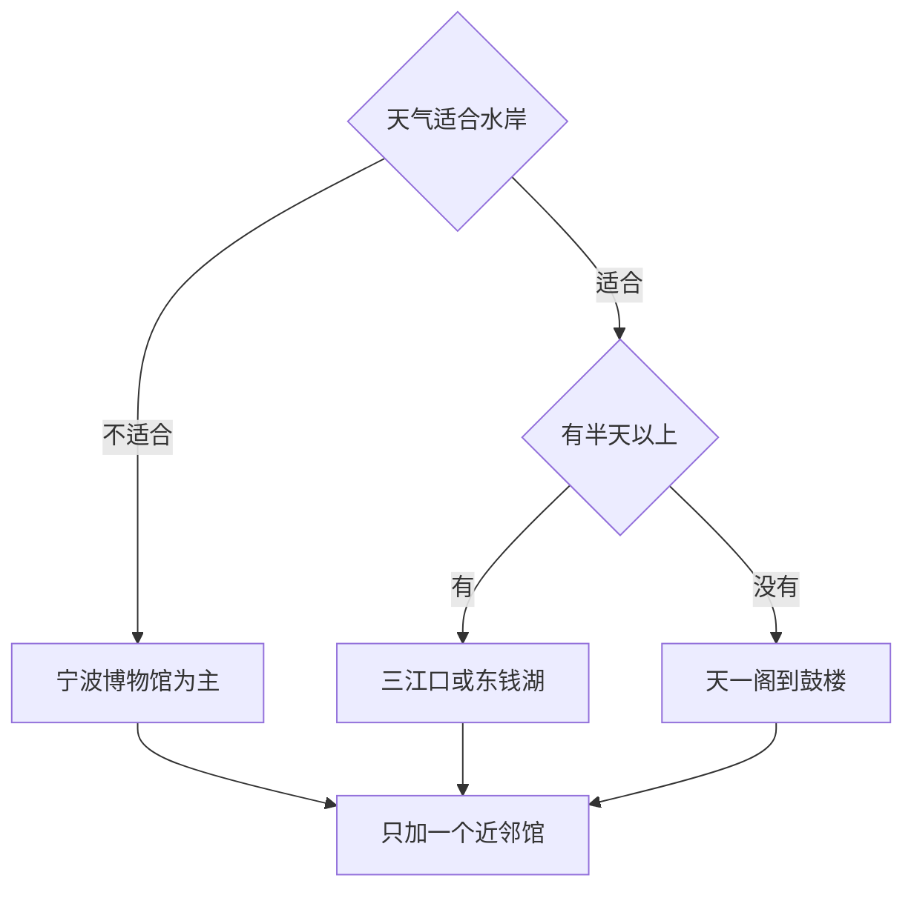

# 宁波市

> 一句话定位：宁波是一座要从藏书楼、三江口和港口贸易读起，再向东钱湖、史前遗址与东海岸展开的低调山海城市。  
> 建议停留：城区首访 2 天；加入东钱湖或一处远郊需 3–4 天；溪口雪窦山、象山海岸可再加 1–2 天。  
> 对用户的主要匹配：水岸漫游、港城历史、博物馆、相对松弛的一人食、江南与海洋混合气质，匹配度中高。  
> 本页用途：先离线选择“城区清图”或“一条山海专项线”；场馆、远郊交通、海鲜餐厅与天气在出发前复核。

## 先判断宁波适不适合这次旅行

宁波的优势不是全国头部景点密度，而是内容之间能互相解释：天一阁说明藏书与浙东学术，月湖和鼓楼保留老城尺度，庆安会馆与三江口说明航运和港口，宁波博物馆把河姆渡、明州港、宁波帮和近现代城市放进同一条叙事。用户喜欢水系、历史街区、摄影和一人食，这条城区线很适合周末独行。

需要管理预期：老城历史空间并非完整古城，鼓楼、南塘老街和老外滩都有明显商业化；真正的湖山、史前遗址、佛教名山和海岸分散在东钱湖、余姚、奉化、北仑与象山。它们行政上都属宁波，但绝不能当成市中心“顺路景点”。

## 城市由哪些游览片区组成

先看城区连续线，再看四个向外展开的方向。只有天一阁—老城—三江口—老外滩适合靠步行连续完成。

城区主线中，月湖到鼓楼、鼓楼到三江口都能边走边看；跨江到老外滩后仍可沿水岸继续。宁波博物馆位于鄞州，需要轨道或短程打车切换。东钱湖适合半日以上；河姆渡、溪口雪窦山、中国港口博物馆和象山海岸各自需要完整交通模块。

## 主要景点

| 景点 | 片区 | 类型 | 为什么去 | 典型用时 | 室内外 | 预约/排队风险 | 清图层级 |
|---|---|---|---|---:|---|---|---|
| 天一阁博物院与月湖 | 海曙 | 藏书楼、园林、城市湖 | 从私家藏书、古建与湖畔空间进入宁波文化核心 | 2.5–4 小时 | 混合 | 高：票务、限流和古建维护 | A |
| 鼓楼—永丰库遗址—老城街巷 | 海曙 | 城市遗址、街区 | 用较短步行补足宁波建城、仓储与市井尺度 | 1.5–3 小时 | 混合 | 中：商业街人流、遗址开放 | A |
| 三江口与老外滩 | 海曙、江北 | 港城水岸、建筑街区 | 看奉化江、姚江汇成甬江，以及开埠建筑与夜间水岸 | 2–4 小时 | 户外为主 | 高：周末夜间与活动客流 | A |
| 庆安会馆 | 三江口 | 海事民俗博物馆、古建 | 用航运会馆解释宁波商贸、妈祖信仰与港口网络 | 1–2 小时 | 混合 | 中：闭馆日与修缮 | A |
| 宁波博物馆 | 鄞州 | 城市综合博物馆 | 从河姆渡到港城、宁波帮建立完整城市历史框架，建筑本身也值得看 | 2.5–4 小时 | 室内 | 高：周末、暑期和临展客流 | A |
| 宁波美术馆 | 老外滩北侧 | 美术馆、工业遗存 | 给老外滩摄影线加入室内展览与建筑节点 | 1.5–2.5 小时 | 室内 | 中：展览和临时布展 | B |
| 天封塔与城隍庙周边 | 海曙 | 古塔、老城节点 | 补看旧城南部地标，可与小吃和街巷顺路组合 | 1–1.5 小时 | 户外为主 | 低到中：内部开放不稳定 | B |
| 南塘老街 | 海曙 | 商业历史街区 | 集中认识宁波小吃品类，适合补餐而非考古式参观 | 1–2 小时 | 户外为主 | 高：节假日商业人流 | B |
| 东钱湖 | 鄞州 | 湖泊、村落、度假区 | 湖山、水岸骑行和韩岭等村镇构成松弛自然模块 | 半天–1 天 | 户外为主 | 高：景点分散、接驳与天气 | B |
| 保国寺古建筑博物馆 | 江北远郊 | 木构古建 | 以真实古建筑理解江南木构技术，内容独特 | 2–3 小时加往返 | 混合 | 中高：远郊交通和开放安排 | C |
| 宁波帮博物馆 | 镇海 | 专题博物馆 | 理解宁波商帮、移民与近现代商业网络 | 2–3 小时 | 室内 | 中：馆舍展陈调整 | C |
| 河姆渡遗址博物馆 | 余姚 | 史前遗址、考古博物馆 | 认识长江下游稻作、木构和史前聚落 | 半天 | 混合 | 高：远程交通与开放安排 | C |
| 溪口—雪窦山 | 奉化 | 历史镇区、山地、宗教 | 人文史、溪谷瀑布和佛教空间组合，内容足以独立成日 | 1 天 | 混合 | 很高：分区票务、接驳与天气 | C |
| 中国港口博物馆 | 北仑 | 港口专题博物馆 | 把宁波放进全球港口、航运和海上丝路网络 | 半天 | 室内为主 | 高：跨区交通、预约与临展 | C |
| 象山石浦与海岸 | 象山 | 渔港、古镇、海岸 | 从真实渔港和东海景观补足宁波的海洋面 | 1–2 天 | 户外为主 | 很高：长途交通、海况与季节 | C |

父子计数规则：天一阁与月湖按一次连续片区计一项；鼓楼、永丰库及普通街巷按“老城线”计一项；三江口与老外滩按一条水岸体验计一项，江桥和单栋建筑不重复计数。溪口镇区与雪窦山若购买不同分区、实际分两段游览，可在专项日中分别记，但不进入城区清图分母。

## 代表性美食与适合片区

| 食物或体验 | 为什么有代表性 | 适合片区 | 独食友好 | 常见风险与替代逻辑 |
|---|---|---|---:|---|
| 宁波汤圆 | 猪油黑芝麻馅的糯米甜点，是宁波最明确的味觉名片之一 | 海曙老城、月湖、社区点心店 | 很高 | 甜度和油脂较高，单点一份即可 |
| 宁波年糕 | 稻米饮食代表，可炒、煮或与雪菜、海鲜组合 | 海曙、鄞州社区餐馆 | 很高 | 景区小吃可能偏同质，优先现炒现煮 |
| 海鲜面 | 把港城海味变成高效率一人食 | 老外滩外围、海曙、鄞州 | 很高 | 先问当日海鲜和总价，避免时价误解 |
| 咸齑大汤黄鱼 | 雪菜与黄鱼体现宁波菜的咸鲜和海味 | 正规宁波菜馆 | 中 | 鱼类多按条上桌，独行确认规格 |
| 红膏炝蟹 | 生腌或盐渍海鲜代表，风味强烈 | 传统宁波菜馆、象山 | 低到中 | 涉及生食和冷链风险；肠胃敏感、炎热天气可跳过 |
| 苔菜小方烤或苔菜类菜肴 | 海岸植物风味与酱香结合，辨识度高 | 海曙、鄞州宁波菜馆 | 中 | 口味偏咸甜，配饭并少量尝试 |
| 油赞子 | 宁波式油炸面点，适合沿途补能 | 鼓楼、海曙老街 | 很高 | 刚出锅最佳；不为单一名店久排 |
| 奉化千层饼与水蜜桃季节品 | 代表奉化地方物产，可作为远郊线补充 | 奉化溪口 | 高 | 水蜜桃看实际产季，包装特产先看日期 |

独食最稳组合是“海鲜面或年糕做正餐＋汤圆或油赞子选一种”。若想吃整桌宁波菜，最好与同行者共享；独行点海鲜必须先问重量、计价方式和加工费。老外滩适合夜景，但正餐不必锁死在临江第一排，向居民区退一两条街通常更容易控制预算与排队。

## 怎样把景点串起来

宁波最先要判断的不是“还有多少景点”，而是天气是否支持水岸，以及是否真的留出了远郊往返时间。

河姆渡、溪口雪窦山和象山不作为临场加项；没有完整交通余量时，留到下一次比赶到门口更划算。

### 首次到访主线：藏书楼走到港口

`天一阁与月湖 → 鼓楼与永丰库遗址 → 天一广场只作穿行 → 庆安会馆 → 三江口 → 老外滩`

这是宁波最完整的城市叙事线，从传统文脉走向港口与开埠城市。硬锚点选天一阁或庆安会馆的开放窗口；商业广场和小吃街都可以删。全线较长，可在鼓楼、东门口或三江口通过轨道交通退出，夜景前优先在路线内吃饭休息。

### 摄影水岸线：沿三江口看城市换面

`庆安会馆 → 奉化江或甬江沿岸 → 三江口桥梁视角 → 老外滩 → 宁波美术馆`

重点是水面、桥梁、老建筑和现代天际线的层层转换，适合傍晚到蓝调。按选岸约 4–7 公里；美术馆若闭馆就只看建筑外部，线路仍成立。强风、暴雨或夏季高温时缩成庆安会馆加老外滩短段。

### 雨天或高温线：先把城市历史看懂

`宁波博物馆 → 鄞州文化广场室内休息 → 轨道交通回海曙 → 天一阁或庆安会馆二选一`

宁波博物馆是主馆，至少预留一个完整内容段；第二馆只在开放和体力都合适时追加。大雨导致古建区域湿滑或临时关闭时，不强求天一阁庭院，把第二馆改成宁波美术馆或留待晴天。

### 湖山放松线：东钱湖单独成段

`东钱湖选定入口 → 湖岸步行或骑行一段 → 韩岭或其他村镇补餐 → 原路或公共交通退出`

东钱湖面积大，不追求绕湖。出发前只选一个湖岸段和一个文化节点，骑行前确认车辆可用性与返程点。雨天、大风或酷暑下不做长距离环湖，把它改成短水岸加室内休息。

## 清图范围怎么定

### A 级：城区首访分母

- [ ] 天一阁博物院与月湖
- [ ] 鼓楼—永丰库—老城线
- [ ] 三江口与老外滩
- [ ] 庆安会馆
- [ ] 宁波博物馆

完成 4 项即可视为城区高完成度。天一阁或庆安会馆临时关闭且已拍外观、留有复核记录时，可从当次分母剔除；普通商业街、桥梁和单栋老建筑不单独计数。

### B 级：城区补充或近郊半日

宁波美术馆、天封塔与城隍庙、南塘老街、东钱湖。若本次主题明确为“水岸宁波”，东钱湖可升为 A，但相应减少一个城区馆，不用把一天塞满。

### C 级：远郊专项线

保国寺、宁波帮博物馆、河姆渡、溪口雪窦山、中国港口博物馆、象山石浦与海岸。C 级是距离分层而非价值排序；一次只选一个方向，象山最好住宿。

## 慢启动、高巡航怎么用在宁波

- 中午启动时以天一阁或宁波博物馆作唯一硬锚点，之后沿相邻片区一路加，不先赶远郊。
- 市区的景观步行是“月湖—老城”和“三江口—老外滩”；鄞州、东钱湖、余姚、奉化之间都属于交通段。
- 老外滩夜景前在三江口附近路线内吃饭或咖啡休息，不回酒店重启。
- 博物馆刷得快，可追加同片区美术馆或街区；刷得慢则删商业街，不删城市主馆。
- 海鲜餐厅按一个独立项目看待：先确认排队、时价和份量。独行时面、年糕和汤圆提供低成本兜底。
- 远郊日若出门晚，直接缩成东钱湖或保国寺半日，不临时硬上溪口、河姆渡或象山。

## 出发前只复核这些

- [ ] 天一阁、庆安会馆、宁波博物馆、宁波美术馆的开放、预约、修缮与最后入馆；
- [ ] 三江口、老外滩在大型活动、暴雨或防汛期间的滨水管制；
- [ ] 东钱湖选定湖岸、骑行或船类项目、接驳和返程方式；
- [ ] 河姆渡、保国寺、宁波帮博物馆、中国港口博物馆的跨区交通；
- [ ] 溪口与雪窦山的分区票务、景交、索道或步道状态；
- [ ] 象山海况、台风、休渔期体验变化和住宿返程；
- [ ] 海鲜餐厅是否明码标价、具体店是否仍营业及能否线上取号；
- [ ] 本页研究日期之后的场馆合并、改造和轨道交通变化。

## 来源

- [文化和旅游部：宁波文旅推介与特色线路](https://www.mct.gov.cn/whzx/qgwhxxlb/zj/202309/t20230915_947283.htm)：支持老外滩、天一阁、东钱湖组成“古韵遗风”城市线；核验日期 2026-07-30。
- [浙江省文化广电和旅游厅：宁波地铁文旅线路](https://ct.zj.gov.cn/art/2022/12/8/art_1652992_59014810.html)：核对宁波图书馆、三江口、庆安会馆、永丰库、天一阁等城区空间关系；核验日期 2026-07-30。
- [宁波博物院官方网站](https://www.nbmuseum.cn/)：核对宁波博物馆、宁波帮博物馆的机构关系、展览与当前开放公告入口；核验日期 2026-07-30。
- [宁波市文化和旅游发展规划](https://wglyj.ningbo.gov.cn/module/download/downfile.jsp?classid=0&filename=c7d1d0be71664352b7fda312a6f6e572.pdf)：支持天一阁月湖、老外滩、东钱湖、溪口雪窦山、象山等目的地分层；核验日期 2026-07-30。
- [海曙区政府：宁波精品旅游线路](https://www.haishu.gov.cn/art/2024/12/9/art_1229100536_59098560.html)：参考“鼓楼—天一阁—三江口—庆安会馆—老外滩”串联关系；核验日期 2026-07-30。
- [宁波市文化广电旅游局：宁波传统美食活动](https://wglyj.ningbo.gov.cn/art/2024/9/2/art_1229057568_58929308.html)：用于宁波地方菜与海鲜饮食背景；核验日期 2026-07-30。
- [宁波市文化广电旅游局：博物馆里的宁波年味](https://wglyj.ningbo.gov.cn/art/2025/2/14/art_1229057569_58930143.html)：支持猪油汤团、糯米小圆子与城市饮食记忆；核验日期 2026-07-30。

本页不固化票价、船班、索道与营业时刻。远郊交通、古建修缮、滨水安全和海鲜时价应在实际出发前重新确认。
