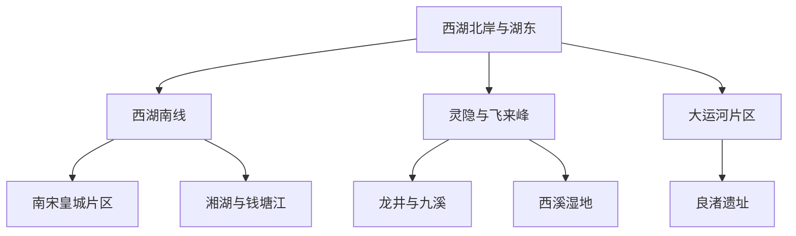
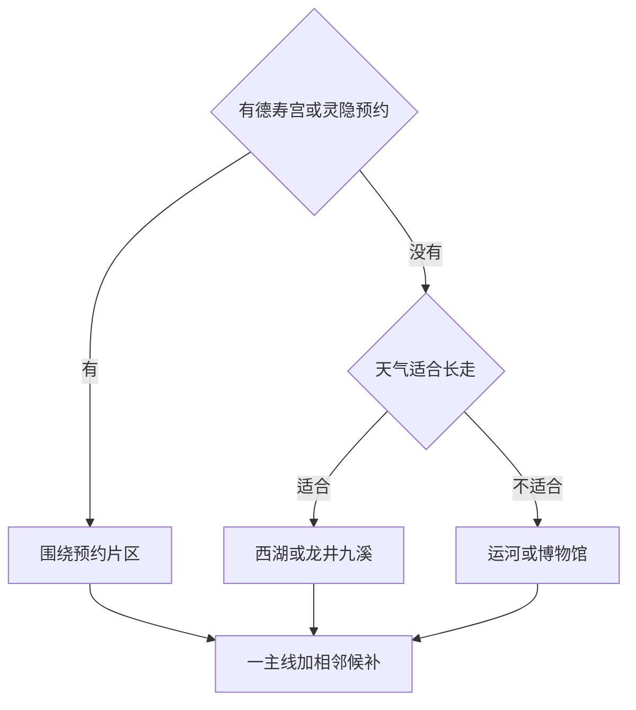

# 杭州市

> 一句话定位：杭州的核心不是沿湖拍一张照，而是从西湖的人文山水继续走进茶山、南宋城市、大运河和良渚，把“山水城市”看成几层叠合的历史。  
> 建议停留：首访 2–3 天；加入西溪、良渚或一条山林长走需 4–5 天。  
> 对用户的主要匹配：水系、湿润山林、可摄影长走、古今混合、路线内茶馆休息，匹配度高；热门湖岸与夏季闷热是主要摩擦。  
> 本页用途：先离线选择一个湖区主线和一个文化或远郊模块，出发前再核验场馆、游船、接驳和天气。

## 先判断杭州适不适合这次旅行

杭州很适合“慢启动、高巡航”：不必抢清晨第一班，选一段湖岸或山脚作为入口，正式出门后能连续走数小时，沿途不断有园林、寺院、博物馆、茶馆和城市出口。西湖并不是纯自然湖，而是堤、岛、塔、寺、园林与周围山体共同形成的文化景观；把它当成若干可走的片区，比逐个追“西湖十景”更接近真实体验。

不适合的玩法是同一天把西湖、灵隐、西溪、运河、良渚全部串上。它们在同一座城市，却不是同一条步行线。节假日的断桥、湖滨、灵隐和河坊街客流很大；盛夏湿热、雷雨和台风影响山路，春秋茶季和桂花季也会推高部分片区人流。

## 城市由哪些游览片区组成

看图时重点区分“环湖相邻”与“需要跨区交通”：湖东、湖北和湖南可连续走，湖西山林需要选入口；大运河、西溪和良渚分别是独立模块。

西湖北岸与湖东最容易接城市交通；南线景点更分散，但湖山层次更丰富。灵隐、龙井、九溪在地理上相邻，却涉及寺院、村道和山路，不应默认全串。拱宸桥大运河片区适合独立半日；良渚距核心城区较远，博物院和遗址公园还需要在内部继续移动。

## 主要景点

| 景点 | 片区 | 类型 | 为什么去 | 典型用时 | 室内外 | 预约/排队风险 | 清图层级 |
|---|---|---|---|---:|---|---|---|
| 西湖北岸与湖东步行段 | 孤山、白堤、断桥、湖滨 | 湖泊、人文景观 | 堤岛、城市界面与经典湖景最集中，适合第一次建立方位 | 3–5 小时 | 户外 | 很高：节假日和日落人流 | A |
| 西湖南线步行段 | 苏堤、花港、雷峰塔周边、柳浪闻莺 | 湖山、园林 | 湖面、山色、堤桥和南宋意象更完整 | 3–5 小时 | 户外为主 | 高：热门节点与观光车等候 | A |
| 灵隐寺与飞来峰造像 | 湖西 | 宗教、石刻、山林 | 寺院空间与石窟造像共同构成杭州人文山林核心 | 3–5 小时 | 混合 | 很高：分项票务、预约与节假日客流 | A |
| 清河坊—南宋御街 | 吴山、上城 | 历史街区 | 连接市井、小吃、药铺和南宋皇城叙事 | 2–3 小时 | 户外为主 | 高：商业段拥挤 | A |
| 南宋德寿宫遗址博物馆 | 上城 | 遗址博物馆 | 用考古展示理解南宋都城，而不只停在仿古街面 | 1.5–2.5 小时 | 室内 | 很高：预约名额与临展安排 | A |
| 拱宸桥与桥西历史街区 | 拱墅 | 运河、历史街区 | 看大运河城市生活、桥梁与工业手工艺遗存 | 3–5 小时 | 混合 | 中：各馆开放不同 | A |
| 浙江省博物馆孤山馆区 | 孤山 | 综合博物馆 | 在湖岸补浙江历史与艺术，不增加跨区成本 | 1.5–3 小时 | 室内 | 中：馆区调整与展览需复核 | B |
| 中国茶叶博物馆双峰馆区 | 龙井路 | 专题博物馆 | 从茶叶实物、茶史和山地环境理解杭州茶文化 | 2–3 小时 | 混合 | 中：馆区和活动预约需复核 | B |
| 龙井村与九溪十八涧 | 湖西南 | 茶山、溪谷、步道 | 把交通移动变成茶田、溪流与林荫摄影长走 | 3–5 小时 | 户外 | 高：雨后路况、茶季车流 | B |
| 中国丝绸博物馆 | 玉皇山南 | 专题博物馆 | 以服饰、织造和丝路补足江南物质文化 | 2–3 小时 | 室内 | 中：展览与休馆日 | B |
| 中国京杭大运河博物馆及手工艺馆群 | 桥西 | 博物馆群 | 与拱宸桥共同解释运河、工艺和城市生活 | 2–4 小时 | 室内 | 中：馆舍改造和开放差异 | B |
| 西溪国家湿地公园 | 城西 | 湿地、水乡 | 城市湿地、农耕水网和慢速游船构成不同于西湖的水景 | 半天 | 混合 | 高：分区票务、船班、蚊虫与天气 | B |
| 良渚博物院 | 余杭 | 考古博物馆 | 先通过玉器、聚落与水利系统建立遗址理解框架 | 2–3 小时 | 室内 | 高：预约与交通 | C |
| 良渚古城遗址公园 | 余杭 | 大遗址、考古景观 | 在真实尺度上理解城址、墓地和水利系统 | 半天–1 天 | 户外为主 | 很高：预约、内部接驳和极端天气 | C |
| 湘湖 | 萧山 | 湖泊、遗址、公园 | 比西湖更松弛的城市南部水岸，可结合跨湖桥文化 | 半天 | 户外为主 | 中：季节活动与接驳 | C |
| 千岛湖 | 淳安 | 湖泊、群岛 | 杭州行政范围内的大型度假目的地，需住宿或完整专项日 | 1–2 天 | 户外 | 很高：长途交通、船线与天气 | C |

父子计数规则：断桥、白堤、孤山和湖滨属于“西湖北岸与湖东步行段”的内部节点，不逐个计数；苏堤、花港、雷峰塔周边按“西湖南线”计一项，若实际购票进入独立场馆，可在旅行记录里另记参观，但不抬高首访分母。灵隐寺与飞来峰作为一次连续游览计一项。良渚博物院和遗址公园内容与位置不同，可各记一项，但两者都属于 C 级专项线。

## 代表性美食与适合片区

| 食物或体验 | 为什么有代表性 | 适合片区 | 独食友好 | 常见风险与替代逻辑 |
|---|---|---|---:|---|
| 片儿川 | 雪菜、笋片与肉片构成杭州日常面食代表 | 上城、武林、马塍路一带 | 很高 | 老店高峰排队时换社区面馆 |
| 葱包桧 | 油条与葱裹入面皮压烤，适合边走边吃 | 河坊街周边、社区小吃店 | 很高 | 景区摊位品质波动，只买一份试味 |
| 杭式小笼与生煎 | 日常面点，适合低决策成本正餐 | 上城、拱墅、居民区 | 很高 | 不必追单一网红店 |
| 东坡肉 | 杭帮菜标志性红烧肉，味型偏甜润 | 湖滨、吴山、传统杭帮菜馆 | 中 | 份量和油脂感较强，独行选小份 |
| 龙井虾仁 | 茶香与河鲜结合的经典杭帮菜表达 | 湖滨、龙井片区 | 中 | 旅游区价格差异大，先看明码标价 |
| 西湖醋鱼 | 名气高于稳定口碑，适合把它当一次味型体验 | 正规杭帮菜馆 | 低到中 | 独食份量大、品质差异明显；不必为清图硬吃 |
| 定胜糕、荷花酥、藕粉 | 适合少量补能的江南甜点 | 河坊街、南宋皇城、运河片区 | 很高 | 甜点容易重复，一路只选一种 |
| 龙井茶或径山茶体验 | 茶是杭州景观与生活方式的连接点 | 龙井、中国茶叶博物馆周边 | 高 | 景区推销和价格不透明；先确认茶类、克重和总价 |

独食建议：面馆、小笼和小吃负责效率，杭帮菜负责一顿有意识的升级餐。若独行，不需要同时点东坡肉、西湖醋鱼和龙井虾仁；选一道主菜配饭，再把余下菜留给以后同行。河坊街可用于认识品类，不等于必须在那里完成所有正餐。

## 怎样把景点串起来

杭州当天选线先看预约，再看山路与湖岸天气。这样不会因为一张“全景点地图”在西湖、西溪和良渚之间来回横跳。

良渚和千岛湖不进入这张当天换挡图：决定去它们时，本身就是独立专项日。

### 首次到访主线：从湖山走回城市

`孤山 → 白堤 → 断桥 → 湖滨 → 柳浪闻莺 → 清河坊或德寿宫`

这条线让西湖从山水逐渐过渡到南宋城市，正式走完约需半日以上。硬锚点只选德寿宫预约或湖边日落之一；如果中午才出发，可从湖滨反向走到孤山，清河坊改为夜间候补。体力下降时在断桥、龙翔桥或吴山附近退出，不为完整环湖硬走。

### 摄影长走线：茶山与溪谷

`中国茶叶博物馆双峰馆区 → 龙井村 → 九溪十八涧 → 九溪公交或钱塘江方向退出`

以茶博馆作为知识和休息锚点，后半段再进入茶田、溪谷和林荫。整段按选路约 7–10 公里，部分路面雨后湿滑；雷雨、暴雨、高温预警或天黑前余量不足时，只做茶博馆与龙井村，不下九溪。沿途商业茶室不是必停点，消费前先看价格。

### 运河慢游线：桥、街区与室内馆群

`拱宸桥 → 中国京杭大运河博物馆 → 桥西历史街区 → 手工艺馆群 → 运河边休息`

这条线节点紧凑，适合慢启动后连续刷馆，也适合作为阴天版本。桥与街区免费公共空间是底座；具体馆舍若闭馆，就删馆不删路线。夜间想继续时留在运河沿线，不再跨回西湖追同一晚的灯光。

### 雨天或高温线：南宋城市与博物馆

`德寿宫 → 杭州博物馆或中国财税博物馆 → 清河坊短走 → 中国丝绸博物馆`

前半段集中在吴山周边，雨势减弱时再走街区；丝绸博物馆需短程公共交通或打车，不必靠步行硬连。若德寿宫无预约，把杭州博物馆或浙江省博物馆设为主馆，西湖只留一小段雨后湖岸。

## 清图范围怎么定

### A 级：普通首访分母

- [ ] 西湖北岸与湖东步行段
- [ ] 西湖南线步行段
- [ ] 灵隐寺与飞来峰
- [ ] 清河坊—南宋御街
- [ ] 南宋德寿宫遗址博物馆
- [ ] 拱宸桥与桥西大运河片区

完成 5 项可视为首访高完成度。德寿宫若预约不到且已完成杭州博物馆，可按出发前冻结的规则替代；临时闭馆不计个人遗漏。西湖内部小景不逐一计分。

### B 级：按兴趣加开的模块

浙江省博物馆、中国茶叶博物馆、龙井—九溪、中国丝绸博物馆、大运河馆群、西溪湿地。用户偏好摄影长走时，龙井—九溪的优先级可升到 A；暴雨或高温时则直接降为候补。

### C 级：远郊或完整专项日

良渚博物院、良渚古城遗址公园、湘湖、千岛湖。良渚因历史价值进入城市必知清单，但因交通和园区尺度不进入普通 2–3 天首访分母；千岛湖更应视为独立目的地。

## 慢启动、高巡航怎么用在杭州

- 每天只选“西湖一个湖岸段＋一个室内或街区锚点”，不要用地图圆环诱导自己强行环湖。
- 预约馆尽量放在下午；上午只是酒店附近早餐、咖啡或可删的短湖岸。
- 湖边、茶馆和博物馆咖啡区适合路线内恢复。回酒店意味着重新跨城，除非晚间不再安排固定项目。
- 西湖、龙井—九溪是景观步行；西溪、良渚、运河之间是交通段，直接用地铁、公交或打车换片区。
- 春秋可扩展山路，盛夏优先早晚湖岸加白天室内馆；雷雨时不进入溪谷和林下长线。
- 一人食先吃面和小笼，杭帮菜只设一顿升级餐；排队超过上限就换同类，不让名店挤掉湖边光线。

## 出发前只复核这些

- [ ] 德寿宫、灵隐与飞来峰、浙江省博物馆各馆区、中国茶叶博物馆的预约和临时展陈；
- [ ] 西湖游船、观光车、环湖交通与大型活动期间的限流；
- [ ] 九溪、龙井、宝石山等山林步道在暴雨、雷电、台风和地质风险下是否开放；
- [ ] 西溪湿地的开放分区、船班、票务和蚊虫季防护；
- [ ] 良渚博物院与遗址公园是否分别预约、内部接驳和返程交通；
- [ ] 桂花、荷花、梅花、茶季等季节景观是否处于实际观赏期；
- [ ] 想去的面馆、茶馆和杭帮菜馆是否仍营业、是否搬迁或排号；
- [ ] 本页研究日期后的场馆改造和交通变化。

## 来源

- [杭州市文化广电旅游局“城市·漫步”](https://wgly.hangzhou.gov.cn/cw/cn/index.html)：核对杭州三大世界文化遗产、城市漫步主题及良渚、山林等片区关系；核验日期 2026-07-30。
- [杭州市文化广电旅游局文化旅游精品线路](https://wgly.hangzhou.gov.cn/module/download/downfile.jsp?classid=0&filename=c3ccb4250d3143a09047ee20fbe1170c.pdf)：参考西湖、西溪、径山、良渚等官方线路组合；核验日期 2026-07-30。
- [UNESCO：杭州西湖文化景观](https://whc.unesco.org/en/list/1334/)：支持西湖由湖面、堤岛、寺塔、园林和三面山体共同构成文化景观的定位；核验日期 2026-07-30。
- [UNESCO：良渚古城遗址](https://whc.unesco.org/en/list/1592/)：核对遗产组成、稻作文明、城市与水利系统价值；核验日期 2026-07-30。
- [良渚遗址管理区官方网站](https://www.lzsite.cn/)：用于良渚遗址内容与出发前参访复核入口；核验日期 2026-07-30。
- [浙江省博物馆官方网站](https://www.zjmuseum.com.cn/cn/)：用于馆区、展览及当前入馆政策复核；核验日期 2026-07-30。
- [中国茶叶博物馆官方网站](https://www.teamuseum.cn/)：核对茶文化专题馆定位，并作为馆区和活动复核入口；核验日期 2026-07-30。
- [杭州文旅城市手册](https://wgly.hangzhou.gov.cn/attach/538/2307051510367229.pdf)：支持片儿川、葱包烩及杭州面食等饮食背景；核验日期 2026-07-30。

本页不保存票价和每日营业时刻。湖区交通、场馆预约、山路安全和季节景观均以实际出发日前的官方公告为准。
