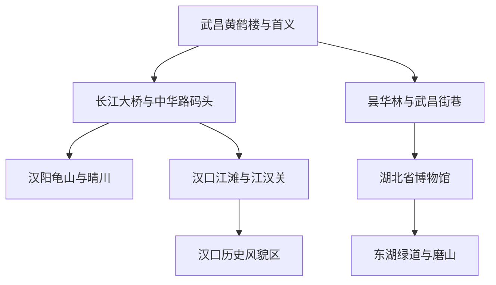
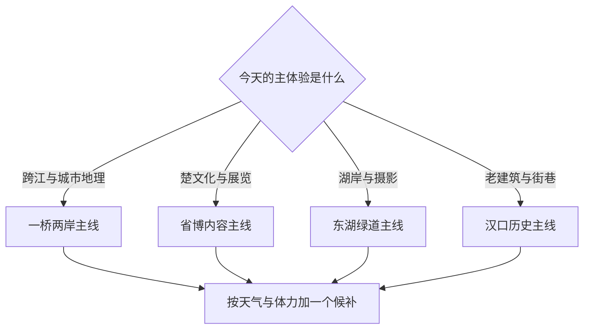

# 武汉市

> 一句话定位：武汉最值得沿长江、汉江和东湖理解——三镇不是一片连续街区，而是被水系、桥梁、轮渡、近代商埠与楚文化场馆连接起来的多中心城市。  
> 建议停留：首访 3–4 天；加入多个博物馆、完整东湖或远郊后 5–6 天。  
> 对用户的主要匹配：水系、城市史、博物馆、连续街区、美食和熟悉的大学生活记忆；主要摩擦是夏季湿热、跨江跨度及重油重碳饮食。  
> 本页用途：先离线选择“武昌古城、汉口商埠、汉阳知音、东湖楚文化”中的当天主轴，再临行核验预约、轮渡和天气。

## 先判断武汉适不适合这次旅行

武汉既不是只有黄鹤楼，也不是把热干面当景点就结束。它的核心体验是看长江与汉江怎样把武昌、汉口、汉阳分开，又怎样由桥、轮渡、江滩和城市生活重新连接。对用户来说，它还是有长期生活证据的城市：大学阶段在华中师大、街道口附近生活，对交通、美食和景色总体反馈正面；代价是当年的饮食环境明显推高了体重，说明“好吃”与“健康节律”需要同时规划。

最强体验：

- 黄鹤楼—长江大桥—轮渡—汉口江滩能一次读懂“一桥两山”和两江四岸；
- 湖北省博物馆是楚文化、曾侯乙和编钟体系的重磅内容馆；
- 东湖不是一个湖边拍照点，而是由听涛、磨山、落雁等片区和绿道组成的超大湖区；
- 汉口沿江的近代建筑、里份和街道适合连续摄影漫游；
- “过早”品类密度高，独行也能小份多样。

主要摩擦：

- 夏季高温高湿会把普通步行变成体力项目，暴雨和长江水位也可能让轮渡或滨水设施调整；
- 武昌、汉口、汉阳、东湖之间不能用“看起来在市中心”估算移动；
- 省博、东湖都容易单独占半天，二者加在同一主线时必须删减；
- 早餐与正餐都容易油、盐、碳水叠加，旅行几天也应主动安排清淡餐和蔬菜。

## 城市由哪些游览片区组成

看图时先抓住三条关系：武昌古城位于长江南岸；汉口商埠位于长江北岸；汉阳夹在长江与汉江之间。东湖在武昌以东，是另一套湖区尺度。

黄鹤楼、户部巷、中华路码头可在武昌一侧步行串联；过江后，武汉关—江汉路—中山大道—黎黄陂路—汉口江滩形成另一条连续走廊。湖北省博物馆靠近东湖听涛片区，但“地图上靠湖”不代表看完馆还能完整刷东湖；更合理的是省博加一段湖岸，或把东湖单开半天。汉阳的晴川阁、龟山、古琴台适合一桥两山主题，不应只为清图临时往返。

## 主要景点

表中用时为规划估算。省博暑期规则、编钟演出、轮渡航线与夜游均属于时变事实。

| 景点 | 片区 | 类型 | 为什么去 | 典型用时 | 室内外 / 天气 | 预约 / 排队 | 清图层级 |
|---|---|---|---|---:|---|---|---|
| 黄鹤楼公园 | 武昌蛇山 | 名楼 / 公园 / 观景 | 看长江大桥、蛇山与城市关系，也是诗歌地标 | 2–3 小时 | 混合；高温、暴雨敏感 | 目前取消实名预约；购票、夜游和临时开放另查 | A |
| 武汉长江大桥—中华路码头走廊 | 武昌江岸 | 桥梁 / 江景 / 城市步行 | 把桥上视角、江面尺度与轮渡接起来，移动本身就是主体验 | 1.5–2.5 小时 | 室外；风雨、暴晒敏感 | 步行不预约；轮渡航线和水位另查 | A |
| 湖北省博物馆 | 东湖西岸 | 省级综合博物馆 | 曾侯乙、楚文化与编钟体系是武汉最强内容馆之一 | 核心 3 小时；深看 4–5 小时 | 室内 | **强预约**；当前最多提前 5 天，分时入馆，编钟演出另购 / 另查 | A |
| 东湖绿道与听涛 / 磨山片区 | 武昌东部 | 城市湖泊 / 绿道 / 园林 | 湖岸、湿地、森林和楚文化景观组成可扩展的自然主线 | 半天至 1 天 | 室外；酷暑、雷雨敏感 | 开放空间为主；观光车、游船和园中项目另查 | A |
| 汉口历史风貌区 | 江岸—江汉 | 近代建筑 / 里份 / 街区 | 江汉关、中山大道、黎黄陂路和老建筑可连续理解商埠武汉 | 3–5 小时 | 混合 | 街区开放；单体场馆各自预约 | A |
| 汉口江滩—武汉关轮渡体验 | 汉口沿江 | 江滩 / 轮渡 / 夜景 | 从水面看两江四岸，是城市地理而非单纯交通 | 1.5–3 小时 | 室外；水位和天气敏感 | **航线强时变**；以“武汉两江轮渡”公告为准 | A |
| 辛亥革命博物院与首义片区 | 武昌首义 | 近代史博物馆 / 遗址 | 把武昌起义、红楼与首义广场放回近代城市史 | 2.5–4 小时 | 混合 | 免费实名预约；周一闭馆等规则复核 | B |
| 昙华林 | 武昌古城 | 历史街区 / 文创 | 与黄鹤楼主线相邻，适合看坡地街巷和城市更新 | 1–2 小时 | 混合 | 街区开放；店铺营业变化快 | B |
| 户部巷 | 黄鹤楼附近 | 小吃街 | 地理位置适合补给，但不代表武汉美食的全部 | 30–60 分钟 | 混合 | 节假日拥挤；不为单店长队 | B |
| 晴川阁—龟山 | 汉阳江岸 | 古建 / 山地 / 观景 | 与蛇山、长江大桥构成“一桥两山”的对岸视角 | 2–3 小时 | 混合 | 场馆开放、登山路径和活动另查 | B |
| 古琴台 / 月湖文化区 | 汉阳 | 历史文化 / 湖区 | 补足知音文化，适合与晴川线或琴台演出结合 | 1.5–3 小时 | 混合 | 场馆、演出和美术馆预约分别复核 | B |
| 湖北美术馆 | 东湖西岸 | 美术馆 | 与省博同片区，适合作为当期展览候补 | 1.5–2.5 小时 | 室内 | 预约、闭馆与展览更换快 | B |
| 武汉大学 | 珞珈山 | 校园 / 近代建筑 | 山地校园与樱花季著名，非花季也可做建筑主题 | 1.5–3 小时 | 室外为主 | **校园访问强时变**；樱花季预约、交通和人流严格 | B |
| 华中师大—街道口生活片区 | 洪山 | 校园记忆 / 城市日常 | 对用户是求学阶段回访，不是通用游客必去；可验证城市生活变化 | 2–4 小时 | 混合 | 校园入校规则临行核验 | 个人回访，不计通用清图 |
| 盘龙城遗址博物院 | 黄陂 | 考古遗址 / 博物馆 | 对早期城市与长江文明有兴趣时价值高，但距中心较远 | 半天至 1 天 | 混合 | 开放、预约与交通另查 | C |
| 木兰文化生态旅游区 | 黄陂远郊 | 山地 / 乡村 / 景区群 | 适合自然或家庭度假主题，不属于中心城区主线 | 1 天以上 | 室外为主 | 景区多、票务分散、季节性强 | C |

### 景区和路线怎样计数

- 黄鹤楼公园按 1 项；园内主楼、牌坊和亭台不重复计数。
- “武汉长江大桥—中华路码头”按 1 条武昌江岸走廊计；“汉口江滩—武汉关轮渡”按 1 条跨江体验计。若仅把轮渡当换乘且未游览江岸，不另计景点。
- 东湖首次按“完成一个明确片区＋一段绿道”计 1 项，不把听涛、磨山、落雁、每个驿站全部叠进同一分母。
- 汉口历史风貌区按街区模块计 1 项；江汉关若实际入馆可在深度清单另记。
- 华中师大—街道口是用户个人回访，不进入通用城市清图率。

## 代表性美食与一人食

| 食物或体验 | 为什么有代表性 | 适合在哪个片区吃 | 独食友好 | 常见风险与替代 |
|---|---|---|---:|---|
| 热干面 | 武汉“过早”的核心主食，芝麻酱与碱水面辨识度高 | 全城，优先居民区早餐店 | 高 | 必须趁热拌；热门店长队时换附近高周转小店 |
| 三鲜豆皮 | 糯米、蛋皮与肉丁组合，是官方“十大名点”之一 | 汉口、武昌早餐店 | 高 | 单份碳水与油脂已高，不再叠糯米包油条 |
| 面窝 / 鲜鱼糊汤粉 / 蛋酒 | 能组成比单一热干面更完整的过早样本 | 粮道街、山海关路及居民区 | 高 | 早市售完快；每次选 1–2 种，不为打卡全吃 |
| 重油烧卖 / 糯米包油条 | 武汉典型“碳水叠碳水”，体验性强 | 老早餐街区 | 高 | 用户有体重上升历史证据，只尝一种并配无糖饮品 |
| 排骨藕汤 | 武汉煨汤传统代表，适合在高步行日恢复 | 湖北菜馆、居民区餐厅 | 中高 | 砂锅份量可能大；问清小份或例汤 |
| 清蒸武昌鱼 / 淡水鱼鲜 | 体现本地水乡鱼菜传统 | 正规湖北菜馆 | 中低 | 独行整鱼份量大、刺多；选小份鱼菜或与同行共享 |
| 鲜肉汤包 | 汉口老字号小吃系统的重要组成 | 汉口历史区 | 高 | 汤汁烫；不必和豆皮、热干面同顿全点 |
| 鸭脖 / 卤味 | 城市零食与夜宵辨识度高 | 全城正规门店 | 高 | 钠和辣度高，只作少量加餐，不代替正餐 |
| 油焖小龙虾 | 季节性夜宵代表 | 雪松路等餐饮片区 | 中低 | 季节、价格、卫生与排队波动；独行选小份或跳过 |

对用户最合适的规则不是“少吃武汉菜”，而是避免连续多顿重油重碳：每次过早选一个主碳水，加蛋、牛肉或豆制品；午晚餐至少一顿选清蒸、煨汤、青菜和米饭可控组合。用户在武汉长期生活时曾增重二三十斤，这是个人健康证据，不是对武汉饮食的普遍评价。

## 怎样把景点串起来

先决定今天围绕江、湖、馆还是个人回访展开；轮渡和演出只在确认当日运营后才成为硬锚点。

### 首次到访主线：一桥两岸

`黄鹤楼 → 武昌江岸 / 户部巷补给 → 中华路码头 → 轮渡过江 → 武汉关 → 汉口江滩`

黄鹤楼是白天内容锚点，轮渡是运营硬锚点，汉口江滩可延伸到蓝调或夜景。2026 年武汉官方将黄鹤楼、斗级营、户部巷、轮渡和晴川一带整合为“一桥两山”核心线路，这条空间逻辑可靠；具体航线、上下船码头和末班不能提前永久写死。若轮渡停航，就用地铁过江，江滩体验仍保留。

### 汉口近代建筑摄影线

`江汉关 → 江汉路 → 中山大道 → 黎黄陂路及周边街巷 → 咖啡馆路线内休息 → 汉口江滩`

这是一条高匹配连续漫游线：建筑立面、里份入口、电车式街景和江岸可不断切换。下午至蓝调更适合摄影；炎热时把咖啡馆或开放场馆作为中段恢复，不回酒店。途中只进入明确对外开放的建筑，不把居民里份当布景私闯。

### 湖北省博物馆与东湖短线

`湖北省博物馆 → 馆内或附近休息 → 东湖听涛片区短走 → 湖边日落候补`

省博预约是唯一硬锚点。用户内容吞吐较高，可准备“镇馆重点＋楚文化核心版”和“全馆版”；如果实际看满 4–5 小时，只走听涛附近湖岸，不再去磨山。编钟演出有单独场次和票务，想看就设提醒，不能边看展边临时决定。

### 东湖完整绿道线

`听涛或湖中道入口 → 一段明确绿道 → 湖岸休息 → 磨山或落雁二选一 → 原方向退出`

东湖绿道把听涛、磨山、落雁等片区串联，但全量远超普通城市散步。先选一个入口和一个终点，骑行、步行、观光车只选适合当日体力的组合。夏季避开正午连续暴晒；雷雨前不进入远离出口的湖心或林地段。

### 雨天或高温线

`湖北省博物馆或辛亥革命博物院 → 室内午餐 → 湖北美术馆 / 琴台场馆候补 → 提前回撤`

省博与湖北美术馆相邻度较好，但省博若深看就不强加美术馆。辛亥革命博物院更适合与首义片区结合。武汉暴雨可能同时影响地面交通与滨江路线，雨天不把“坐轮渡看看”当可靠兜底。

### 用户回访线：求学生活而非通用景点

`华中师大周边 → 街道口 → 熟悉的过早或正餐 → 视体力接东湖或珞珈山外围`

这条线的价值是校准记忆：交通是否仍方便、饮食和街区怎样变化、当年的生活正反馈是否仍成立。校园是否允许社会访客进入必须复核。它不进入城市通用清图分母，也不把个人怀旧写成景区价值。

## 清图范围怎么定

### 首访城市核心分母

- A 级共 6 项：黄鹤楼、长江大桥—中华路码头走廊、湖北省博物馆、东湖一个完整片区、汉口历史风貌区、汉口江滩—武汉关轮渡体验。
- B 级为相邻补充：辛亥革命博物院、昙华林、户部巷、晴川阁—龟山、古琴台、湖北美术馆、武汉大学。
- C 级另开分母：盘龙城、木兰文化生态旅游区及黄陂、江夏等远郊主题。
- 个人回访：华中师大—街道口单列，不与首次游客清图率混算。
- 不计入：地铁换乘、普通商场、餐厅、酒店和仅用于过江的交通节点。

两江四岸不是四个需要分别打卡的“景点”。完成一次有观察内容的跨江路线、一次汉口历史区和一次东湖片区，已经能建立城市地理框架；之后再按主题扩大分母。

## 对用户旅行方式的适配

- **慢启动**：省博预约、编钟演出或樱花季校园是少数需要按票时启动的日子；普通城市线可中午开始，把蓝调作为唯一晚间锚点。
- **高巡航**：武昌与汉口各准备 2 个同岸候补。过江之后就在另一岸继续，不为多刷一个点反复跨江。
- **路线内休息**：汉口历史区用咖啡馆，东湖用湖岸驿站，武昌用场馆休息区。夏季恢复节点是防中暑设计，不是“浪费时间”。
- **摄影**：优先桥上 / 江面关系、汉口建筑立面、江滩蓝调和东湖水岸；高温雾霾或暴雨时改拍室内展陈与街区细节。
- **独行餐饮**：过早天然独食友好，但一次只选 1–2 个主食；正餐用小份湖北菜、例汤或熟悉的稳定店，不在热门早餐街四处排队。
- **健康节律**：把“早餐之都”当多日抽样，不当一顿全清。连续高碳水后下一餐主动选蔬菜、蛋白质和清淡汤水。
- **最后一天**：只在酒店同岸留一个主景点和零等待餐饮；不把轮渡、热门过早、跨江取行李和赶站同时绑定。

## 出发前只复核这些

- [ ] 湖北省博物馆最新放票日、放票时刻、预约时段、暑期延时和编钟演出票；
- [ ] 黄鹤楼白天购票、夜游演出、临时闭园与公园出入口；
- [ ] 武汉轮渡当前航线、上下船码头、班次、末班、票价及水位 / 天气停航；
- [ ] 东湖绿道开放、观光车、游船、共享骑行和雷雨高温预警；
- [ ] 辛亥革命博物院、湖北美术馆及大学校园的预约、闭馆和入校规则；
- [ ] 两江四岸灯光、演出和季节活动是否当天举行；
- [ ] 目标早餐店售罄时间、热门餐厅排队和附近替代；
- [ ] 暴雨、台风影响、高温、长江水位及滨江临时封闭；
- [ ] 本页 2026-07-30 之后的重大变化。

## 来源

- [武汉市人民政府：武汉旅游](https://www.wuhan.gov.cn/zjwh/whly/index_1.shtml) — 核验 2026 年城市文旅动态、东湖、黄鹤楼与两江活动入口；核验日期：2026-07-30。
- [武汉市人民政府：“一桥两山”旅游核心区](https://www.wuhan.gov.cn/zjwh/whly/202602/t20260204_2724612.shtml) — 支持黄鹤楼、斗级营、户部巷、轮渡和晴川的空间串联；核验日期：2026-07-30。
- [黄鹤楼公园官网](https://www.hhlgysl.com/) — 用于临行复核公园票务、开放和公告；核验日期：2026-07-30。
- [武汉市人民政府：黄鹤楼取消实名预约](https://3g.wuhan.gov.cn/sy/whyw/202407/t20240711_2427365.shtml) — 支持当前无实名预约的制度背景；购票与临时规则仍需临行复核；核验日期：2026-07-30。
- [湖北省博物馆服务页](https://hbww.org.cn/fuwu/index.html) — 核验实名分时预约、当前最多提前 5 天、暑期安排、入口与编钟演出信息；核验日期：2026-07-30。
- [武汉市人民政府：东湖绿道](https://www.wuhan.gov.cn/zjwh/whly/202211/t20221102_2080090.shtml) — 支持绿道串联听涛、磨山、落雁等片区；核验日期：2026-07-30。
- [辛亥革命博物院参观须知](https://1911museum.cn/list_37.html) — 核验场馆服务、讲解及入馆注意事项；预约与开放日临行再核；核验日期：2026-07-30。
- [武汉市交通运输局：轮渡运营公告入口](https://jtj.wuhan.gov.cn/jtzx/gjxldz/202306/t20230614_2216005_slhxq.shtml) — 证明航线会因码头施工临时调整；不把旧时刻写成永久事实；核验日期：2026-07-30。
- [武汉市商务局：2024 武汉十大名菜、十大名点](https://sw.wuhan.gov.cn/xwdt/mtbd/202404/t20240429_2395535.shtml) — 支持热干面、豆皮、面窝、汤包、排骨藕汤、武昌鱼等代表性饮食；核验日期：2026-07-30。
- [武汉市文化和旅游局：武汉美食旅游](https://wlj.wuhan.gov.cn/zwgk_27/zwdt/jdxw/202309/t20230918_2265930.shtml) — 支持过早、湖北菜和主要美食街区的城市饮食结构；核验日期：2026-07-30。
- [[个人画像体系/旅行与城市偏好画像/旅行与城市偏好画像|旅行与城市偏好画像]] — 支持用户在华中师大、街道口生活的正反馈和饮食增重证据，以及慢启动、高巡航、独行与路线内休息偏好；非官方事实。

