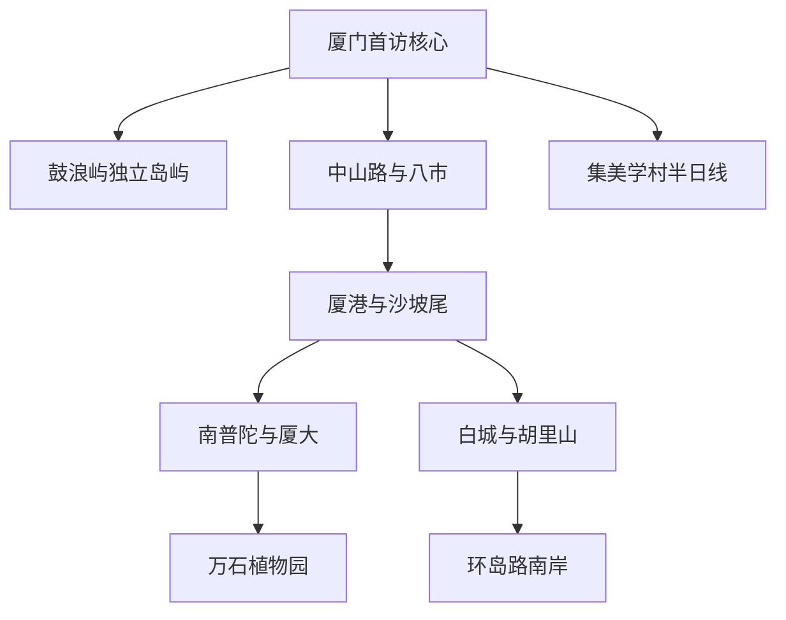
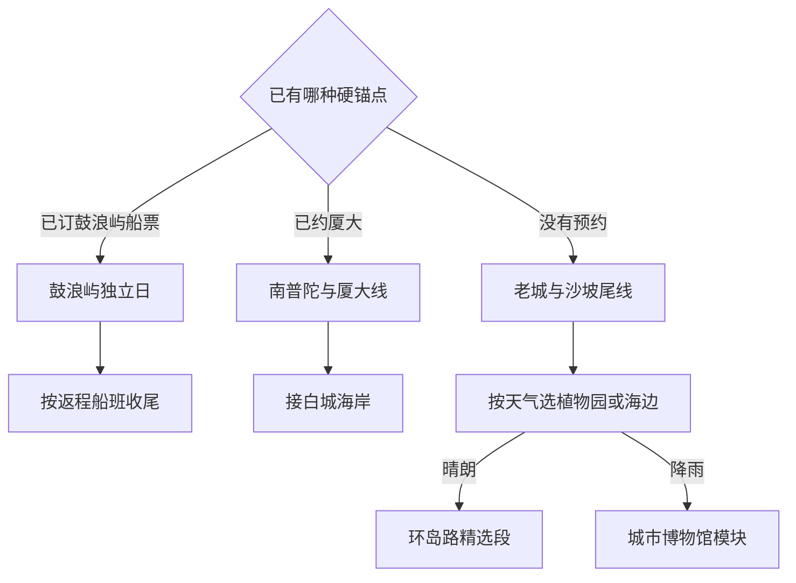

# 厦门市

> 一句话定位：厦门是一座“海岛世界遗产＋闽南老城烟火＋山海步行＋现代滨海生活”能在几天内自然切换的复合型目的地。  
> 建议停留：首访 **3 天**；加入集美、岛外或慢节奏重游 **4–5 天**。  
> 对用户的主要匹配：海边、湿润明亮、古城与近代建筑、连续步行、摄影、独行和路线内休息均为高匹配；你已有明确正反馈。  
> 本页用途：以后先离线选“鼓浪屿、岛内老城、南岸海边或集美”模块；只对轮渡、预约、开放、票价、台风和潮汐做出发前复核。

## 先判断厦门适不适合这次旅行

厦门的优势不是某一处海滩，而是不同体验之间转换成本低：上午看闽南寺院或博物馆，下午从沙坡尾走向海边，晚上回中山路与八市吃小吃；另用一天把鼓浪屿当完整历史社区，而不是几个收费景点的集合。这正好符合你对复合型目的地、海边和自由漫游的偏好。

| 你这次最在意什么 | 厦门的匹配 | 需要接受的代价 |
|---|---|---|
| 海边与长距离步行 | 很高；环岛路、演武大桥周边和鼓浪屿海岸都有连续景观 | 盛夏遮阴不连续，海风不能抵消高温与紫外线 |
| 古城、建筑与博物馆 | 高；鼓浪屿、中山路、厦港、集美分别代表不同历史层 | 热门街区商业化明显，需主动离开主商业动线 |
| 松弛独旅 | 很高；小吃、咖啡、公共交通和短距离打车都方便 | 鼓浪屿船票是少数必须提前固定的硬锚点 |
| 摄影与随机发现 | 很高；海面、骑楼、坡地、植物和校园建筑变化丰富 | 鼓浪屿与沙坡尾热门机位在节假日拥挤 |
| 高完成率 | 高；岛内可拆成相邻模块 | “厦门全市”包含广阔岛外区域，不能用岛内清图冒充全市完成 |

明显短板是节假日客流、夏秋台风与高湿高温，以及部分街区被同质化餐饮和旅拍占据。若只剩一天且没有鼓浪屿船票，不必临时高价补票；完成中山路—八市、沙坡尾—南普陀和一段海岸，仍能得到完整的厦门样本。

## 城市由哪些游览片区组成

厦门首访可分为一个独立岛屿、三段相邻的岛内走廊，以及一个跨海半日模块。先认清关系，就不会在海边与老城之间反复打车。

- **鼓浪屿**：必须乘船，至少半天，最好按独立日处理。白天游客出发码头与夜间航线可能不同，不能凭“中山路对面就是轮渡”直接推断。
- **老城到厦港**：中山路、八市、鹭江道、华新路部分老街与沙坡尾可以拼成城市步行，但不必逐条支巷全走。
- **南普陀—厦大—海岸**：南普陀与厦大相邻，继续向南可到演武大桥观景区、白城和胡里山炮台。厦大能否进入取决于预约，不应卡住整条路线。
- **植物园**：西门靠近岛内核心，适合与南普陀分成前后半日；从南门进可借山势与环岛路衔接，但园内距离、扶梯和景交车状态需临时确认。
- **集美**：跨出厦门岛后另成一组，龙舟池、集美学村、鳌园与陈嘉庚纪念内容可连续走，不和鼓浪屿同日硬拼。

## 主要景点

| 景点或游览单元 | 片区 | 类型 | 为什么去 | 典型用时 | 室内外 | 预约/排队 | 清图层级 |
|---|---|---|---|---:|---|---|---|
| 鼓浪屿历史国际社区 | 鼓浪屿 | 世界遗产、近代建筑、海岛社区 | 中外文化交汇、坡地街巷、音乐传统与海岸共同构成厦门最强名片 | 5–8 小时 | 室内外混合 | 游客船票实名限量，节假日需提前；航线受天气影响 | A |
| 日光岩 | 鼓浪屿 | 登高、岩石、观景 | 俯瞰岛屿空间，适合建立全岛方向感 | 1–1.5 小时 | 室外 | 收费与限流时变；热门时段顶部拥挤 | B，鼓浪屿子点 |
| 菽庄花园与钢琴博物馆 | 鼓浪屿 | 园林、海景、音乐 | 藏海园林与岛屿音乐史结合 | 1.5–2 小时 | 室内外混合 | 收费与展馆开放需复核 | B，鼓浪屿子点 |
| 八卦楼与风琴相关展馆 | 鼓浪屿 | 建筑、音乐博物馆 | 建筑辨识度高，补足“音乐之岛”而非只逛商业街 | 1–1.5 小时 | 室内为主 | 场馆开放、展陈与票务可能调整 | B，鼓浪屿子点 |
| 中山路—八市—鹭江老城单元 | 思明老城 | 骑楼、市场、食物、港口城市 | 一次覆盖闽南骑楼、老城生活与厦门小吃 | 2.5–4 小时 | 室外为主 | 街区免预约；市场营业与商户更替快 | A |
| 沙坡尾避风坞—厦港街区 | 厦港 | 港口遗存、街区、文创 | 看渔港记忆与当代青年空间叠加，适合摄影和休息 | 1.5–3 小时 | 室外为主 | 商业活动时变；不把艺术西区每家店计数 | A |
| 南普陀寺 | 五老峰下 | 佛寺、闽南文化 | 寺院、素食与山海城市关系明确，停留可长可短 | 1–1.5 小时 | 室内外混合 | 宗教活动、礼佛与入寺规则需尊重官方公告 | A |
| 厦门大学思明校区 | 五老峰、白城 | 校园、建筑 | 嘉庚建筑与山海校园有代表性，但学校首先是教学科研场所 | 1.5–2.5 小时 | 室内外混合 | 当前仅官方渠道预约、分时限额，不接受现场预约 | B，条件项 |
| 厦门园林植物园 | 万石山 | 植物园、山地、摄影 | 雨林世界、多肉植物区与万石山地形兼具内容和出片率 | 2–4 小时 | 以室外为主 | 可现场或官方小程序购票；雾森、景交车和临闭信息另查 | A |
| 胡里山炮台 | 白城 | 海防遗址、炮台 | 把厦门港口位置与近代海防史落到实体空间 | 1.5–2 小时 | 室内外混合 | 票务、表演或活动时刻属于时变信息 | B |
| 白城—环岛路精选海岸段 | 厦门岛南岸 | 海滨步道、骑行、摄影 | 海、沙滩、桥与城市山体连续出现，移动本身有价值 | 2–5 小时 | 室外 | 无需预约；骑行、潮汐、暴晒和台风需复核 | A |
| 曾厝垵 | 环岛路 | 原渔村、商业街区 | 适合补给和观察旅游商业，不是不可替代的古村核心 | 1–1.5 小时 | 室外为主 | 节假日拥挤；不把小吃店逐家计入清图 | B |
| 厦门山海健康步道精选段 | 岛内山地 | 城市步道、观景 | 从山地角度看岛城与海湾，适合重游和连续步行 | 2–4 小时 | 室外 | 入口多、路线长；雷雨和高温不走暴露段 | B |
| 华侨博物院 | 厦港附近 | 华侨史、综合博物馆 | 理解厦门与东南亚、华侨和近代城市发展的关系 | 1.5–2.5 小时 | 室内 | 闭馆日、临展与入馆规则复核 | B |
| 厦门市博物馆主馆 | 文化艺术中心 | 城市史、闽台文化 | 雨天快速建立厦门历史与民俗框架 | 2–3 小时 | 室内 | 常设展免费；当前开放与预约公告另查 | B |
| 集美学村—龙舟池—鳌园单元 | 集美 | 历史街区、嘉庚建筑、滨水 | “山—城—水”格局、教育与华侨文化区别于岛内 | 4–6 小时 | 室内外混合 | 纪念场馆闭馆日、校园边界和活动需复核 | C |
| 五缘湾湿地与湾区公园 | 岛内东北 | 湿地、城市休闲 | 适合重游、观鸟或想看厦门日常公共空间时加入 | 2–4 小时 | 室外 | 季节、观鸟保护与活动规则时变 | C |

父子计数规则：鼓浪屿本身是 A 级父项，日光岩、菽庄花园、八卦楼等用于记录岛内完成度，不与鼓浪屿重复抬高城市分母；中山路、八市和鹭江老城合为一项；白城至环岛路按本次选定的一段计一项，不按每个沙滩或驿站拆分。

## 代表性美食与独食策略

厦门小吃很适合独旅，但热门街区容易把“闽南小吃”变成同质化摊位。优先确认食物本身是否现做、周转快、价格清楚；一家队长就换同品类的社区店，不需要把店名当景点。

| 食物或体验 | 为什么有代表性 | 适合在哪个片区吃 | 独食友好 | 常见风险与替代 |
|---|---|---|---:|---|
| 沙茶面 | 东南亚香料经华侨社会本地化，是厦门最稳定的一人主食 | 八市外围、老城、社区店 | 高 | 配料多容易超量；先选 2–3 种，不追求豪华全加 |
| 海蛎煎 | 海蛎、地瓜粉与鸡蛋构成典型闽南海味 | 八市、老城 | 高 | 油量较高，可与清淡汤品错开 |
| 土笋冻 | 海洋食材与凝冻技法辨识度很高，已列入厦门闽南文化保护名录 | 老城、海沧来源店 | 高 | 先确认原料与卫生；不接受口感就不为清单硬吃 |
| 烧肉粽 | 糯米、五花肉、香菇等形成饱腹型小吃 | 中山路外围、老城 | 高 | 碳水与油脂都高，可直接当一餐 |
| 五香卷 | 豆皮包肉馅油炸，是闽南常见小吃 | 八市、老城 | 高 | 适合小份共享；独食时与其他炸物二选一 |
| 花生汤 | 厦门传统甜汤，适合作为路线内短休 | 中山路、老城 | 高 | 甜度高，搭配咸食而非再叠甜点 |
| 面线糊 | 早餐或夜间补给灵活，配料可控 | 老城居民区 | 高 | 热门早餐时段排队，附近店可替代 |
| 姜母鸭 | 姜、麻油和鸭肉香气强，是更完整的闽南正餐 | 思明、湖里 | 中 | 常按半只或整只卖，独行先问小份 |
| 厦门薄饼 | 蔬菜、肉与薄饼组合，体现节令和家庭饮食 | 老城、同安 | 高 | 并非所有店日常供应，看到可靠现做再吃 |
| 酱油水海鲜 | 用较简单做法突出鲜味，适合认识本地海产 | 厦港、社区海鲜排档 | 中 | 先问时价、重量和做法；一人选 1 种鱼或小份贝类 |
| 馅饼与南普陀素饼 | 华侨、寺院与城市伴手礼文化的一部分 | 鼓浪屿、南普陀 | 高 | 属伴手礼，不用为品牌门店长排队 |

独食默认组合可以是：`沙茶面一碗＋土笋冻小份`、`烧肉粽＋花生汤`、`面线糊＋五香卷`。海鲜不是必须通过大排档大桌完成；选一道酱油水鱼或一份海鲜主食，反而更可控。

## 怎样把景点串起来

厦门只有两个常见硬约束：鼓浪屿去程船班与厦大访客预约。先看它们是否成立，再选岛内模块。

没有预约不等于没有行程。老城、沙坡尾、海岸和植物园足以组成完整一天；不要在现场反复刷新厦大或鼓浪屿名额，吞掉已经可用的时间。

### 首次到访主线：一座岛加一条岛内走廊

**鼓浪屿独立模块**：`上岛码头 → 内部生活街巷 → 八卦楼或其他音乐场馆 → 日光岩或菽庄花园择重点 → 海岸 → 按船班离岛`

- 第一次至少选一个登高点和一个室内文化点，不用把五大收费景点全部刷完。
- 龙头路只解决补给，不让商业街占据岛上大部分时间；建筑与社区价值主要在支路。
- 返程通常比去程自由，但仍应在上岛前看清当前有效码头、末班与天气公告。

**岛内老城到海边模块**：`八市与中山路 → 鹭江或老城支巷 → 沙坡尾 → 南普陀 → 厦大条件项 → 演武大桥观景区或白城`

- 若中午启动，先吃老城小吃，再把南普陀或华侨博物院设为唯一闭馆锚点。
- 厦大预约成功就进入校园；没有预约从南普陀直接去演武大桥与白城，不在门口等。
- 体力好可继续胡里山炮台或环岛路，体力下降就在沙坡尾、白城结束。

### 摄影连续步行线：从渔港走到海岸

`沙坡尾避风坞 → 演武大桥观景区 → 厦大白城 → 胡里山炮台外沿 → 珍珠湾或曾厝垵外海岸`

- 约 6–10 公里，按终点决定距离。渔港、桥、高楼、沙滩和海岸植被连续变化，适合把移动过程作为主体验。
- 下午后段至蓝调更友好；盛夏正午不要从沙坡尾硬走全线。
- 白城、胡里山和曾厝垵附近均可退出。曾厝垵只是补给点，不必深入拥挤商业巷才算完成。
- 海边日落受云量影响，把它设为奖励项；真正在意时设置离开上一站的最晚时间。

### 雨天或高温线：用城市史替代海岛奔波

`厦门市博物馆主馆 → 同一文化艺术中心内当前开放场馆择一 → 商场或书店休息 → 雨势减弱后五缘湾或中山路短走`

另一条更靠老城的备选是 `华侨博物院 → 南普陀短停 → 沙坡尾室内休息`。持续雷暴、强风或轮渡停航时，不把鼓浪屿当雨天项目；阵雨和小雨也应先确认船班再出发。

### 集美半日线：看另一种厦门

`集美学村建筑群 → 龙舟池 → 鳌园与嘉庚公园 → 陈嘉庚纪念内容择一`

这条线的重点是华侨兴学、嘉庚建筑和“山—城—水”格局，不是多看一个商业古镇。它至少需要半天，适合第四天、返程前或已经去过岛内核心后的重游。

## 清图范围怎么定

### 首访 A 级分母：6 项

1. 鼓浪屿历史国际社区；
2. 中山路—八市—鹭江老城单元；
3. 沙坡尾—厦港单元；
4. 南普陀寺；
5. 厦门园林植物园；
6. 白城—环岛路本次选定的连续海岸段。

3 天首访完成其中 **5 项**，且鼓浪屿、老城和海岸三类都有覆盖，即可视为核心框架完成。因风浪导致轮渡停航时，鼓浪屿从本次分母剔除，不用拿商业海上项目替代。

### B 级与 C 级怎样处理

- **B 级**：厦大思明校区、胡里山炮台、华侨博物院、厦门市博物馆、山海健康步道、曾厝垵，以及鼓浪屿内部收费子点。按预约、天气和兴趣加入。
- **C 级**：集美学村、五缘湾湿地、园博苑、同安旧城、天竺山、翔安与环东海域等岛外线。只有本次明确选择才进分母。
- **不计入**：码头、轮渡本身、普通商业街店铺、网红咖啡馆、公交换乘点和沙滩上的单个拍照装置。
- **父子边界**：不能既把鼓浪屿算一项，又把每个付费景点都算城市 A 级；内部完成度只用于下次重游决策。

## 对你的旅行方式怎样适配

- **慢启动**：除鼓浪屿船班外，厦门大多数模块可从中午开始。把鼓浪屿安排在真正愿意早起的一天，其他日子让老城午饭自然启动。
- **高巡航**：沙坡尾后准备南普陀、华侨博物院、演武大桥、白城四个相邻候补；根据开放和体力向前开，不把它们写成必须全部完成的课表。
- **路线内休息**：沙坡尾咖啡馆、植物园游客区、海边坐点与中山路甜汤都可恢复。海边线中途回酒店通常会损失最好的傍晚光线。
- **单人旅行**：沙茶面、肉粽、面线糊、海蛎煎和甜汤都天然适合独食；大份姜母鸭和海鲜排档要先确认小份。
- **摄影**：鼓浪屿拍建筑与坡地，沙坡尾拍港口新旧，环岛路拍海岸，集美拍嘉庚建筑与水面。日落与雾森都属于时间敏感内容，需要单独闹钟，而非笼统写“下午去”。
- **舒适底盘**：住宿优先思明区、靠近地铁或主公交走廊，同时避开酒吧与夜市正上方。你对睡眠敏感，不必为“住在景区里”牺牲隔音。

## 出发前只复核这些

- [ ] 鼓浪屿游客船票的唯一官方渠道、去程码头、航班、证件、返程规则与天气停航；
- [ ] 鼓浪屿日光岩、菽庄花园、八卦楼等场馆的当前票务、开放和临时维修；
- [ ] 厦大思明校区是否开放访客预约、放号时间、入校口与允许参观范围；
- [ ] 植物园开放入口、雾森时段、观光车、临时闭馆与高温提示；
- [ ] 台风、强对流、暴雨、海浪、潮汐和海岸步道封闭；
- [ ] 厦门市博物馆、华侨博物院及集美场馆的闭馆日和预约；
- [ ] 具体餐厅是否仍营业，海鲜价格与重量是否清楚；
- [ ] 本页 2026-07-30 核验之后的重大变化。

## 来源

- [厦门市鼓浪屿—万石山风景名胜区管理委员会](https://gly.xm.gov.cn/)：核验鼓浪屿历史国际社区定位、官方公告与文化遗产信息入口，2026-07-30。
- [鼓浪屿景区官方导览](https://www.glyylq.cn/survey.php)：核验日光岩、菽庄花园、八卦楼等国有核心景点构成，2026-07-30。
- [鼓浪屿历史文化街区保护规划](https://zygh.xm.gov.cn/zwgk/zdxxgk/ghcg/zxgh/202108/t20210813_2574300.htm)：核验历史国际社区、建筑、海岸与景观视廊的整体价值，2026-07-30。
- [厦门轮渡有限公司购票须知](https://xmferry.com/wybm/wshlk/wlgpp/index.htm)与[官方票价调整通告](https://www.xmferry.com/xwzx/zxgg/30544.htm)：核验官方购票渠道、往返凭证和航线需动态查询，2026-07-30。
- [厦门大学思明校区预约参观指南](https://baowei.xmu.edu.cn/info/1003/1005.htm)：核验唯一官方预约渠道、分时限额和不接受现场预约，2026-07-30。
- [厦门园林植物园景区简介](https://www.xiamenbg.com/Home/yyzn)、[官方精华线路](https://www.xiamenbg.com/Home/chIndex)与[出游贴士](https://www.xiamenbg.com/Home/newsDetail?newsId=8763&typeId=0)：核验专类园、典型用时、入口差异与购票方式，2026-07-30。
- [厦门市政府：旅游业高质量发展意见](https://www.xm.gov.cn/zwgk/flfg/sfwj/202109/t20210901_2580031.htm)：核验鼓浪屿、中山路、沙坡尾、环岛路、集美、胡里山等城市旅游结构，2026-07-30。
- [厦门市自然资源和规划局：集美学村保护规划](https://zygh.xm.gov.cn/zwgk/zdxxgk/ghcg/zxgh/202110/t20211019_2592438.htm)：核验“山—城—水”格局、嘉庚建筑与龙舟池周边遗产，2026-07-30。
- [厦门市博物馆官网](https://www.xmmuseum.com/)：核验主馆与官方参观公告入口，2026-07-30。
- [厦门市政府：沙茶面](https://www.xm.gov.cn/english/services/citytour/delicacies/202111/t20211108_2596761.html)与[厦门市文旅局：闽南文化保护名录](https://wlj.xm.gov.cn/zwgk/91301/202212/t20221212_2709066.htm)：核验沙茶面、土笋冻、薄饼、馅饼与素饼等饮食文化，2026-07-30。

