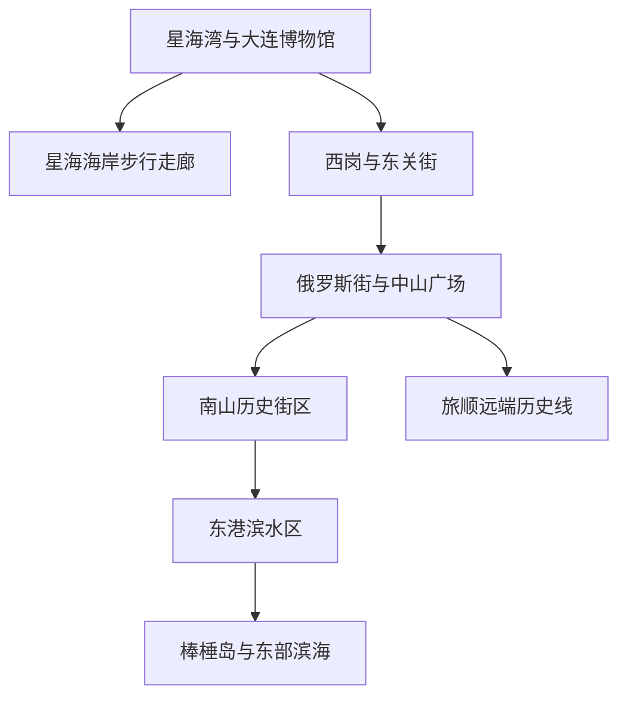
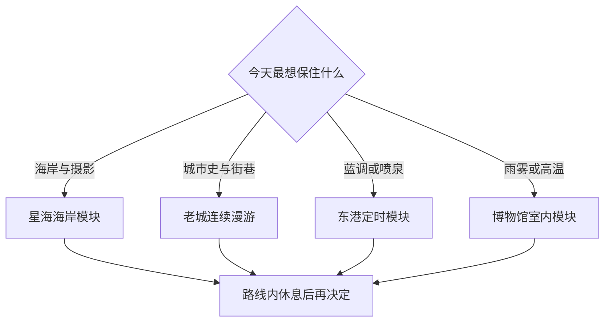

# 大连市

> 一句话定位：把海岸、近代港城、成片老建筑和东北生活方式放进同一趟城市旅行里，大连最有价值的不是孤立打卡，而是沿海与街区之间的连续移动。  
> 建议停留：首访 3–4 天；加入旅顺、金石滩等远端模块时 5–6 天。  
> 对用户的主要匹配：海边与水系、可摄影的长距离步行、近代城市史、街区漫游、独行友好、路线内休息。  
> 本页用途：先离线完成片区选择和路线拼装；开放时间、喷泉、洗浴及餐厅排号等只在出发前复核。

## 先判断大连适不适合这次旅行

大连对用户的旅行适配度已经由一次三日独旅实际验证。最强组合不是“去海边看看”，而是“上午慢启动，出门后把博物馆、海岸摄影、老建筑街区和一项本地生活体验连续串起来”。星海广场到星海湾大桥观景方向的沿海步行、东关街至中山广场再到南山一带的城市探索，都说明移动过程本身可以成为主景点。

主要优点：

- 海岸视野、桥梁、坡地和近代建筑同时提供摄影题材；
- 大连博物馆与老城街区能互相解释，适合“先建立城市史框架，再看街景”的读法；
- 日料、海鲜饺子、焖子等可找到一人份或小份，独食不必自动退回连锁快餐；
- 咖啡馆、海边坐点和东北洗浴都可成为路线内恢复节点。

主要摩擦：

- 星海、老城、东港和东部滨海并不在一个紧凑步行圈，错误加项会把时间耗在跨区移动上；
- 海边风、雾、暴晒和降雨会直接改变摄影价值；
- 喷泉、蓝调、演出和部分夜间商户有明确时钟，不能用上海或华南的夜生活经验推断；
- 热门餐厅若没有提前取号，可能吞掉 2–3 小时，最后一天尤其危险。

若只想在室内购物、完全不愿步行，或冬季又无法接受海风，大连的优势会明显折损。反过来，只要愿意把一段海岸或历史街区当作“景观走廊”，它会比点到点打车更有回报。

## 城市由哪些游览片区组成

先看各片区的实际关系：星海是西南侧海岸底盘；中山—西岗承载老城历史；南山把老建筑与咖啡休息连起来；东港是现代滨水夜景；更东和更南的滨海点需要另开模块。

星海广场、大连博物馆和星海湾海岸可组成一个连续模块。东关街—俄罗斯风情街—中山广场—南山可以做成老城主线，但中间并非每段都值得硬走，体力或光线不合适时用一段地铁、公交或网约车接驳。东港适合把蓝调、喷泉或夜景设为硬锚点；棒棰岛、海之韵、旅顺和金石滩均不应临时塞进市中心路线。

## 主要景点

表中用时是路线规划估算，不是场馆承诺；“预约／排队”会变化，出发前仍要看官方公告。

| 景点 | 片区 | 类型 | 为什么去 | 典型用时 | 室内外 / 天气 | 预约 / 排队 | 清图层级 |
|---|---|---|---|---:|---|---|---|
| 大连博物馆 | 星海 | 城市史博物馆 | 《近代大连》帮助理解港口、租借史与街区建筑，是后续漫游的说明书 | 核心 1.5–2 小时；全馆 2.5–3.5 小时 | 室内 | 免费政策、证件、暑期延时开放出发前复核 | A |
| 星海广场 | 星海 | 城市广场 / 海岸 | 城市尺度、海面与跨海大桥同框，是沿海主线起点 | 1–1.5 小时 | 室外；风、雾、暴晒敏感 | 开放空间；大型活动可能限流 | A |
| 星海湾大桥观景走廊 | 星海—滨海西路方向 | 海岸步行 / 摄影 | 实际旅行验证过的高回报移动段，桥、海岸、坡地和偶发动物共同构成体验 | 2–3.5 小时 | 室外；强天气敏感 | 不靠预约；先核对步道开放与安全提示 | A |
| 东关街历史文化街区 | 西岗 | 历史街区 | 早期中国人聚居区与城市百年生活记忆，适合看修缮后的院落和街巷 | 1.5–2.5 小时 | 混合 | 街区通常可进入；展馆、演出各自有时刻 | A |
| 中山广场及周边建筑 | 中山 | 城市广场 / 近代建筑 | 用环形广场读大连城市规划与多时期建筑，外观摄影价值高 | 45–90 分钟 | 室外 | 无统一预约；部分建筑仍办公，不默认可入内 | A |
| 南山历史文化街区 | 南山 | 街区 / 老建筑 / 咖啡 | 低尺度坡地街巷适合慢走，并有成熟的路线内休息条件 | 1.5–3 小时 | 混合 | 店铺营业变化快；不为单店长队 | A |
| 俄罗斯风情街 | 胜利桥北侧 | 历史建筑街区 | 可补充港城早期城市史，但商业化较强，适合短看而非单独占半天 | 30–60 分钟 | 室外为主 | 无统一预约 | B |
| 东港商务区与滨水步道 | 东港 | 现代滨水 / 夜景 | 开阔港湾、现代天际线和蓝调时段适合收尾 | 1–2 小时 | 室外；风雨敏感 | 喷泉、灯光和活动必须另查当日公告 | B |
| 东方威尼斯水城 | 东港 | 商业街区 / 夜景 | 与东港同片区，可作光线未到时的候补；独立文化价值有限 | 45–90 分钟 | 混合 | 节目与游船时刻另查 | B |
| 莲花山观景台 | 星海西侧山地 | 城市观景 | 从高处看星海湾、大桥与城市关系，能见度好时回报高 | 1.5–2.5 小时 | 室外；雾、风敏感 | 接驳车、售票及末班时间复核 | B |
| 大连自然博物馆与黑石礁海岸 | 黑石礁 | 自然博物馆 / 海岸 | 室内自然史与短海岸步行可互为雨晴替换 | 2–3 小时 | 混合 | 场馆开放、预约另查 | B |
| 傅家庄—燕窝岭一带 | 滨海中路 | 海岸 / 公园 | 更安静的海湾、崖岸和步道，适合扩展海岸摄影 | 半天 | 室外；坡度、风浪敏感 | 部分路段和入口状态另查 | B |
| 棒棰岛景区 | 滨海路东段 | 海湾 / 园林 | 山、海、岛和国宾馆历史叠加，适合晴天半日 | 半天 | 室外；天气敏感 | 购票、开放范围与接驳另查 | C |
| 老虎滩海洋公园 | 虎滩 | 主题公园 / 海洋场馆 | 适合明确想看海洋动物或亲子内容的人；与自然海岸不是同类体验 | 半天至 1 天 | 混合 | 票价、场馆与表演时刻强时变 | C |
| 旅顺口历史片区 | 旅顺 | 军港 / 近代史 / 博物馆群 | 信息密度高，但往返和内部移动都需要完整一天 | 1 天 | 混合 | 场馆、军事管理、外籍访客限制与交通逐项核验 | C |
| 金石滩 | 金普新区 | 地质海岸 / 度假区 | 适合专门的自然海岸或度假日，不属于普通市区清图 | 1 天 | 室外为主 | 季节、项目和交通强时变 | C |

### 景区和子点怎样计数

- “星海广场—星海湾大桥观景走廊”按一条完整海岸体验计 1 项；百年城雕、局部观景台不再重复计数。
- 中山广场按 1 项计数；周围单栋建筑只有实际开放、且有独立参观内容时才另计。
- 东关街按街区计 1 项；内部短期展馆、商业店铺不进入城市核心分母。
- 旅顺和金石滩在市区旅行中各按 1 个远端模块计数；只有专门做深度线路时，才在子清单拆馆舍和遗址。

## 代表性美食与一人食

| 食物或体验 | 为什么有代表性 | 适合在哪个片区吃 | 独食友好 | 常见风险与替代 |
|---|---|---|---:|---|
| 鲅鱼、海胆或海菜馅饺子 / 包子 | 把胶东移民饮食与本地海产放进主食，容易做成单人一份 | 中山、星海、居民区老店 | 高 | 热门店可能长队；优先可线上取号，超过放弃时刻就换普通老菜馆 |
| 大连焖子 / 三鲜焖子 | 辽宁官方资料将油煎焖子及海鲜融合列作地域小吃 | 老城、小吃店 | 高 | 景区摊位品质波动；先点小份试味 |
| 当季海鲜 | 海滨城市的主线饮食 | 中山、东港、居民区海鲜馆 | 中 | 先问按只、按份还是按重量，确认时价和加工费；独行不点大锅拼盘 |
| 大连老菜 | 鲁菜底色与海味、东北口味结合，可用小炒理解城市日常 | 老城、居民区 | 中高 | 菜量常偏大；一荤一素或半份优先 |
| 大连日料 | 港口城市长期形成的餐饮供给，也经用户实测兼具当地感与独食便利 | 中山、南山、星海 | 高 | 不把所有日料自动视为本地特色；优先有明确口碑、可单点的店 |
| 海凉粉、烤鱼片等小吃 / 伴手礼 | 海藻和海产加工体现沿海日常 | 市场、正规商超 | 高 | 伴手礼只买标明厂名、配料和日期的密封产品 |
| 东北洗浴与搓澡 | 不是餐饮，但属于可放在晚间的地方生活体验，并能承担恢复功能 | 市区正规大型洗浴中心 | 独行可行 | 先问浴资、时限和每个加项价格；不把按脚、汗蒸、餐饮默认包含 |

具体餐厅不是长期事实。2026 年用户实测，满意的日料比临时用汉堡兜底更符合“当地特色优先”；海胆饺子热门店则发生过约两小时等位。今后保留“可提前排号的特色店＋附近零等待备选”，而不是固定绑定一家网红店。

## 怎样把景点串起来

先按当天天气和唯一硬锚点选模块，不把四条线全塞进一天。

### 首次到访主线：先读城市，再看海岸

`大连博物馆 → 星海广场 → 星海湾沿海步行 → 海边或咖啡馆休息 → 星海附近晚餐`

这条线几乎不浪费跨区移动。大连博物馆是内容锚点，海岸是摄影锚点；若看展速度快，可完整刷馆后继续走，不必因攻略只写“重点展厅”而提前离开。若风雾大，保留博物馆和广场短走，删除长距离观景段。

### 历史街区连续巡航线

`东关街 → 俄罗斯风情街短看 → 中山广场 → 南山街咖啡休息 → 南山历史街区`

这条线已由用户实际走过并获得正反馈。关键不是全程徒步证明体力，而是把相邻城市史线索连续读下去。南山咖啡馆承担恢复节点：坐下后仍在路线内，不会像回酒店一样触发 60–90 分钟二次启动成本。俄罗斯风情街若人多或商业感过强，可压缩到半小时；精力下降时从中山广场直接去南山。

### 摄影步行线：星海湾长距离版本

`星海广场北侧 → 海岸与桥梁构图点 → 星海湾大桥观景方向 → 原路或就近交通退出`

沿途应留意海面反光、桥梁线条、坡地视角和可能出现的动物，但不要追逐或投喂。大致在日落前后和蓝调前更有层次；出发前先看能见度。体力成本为中高，鞋底防滑、补水和防风优先。任何时候都可在安全公共道路节点结束，不为“走完整条”进入封闭步道、礁石或无照明路段。

### 东港蓝调线：把固定时刻放在最前面

`中山广场或南山 → 交通直达东港 → 东方威尼斯水城短看 → 东港滨水硬锚点 → 就近晚餐`

这条线的目标是蓝调、喷泉或当晚活动，前面的水城只是可删候补。用户曾因快速增加景点而错过喷泉和蓝调；以后必须记录节目开始、最晚到达、最晚离开上一站，并设 T−60 与 T−30 两次提醒。若当天没有节目，东港只作为滨水夜走，不必追求“演出感”。

### 雨天或海雾线

`大连博物馆全馆 → 室内午晚餐 → 自然博物馆或商场休息 → 正规洗浴体验`

两个博物馆不在同一门口，是否追加第二馆取决于精力和闭馆时间。洗浴是地方生活体验而非自动标配；只选“浴资＋一个核心项目”，所有加项先问总价。天气短暂转好时，只补一个邻近海岸点，不跨城追晴。

### 远端线：一次只开一个

- `棒棰岛 → 东部滨海短段 → 东港收尾`：适合晴朗、能见度高的一天。
- `旅顺博物馆 / 历史遗址主线 → 旅顺街区`：完整一天，不与市区 A 级项目叠加。
- `金石滩自然海岸或度假模块`：完整一天，按季节和实际开放项目决定。

## 清图范围怎么定

### 首次旅行默认分母

- A 级共 6 项：大连博物馆、星海广场、星海湾大桥观景走廊、东关街、中山广场、南山历史街区。
- B 级按兴趣加入：俄罗斯风情街、东港滨水、东方威尼斯水城、莲花山、自然博物馆与黑石礁、傅家庄—燕窝岭。
- C 级另开分母：棒棰岛、老虎滩、旅顺、金石滩及季节性海滨项目。
- 不计入：酒店、机场、车站、普通商场、餐厅、洗浴中心和纯换乘广场；它们是配套或体验节点，不是城市景点分母。

若此行明确以“海岸摄影”为主题，可以把 A 级分母改为 4 项：星海广场、星海湾观景走廊、东港滨水、从棒棰岛或傅家庄线二选一。先冻结主题分母，再计算完成率，不能旅行结束后把所有搜到的海滩补进分母。

## 对用户旅行方式的适配

- **慢启动**：正式主线可从 11:30–12:00 开始；上午只放酒店附近海边短走或无需预约的奖励项。海边日出只有天气、睡眠和安全同时成立才开启。
- **高巡航**：每条主线后准备 2 个相邻候补。博物馆若提前刷完，可开星海步行；老城若精力旺，可从中山继续到南山，不临时跨去棒棰岛。
- **路线内休息**：优先南山咖啡馆、海边坐点或晚间洗浴。时间敏感项目开始前不回酒店躺下；必须回房时，把重启成本明确算进去。
- **摄影**：把海岸、桥梁和老建筑街区当走廊，而不是只收集打卡点。普通交通段可以坐车，景观段才值得走。
- **独行用餐**：当地特色优先，再筛一人食；允许重复满意的日料或饺子。热门餐厅若不能提前取号，排队前先决定它是否值得替换一个完整景点。
- **最后一天**：只保留一个主景点和零等待餐饮。曾经“中午出门＋现场排海胆饺子＋菱角湾＋机场”的组合已证明过紧，不再复用。
- **时间提醒**：喷泉、日落、蓝调、演出和活动收摊均设双提醒；攻略必须写“最晚离开上一站”，不能只写开始时间。

以上带有“用户实际验证”的内容来自 2026-07-18 至 20 日个人复盘，是个体经验，不是官方营业、开放或普遍游客行为的证明。

## 出发前只复核这些

- [ ] 大连博物馆、自然博物馆及旅顺各馆的开馆日、预约方式和临展；
- [ ] 星海湾、滨海路、海之韵、棒棰岛等步道和景区是否因天气、施工或活动调整；
- [ ] 当日海风、降雨、海雾、能见度、日落和潮汐风险；
- [ ] 东港喷泉、灯光、游船、演出及街区实际结束时间；
- [ ] 莲花山、旅顺、金石滩等远端模块的接驳和末班交通；
- [ ] 目标餐厅是否仍营业、能否线上取号、预计等待和零等待替代；
- [ ] 洗浴中心的浴资、有效时长、项目单价和夜间交通；
- [ ] 返程航班倒推后的取行李与机场缓冲，不让最后一个景点或午餐侵占；
- [ ] 本页 2026-07-30 之后的重大变化。

## 来源

- [大连博物馆官网](https://www.dlmodernmuseum.com/) — 核验《近代大连》展览定位、地址及 2026 年分季开放安排；核验日期：2026-07-30。
- [大连市西岗区政府：东关街](https://www.dlxg.gov.cn/zsyz/cgtzal/187425.htm) — 支持东关街作为省级历史文化街区、边界、历史建筑与 2025 年底业态概况；核验日期：2026-07-30。
- [大连市西岗区政府：东关街可持续发展提案答复](https://dlxg.gov.cn/xxgk/zdlyxxgk/jycabl/fzxca/2026/189175.htm) — 核验 2026 年街区展陈、演艺与免费艺术活动等动态，具体项目仍须临行复核；核验日期：2026-07-30。
- [辽宁省文化和旅游厅：棒棰岛宾馆景区](https://whly.ln.gov.cn/whly/wlzt/sjly/ajjq/2026030215590914845/index.shtml) — 支持棒棰岛位于滨海路东段及其山海、国宾馆背景；核验日期：2026-07-30。
- [大连老虎滩海洋公园官网](https://laohutan.com.cn/) — 用于临行核验公园、场馆、票务和当日营业状态；核验日期：2026-07-30。
- [辽宁省商务厅：辽宁地域特色美食](https://swt.ln.gov.cn/swt/ywxx/tzgg/2023072517333848787/index.shtml) — 支持大连油煎焖子及三鲜焖子的地方饮食背景；核验日期：2026-07-30。
- [[个人画像体系/旅行与城市偏好画像/原始记录/2026-07-20-大连三日独旅复盘|2026 年大连三日独旅复盘]] — 支持星海湾摄影步行、博物馆吞吐、历史街区串联、路线内休息、排队与最后一天教训；用户一手经验，非官方事实。

