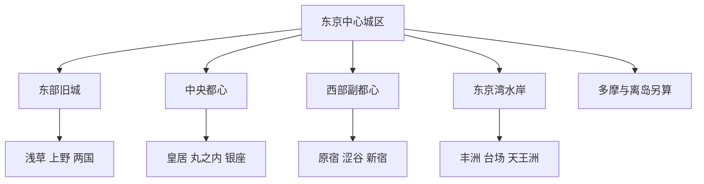
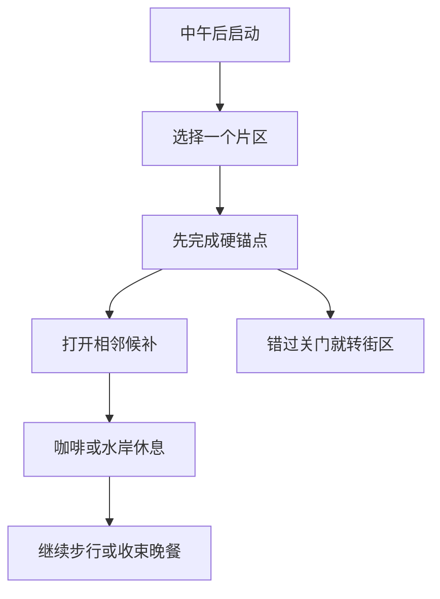

# 东京

> 一句话定位：东京不是一组必须逐个打卡的地标，而是由江户旧城、现代商业街区、博物馆群和东京湾水岸拼成的超大城市；最好的玩法是每次吃透相邻片区。  
> 建议停留：首访 4–6 天；想加入主题乐园、近郊山海或深度博物馆，7–10 天仍有内容。  
> 对用户的主要匹配：国际化大城市、街区漫游、建筑与夜景摄影、博物馆密度、一人食和高效公共交通。  
> 本页用途：先离线确定本次要清哪几个片区，再只联网复核预约、开放、票价、天气和临时交通。

## 先判断东京是否适合这次旅行

东京很适合“慢启动、高巡航”的独行方式。上午不必为了清单硬起床；一旦进入浅草—上野、原宿—涩谷或丸之内—银座这样的连续片区，景点、街景、餐饮和休息点足以支撑数小时高密度探索。铁路把跨区移动做得很可靠，一人席、吧台、定食和面馆又降低了独食成本。

明显短板是尺度。东京行政意义上不仅包括 23 区，还包括多摩山区和伊豆、小笠原诸岛；即使只看中心城区，浅草、涩谷、新宿和台场也不是一个可步行片区。若把所有热门搜索结果塞进同一天，体验会退化成“进站—换乘—拍照—再进站”。本页因此把中心城区作为常规分母，把多摩、奥多摩和离岛单列。

| 偏好或约束 | 匹配度 | 实际含义 |
|---|---:|---|
| 城市漫游与随机发现 | 高 | 谷根千、神保町、清澄白河、表参道支路比单纯地标更耐走 |
| 摄影 | 高 | 寺社、铁路、密集街景、现代建筑、河岸和高层天际线类型齐全 |
| 一人旅行 | 很高 | 餐饮和交通天然支持单人；夜间仍需避开揽客和高压消费场景 |
| 海边与水系 | 中高 | 隅田川、丰洲、台场和天王洲可形成水岸模块，但不是自然海岸 |
| 历史纵深 | 高 | 浅草、皇居旧江户城、上野、两国和江户东京博物馆可串成历史线 |
| 不喜欢分钟级计划 | 高 | 只需锁定少数预约点，其余按片区增删 |
| 低人流、松弛感 | 中 | 热点常年拥挤；需靠平日、错峰和替代街区获得安静体验 |

## 东京由哪些游览片区组成

先看“旧城在东、现代商业在西、皇居与车站居中、海湾向南”的关系。环状铁路方便跨区，但不会缩短片区本身的游览时间。

这张图的关键不是方位背诵，而是避免把东西两端误认为邻点。浅草和上野可放在同一模块；明治神宫、原宿、表参道和涩谷可连续步行；台场、奥多摩或离岛都应单独给出时间。

| 片区 | 稳定看点 | 适合怎样串联 | 边界提醒 |
|---|---|---|---|
| 浅草—隅田川—晴空塔 | 寺町、老铺、水岸、传统娱乐 | 浅草寺复合点后走到隅田川；是否跨河去晴空塔按体力决定 | 浅草寺内部不重复计雷门、仲见世、主殿 |
| 上野—谷根千 | 国家级博物馆、公园、旧街区 | 上野选一座主馆，再由公园北侧进入谷中、根津 | 上野多馆不能默认一天全清 |
| 两国—清澄白河 | 江户史、相扑文化、北斋、仓库咖啡街区 | 江户东京博物馆与两国街景组合；清澄白河是加餐 | 江户东京博物馆已于 2026-03-31 重开，展览仍须当期核验 |
| 皇居—丸之内—日本桥 | 江户城遗存、红砖车站、现代办公建筑 | 东御苑、丸之内仲通和东京站立面天然连续 | 皇居宫殿并非日常自由入内区域 |
| 银座—筑地 | 商业建筑、画廊、歌舞伎、场外市场 | 筑地适合较早时段，之后步行到银座 | 批发主市场已迁丰洲；筑地保留的是场外市场 |
| 原宿—表参道—涩谷 | 神宫森林、潮流、建筑、密集街景 | 明治神宫出发，经表参道或猫街走到涩谷 | 竹下通拥挤时可走支路，不必硬挤 |
| 新宿 | 都市天际线、庭园、霓虹夜景 | 新宿御苑与东侧商业区二选一为主，西侧都厅作免费候补 | 车站尺度大，站内迷路应算移动成本 |
| 六本木—麻布台 | 美术馆、当代建筑、高层城市景观 | 雨天适合用一座美术馆加室内商业体 | teamLab Borderless 为指定日期时段票，不能当零等待候补 |
| 丰洲—台场 | 市场、数字艺术、海湾、公园与娱乐设施 | 丰洲早餐或 teamLab 后沿百合海鸥线去台场 | 片区跨度大，且强受天气、展馆预约影响 |

## 主要景点

表中的用时是“看主要内容”的常见量级，不是预约承诺。A 是首访建议分母，B 是同片区或兴趣补充，C 是需要另开半天以上的远端内容。

| 景点 | 片区 | 类型 | 为什么去 | 典型用时 | 室内外 | 预约/排队 | 清图层级 |
|---|---|---|---|---:|---|---|---|
| 浅草寺—雷门—仲见世 | 浅草 | 寺院与历史街区复合点 | 东京最直观的传统城市入口，街景密度高 | 1.5–2.5 小时 | 以室外为主 | 无需预约；白天高拥挤 | A |
| 东京国立博物馆 | 上野 | 博物馆 | 用一个主馆建立日本美术与历史骨架 | 2–4 小时 | 室内 | 常设展通常可现场；热门特展另购票并可能排队 | A |
| 皇居东御苑 | 丸之内 | 城址与庭园 | 读取江户城尺度，并给高楼区留出绿地呼吸 | 1–1.5 小时 | 室外 | 通常不预约；休园日和入园截止须复核 | A |
| 东京站丸之内站舍与仲通 | 丸之内 | 建筑街区 | 红砖车站、现代高楼和步行街形成稳定摄影走廊 | 1–2 小时 | 混合 | 无预约；车站内人流大 | A |
| 明治神宫 | 原宿 | 神社与森林 | 从高密城市迅速切入安静林下参道 | 1–2 小时 | 室外为主 | 无需预约；按日出日落开闭，月份不同 | A |
| 原宿—表参道—猫街 | 原宿 | 潮流与建筑街区 | 看亚文化、商业建筑与街头人群的连续变化 | 2–3 小时 | 混合 | 无预约；竹下通拥挤 | A |
| 涩谷十字路口及周边 | 涩谷 | 都市街区 | 体验东京人流、屏幕、铁路和商业叠加的城市能量 | 1–2 小时 | 混合 | 无预约；高峰持续拥挤 | A |
| 新宿东西两侧街区 | 新宿 | 都市街区 | 西侧高楼与东侧霓虹形成强烈反差 | 2–3 小时 | 混合 | 无预约；夜间避开揽客 | A |
| 筑地场外市场 | 筑地 | 市场与饮食街 | 海鲜、玉子烧、干货和厨具集中，适合早午餐 | 1–2 小时 | 混合 | 无统一预约；热门店排队，许多店较早收档 | A |
| 江户东京博物馆 | 两国 | 城市史博物馆 | 补足“江户如何成为东京”的城市史主线 | 2–3 小时 | 室内 | 2026 年重开后须复核当期展览、票务与休馆 | A |
| SHIBUYA SKY | 涩谷 | 高层展望台 | 俯瞰西东京天际线，屋顶摄影价值高 | 1–1.5 小时 | 室内外 | 强预约；日落时段易售罄，屋顶受风雨影响 | B |
| 上野公园 | 上野 | 公园与文化区 | 连接多座博物馆、寺社和不忍池 | 1–2 小时 | 室外 | 樱花季极拥挤 | B |
| 谷中—根津—千驮木 | 上野北侧 | 旧街区 | 木屋、寺院、墓园、咖啡馆与生活街巷适合慢走 | 2–4 小时 | 混合 | 无预约；根津神社杜鹃季拥挤 | B |
| 新宿御苑 | 新宿 | 庭园 | 在副都心内部获得大尺度绿地和季节景观 | 1.5–2.5 小时 | 室外 | 特定花期可能实行预约或限流，禁酒规则须遵守 | B |
| 银座—歌舞伎座外观 | 银座 | 商业与表演街区 | 百货、现代建筑、画廊与传统剧场共存 | 1.5–3 小时 | 混合 | 看戏需购票；只逛街无需预约 | B |
| 东京晴空塔 | 押上 | 展望台 | 东东京与隅田川方向的高空视角 | 1.5–2 小时 | 室内 | 建议线上购票；假日及日落时段排队 | B |
| teamLab Borderless | 麻布台 | 数字艺术馆 | 高沉浸室内体验，适合雨天和摄影 | 2–3 小时 | 室内 | 指定日期时段；可能售罄，不可再入场 | B |
| teamLab Planets | 丰洲 | 数字艺术馆 | 身体进入水、光与花园空间，体验与 Borderless 不同 | 2–3 小时 | 室内外混合 | 强预约；服装、涉水和镜面地面注意事项须复核 | B |
| 丰洲市场 | 丰洲 | 批发市场与餐饮 | 观察现代市场体系，适合与海鲜早餐组合 | 1.5–2.5 小时 | 室内 | 部分观察项目有独立规则；休市日必须查日历 | B |
| 台场海滨与彩虹大桥视角 | 台场 | 水岸与现代街区 | 获得东京少见的开阔海湾、日落与夜景 | 2–4 小时 | 混合 | 无统一预约；风雨和大型活动影响大 | B |
| 隅田川水上巴士 | 浅草至湾区 | 水上路线 | 用交通本身串联浅草、滨离宫方向和台场 | 约 1 小时起 | 室内外 | 班次、停靠和售票随航线变化；建议复核 | B |
| 吉祥寺与井之头公园 | 武藏野市 | 街区与公园 | 生活感、绿地、小店和近郊松弛感 | 半天 | 混合 | 无统一预约 | C |
| 三鹰之森吉卜力美术馆 | 三鹰市 | 主题美术馆 | 吉卜力叙事、动画制作与建筑空间 | 2–3 小时 | 室内 | 指定日期预约，通常不售现场票 | C |
| 高尾山 | 八王子市 | 山地步道 | 低门槛近郊登山与季节景观 | 大半天至 1 天 | 室外 | 无统一预约；红叶和周末拥挤，索道状态须查 | C |
| 奥多摩 | 东京都西部 | 山地与峡谷 | 真正脱离中心城区的自然体验 | 1 天起 | 室外 | 交通班次、步道和天气必须单独复核 | C |
| 伊豆与小笠原诸岛 | 东京都岛屿部 | 海岛 | 火山岛、海洋生态和远程自然旅行 | 2 天起 | 室外为主 | 船班、航班、天气和住宿均为独立项目 | C |

东京迪士尼度假区位于千叶县浦安市，不计入东京城市清图率；可以作为从东京出发的独立全天项目。高层展望台也不应全部计为必做：SHIBUYA SKY、晴空塔、东京塔、六本木和都厅视野不同，但首访选一至两处即可。

## 代表性美食与一人食

东京的优势不是只有“东京特产”，而是能同时提供江户传统、全日本地方菜和国际餐饮。离线选餐先按菜品和片区，不把一家网红店当唯一解。

| 食物或体验 | 为什么有代表性 | 适合在哪个片区吃 | 独食友好 | 常见风险与替代 |
|---|---|---|---:|---|
| 江户前寿司或海鲜丼 | 由江户湾海产和快速城市饮食发展而来 | 筑地、丰洲、银座、东京站 | 高 | 名店预约难；改选市场周边非榜首店、立食寿司或午市 |
| 荞麦面与天妇罗 | 江户时期形成的城市快餐传统 | 浅草、日本桥、神田 | 很高 | 老店午间排队；附近普通荞麦店通常更稳 |
| 深川饭 | 蛤蜊、味噌与米饭构成的东东京地方料理 | 门前仲町、深川 | 高 | 分布不如拉面广；把它放进清澄白河或两国模块 |
| 月岛文字烧 | 东京本地铁板料理，适合观察自己动手的用餐方式 | 月岛 | 中 | 部分店更适合两人共享；独行先确认单人份与是否代烤 |
| 相扑锅 | 两国的相扑文化延伸 | 两国 | 中 | 锅物常偏多人；找午间定食或提供一人锅的店 |
| 鳗鱼、泥鳅锅等老东京料理 | 体现浅草、日本桥老铺传统 | 浅草、日本桥 | 中高 | 老店价格和等位差异大；无需执着某一家 |
| 拉面、蘸面 | 东京流派密集且天然吧台化 | 新宿、池袋、东京站等 | 很高 | 排名店队长；同街区准备第二、第三选择 |
| 百货地下食品与车站便当 | 适合独行、雨天和赶交通时稳定补给 | 新宿、东京站、银座 | 很高 | 临近闭店热门品售罄；不把它冒充地方正餐即可 |
| 居酒屋与横丁 | 观察下班后城市生活 | 新宿、涩谷、有乐町 | 高 | 可能有座位费、最低消费或吸烟环境；入座前看菜单 |

独食时采用三层选择：A 层优先吃本地有意义且单人方便的寿司、荞麦、深川饭或拉面；B 层是在同片区已验证满意的店；C 层是车站定食、百货地下食品、连锁面馆。热门餐厅若预计吞掉一个完整景点的时间，就换店，不用用排队证明“来过东京”。

## 怎样把景点串起来

### 首访主线：先建立东京的东西两张脸

不要试图一天横扫全城，把首访拆成两个可独立使用的模块：

- **东东京模块**：`东京国立博物馆 → 上野公园 → 浅草寺复合点 → 隅田川夜景`。硬锚点是博物馆的关门时间；若中午才出门，优先保留博物馆和浅草寺，谷根千留作加餐。
- **西东京模块**：`明治神宫 → 表参道或猫街 → 涩谷十字路口 → 预约展望台或晚餐`。硬锚点只有展望台预约；没有预约就把涩谷街区当终点。

两条模块分别呈现传统城市和当代都市。首访再用半天补 `皇居东御苑 → 丸之内 → 东京站`，城市骨架就已建立；新宿、台场和主题馆按兴趣加入。

### 摄影与连续步行线：丸之内到筑地

`东京站丸之内站舍 → 丸之内仲通 → 皇居外苑 → 日比谷 → 银座支路 → 筑地场外市场或隅田川方向`

- 约 6–8 公里，纯步行约 1.5–2 小时，边拍边逛通常需要半天。
- 看点是红砖站舍、玻璃高楼、林荫街道、皇居护城河与银座商业立面之间的材质变化。
- 最适合从午后走到蓝调时刻；若想在筑地吃东西，应反向从较早时段开始。
- 有乐町、日比谷、银座、东银座等多站可退出；普通交通段不必为凑步数硬走。

### 雨天线：一座主馆加一座预约馆

`东京国立博物馆或江户东京博物馆 → 车站内午餐 → teamLab Borderless或东京站地下空间`

先选一座内容型博物馆作为主馆，再决定是否加入已预约的数字艺术馆。没有预约时，东京站 GRANSTA、百货地下食品和丸之内室内商业体足以构成低风险候补。不要在大雨天临时横穿城市追三个博物馆；东京主馆体量大，一个上午或下午只放一个更稳。

## 清图范围怎么定

东京必须先冻结“中心城区首访版”，否则搜索结果会从一座城市无限延伸到山地和海岛。

- **A 级建议分母，共 10 项**：浅草寺复合点、东京国立博物馆、皇居东御苑、东京站—丸之内、明治神宫、原宿—表参道、涩谷十字路口、新宿街区、筑地场外市场、江户东京博物馆。
- **B 级兴趣池**：谷根千、新宿御苑、银座、晴空塔、一个付费高层展望台、一个 teamLab 馆、丰洲、台场、隅田川航线。高层展望台按“完成其中一个”计 1 项，不要求全部清。
- **C 级独立项目**：吉祥寺、三鹰、高尾山、奥多摩、伊豆和小笠原诸岛；每次纳入行程时另建分母。
- **不计入**：机场、车站换乘、普通商场、酒店、纯餐厅，以及位于千叶县的东京迪士尼度假区。
- **父子规则**：浅草寺复合点只计 1 项；东京站建筑与丸之内步行带计 1 项；上野各博物馆按实际入馆分别计，不能只走过公园就算清馆。

以后若专题旅行以建筑、动漫、咖啡或美术馆为主，应新建专题清单，不修改这 10 项首访分母。

## 慢启动、高巡航怎么用

东京不缺候补，真正稀缺的是“同片区且关门前来得及”。出门晚时先选一个范围小、交通直达的模块，再按体力打开邻点。

- 住宿尽量靠一条可直达两个核心片区的铁路，不必执着住在“地图中央”。
- 每天只固定 1 个指定时段票或早关门场馆；其余用同片区 B 级点扩展。
- 博物馆若比预期刷得快，直接打开谷根千、浅草或丸之内候补；不要提前把它们写成刚性课表。
- 路线内休息优先放在公园、水岸、百货咖啡层或街区咖啡馆，避免回酒店造成 60–90 分钟重启成本。
- 夜间独行可以看新宿或涩谷街景，但不跟随街头揽客进入不透明收费场所；末班车仍应在当日复核。

## 出发前只复核这些

- [ ] SHIBUYA SKY、teamLab、吉卜力美术馆、热门特展和主题乐园的放票日期与入场时段。
- [ ] 东京国立博物馆、江户东京博物馆、新宿御苑、皇居东御苑的休馆或休园日。
- [ ] 丰洲市场休市日、参观规则，以及筑地具体店铺的营业日和收档时间。
- [ ] 水上巴士当日航线、停靠、售票与天气停航；浅草航线的码头不要凭旧攻略推断。
- [ ] 高层展望台的屋顶开放、能见度、强风和取消政策。
- [ ] 樱花、红叶、花火、大型展会和日本法定假期造成的限流与住宿涨价。
- [ ] 台风、酷暑、暴雨、地震影响与铁路临时中断。
- [ ] 本页核验日之后的闭馆、整修、迁址和票价变化。

## 来源

以下均在 2026-07-30 核验；链接用于支撑片区结构和时变风险，具体营业信息仍以出发日页面为准。

- [GO TOKYO：东京片区总览](https://www.gotokyo.org/en/destinations/index.html)：确认官方将东京拆为中央、北部、东部、西部、南部、多摩和岛屿等区域，而不是一个连续步行城市。
- [GO TOKYO：浅草指南](https://www.gotokyo.org/en/destinations/eastern-tokyo/asakusa/)：浅草寺、隅田川与水上交通的稳定关系。
- [GO TOKYO：上野与谷根千](https://www.gotokyo.org/en/story/walks-and-tours/ueno/index.html)、[谷中与根津](https://www.gotokyo.org/en/destinations/northern-tokyo/yanaka-and-nezu/index.html)：博物馆群和旧街区步行关系。
- [东京国立博物馆参观信息](https://www.tnm.jp/modules/r_free_page/index.php?id=113&lang=en)：开馆、票务、休馆与局部关闭，属于出发前复核项。
- [GO TOKYO：东京站与丸之内](https://www.gotokyo.org/en/destinations/central-tokyo/tokyo-station-and-marunouchi/index.html)：东京站、丸之内和皇居方向关系。
- [明治神宫参拜信息](https://www.meijijingu.or.jp/en/visit/)：按月份随日出日落调整开闭；[官方问答](https://www.meijijingu.or.jp/en/qa/)说明常见所需时间和摄影边界。
- [GO TOKYO：原宿](https://www.gotokyo.org/en/destinations/western-tokyo/harajuku/index.html)、[新宿](https://www.gotokyo.org/en/destinations/western-tokyo/shinjuku/index.html)：西东京连续街区与交通关系。
- [SHIBUYA SKY 官方站](https://www.shibuya-scramble-square.com/en/)：展望空间、营业与现场状态；日期票和屋顶天气须另查当日页面。
- [teamLab Borderless 官方站](https://www.teamlab.art/e/tokyo/)：指定日期时段、售罄、不可再入场及场内注意事项。
- [GO TOKYO：筑地](https://www.gotokyo.org/en/destinations/central-tokyo/tsukiji/index.html)、[丰洲](https://www.gotokyo.org/en/destinations/eastern-tokyo/toyosu/index.html)：批发主市场迁往丰洲、筑地场外市场继续存在。
- [GO TOKYO：台场](https://www.gotokyo.org/en/destinations/southern-tokyo/odaiba/)：海湾娱乐与水岸属性。
- [江户东京博物馆官方新闻](https://edo-tokyo-museum.or.jp/en/news/)：确认 2026-03-31 完成整修重开；展览与票务以[参观页](https://edo-tokyo-museum.or.jp/en/information/guide/)为准。
- [GO TOKYO：东京本地饮食](https://www.gotokyo.org/en/see-and-do/drinking-and-dining/tokyo-local-food/index.html)：江户前寿司、荞麦、文字烧、深川饭等饮食骨架。

