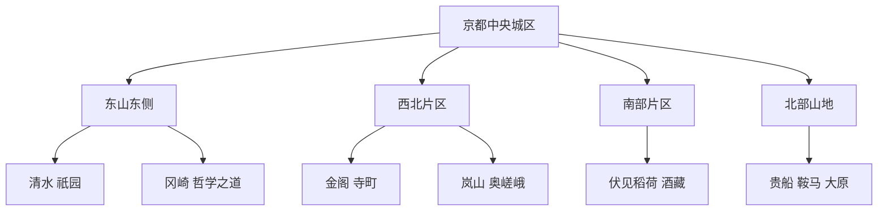
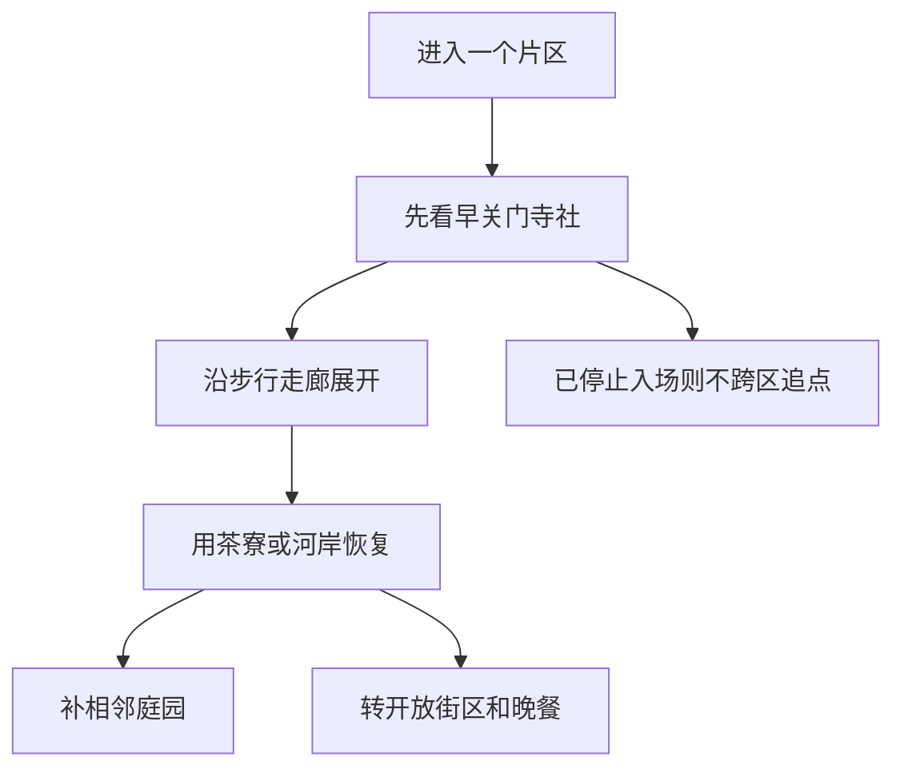

# 京都市

> 一句话定位：京都的价值不在“寺庙数量”，而在古都街道、寺社庭园、山脚水系、传统工艺与日常生活仍交织在同一座城市里。  
> 建议停留：首访 3–5 天；想分季节看庭园、深入岚山与伏见，5–7 天更从容。  
> 对用户的主要匹配：历史纵深、古城街区、建筑与庭园摄影、连续步行、细密饮食文化；海边偏好在这里得不到满足。  
> 本页用途：先离线选一个片区和一条步行走廊；出发前只复核寺社开放、特别拝观、预约、拥挤与季节信息。

## 先判断京都是否适合这次旅行

京都与用户的“历史街区＋摄影＋随机发现”高度匹配。东山、哲学之道、岚山奥嵯峨和伏见酒藏区都不是只在景点入口拍照：连接点之间的石板路、疏水、町家、山脚和小店本身就是内容。独行也很自然，面、定食、和果子、咖啡与许多午市都能单人完成。

但京都比地图看起来更分散。清水寺、金阁寺、岚山、伏见稻荷分别位于不同方向，公交还会受到道路和客流影响。更重要的是，许多寺社和庭园在傍晚前结束参观；“中午启动”仍可用，但必须把早关门的主寺社放在模块前半，把祇园、鸭川、商店街和晚餐留在后半。

| 偏好或约束 | 匹配度 | 实际含义 |
|---|---:|---|
| 历史、古城与文化密度 | 很高 | 同一片区可同时看到寺社、庭园、町家、工艺和饮食传统 |
| 摄影与连续步行 | 很高 | 东山、哲学之道、伏见酒藏和奥嵯峨都是成熟走廊 |
| 一人旅行 | 高 | 游览天然适合独行；会席、锅物和部分精进料理需先确认单人接待 |
| 慢启动、高巡航 | 中高 | 街区适配，寺社关门时间不适配；需用“先寺社、后街区”调整 |
| 海边与水系 | 中 | 鸭川、琵琶湖疏水与伏见水路有水景，但不是海岸型目的地 |
| 低拥挤与松弛感 | 中 | 清水、祇园、伏见稻荷、岚山高峰拥挤；错峰与替代点很重要 |
| 雨天稳定性 | 中 | 博物馆和室内馆不少，但多数代表性庭园、参道仍依赖户外 |

## 京都由哪些游览片区组成

看图时要注意：中央城区可作为中转底盘，东山可以连续走；西北、正北和正南的片区则要用铁路或公交重新开一个模块。

东山南北两段可以靠步行接续，但完整走完也接近一整天。金阁寺和岚山虽都在西侧，却不是“顺路邻点”；伏见稻荷与伏见酒藏同属南部，但铁路站点和游览方向不同，仍需留出移动时间。

| 片区 | 稳定看点 | 适合怎样串联 | 边界提醒 |
|---|---|---|---|
| 清水—祇园 | 清水寺、二三年坂、八坂塔、宁宁之道、八坂神社、花见小路 | 从山上向鸭川方向下行最顺 | 坡路多；寺社早关，祇园是居民与从业者的生活空间 |
| 哲学之道—冈崎 | 银阁寺、哲学之道、永观堂、南禅寺、疏水、博物馆 | 由银阁寺向南走到蹴上和冈崎 | 花期、红叶季拥挤；全线边走边拍需半天以上 |
| 四条—锦市场—二条 | 市场、商店街、町家、二条城、京都御所 | 地铁到片区，片区内步行 | 锦市场不是边走边吃的夜市，许多店较早结束 |
| 金阁—龙安寺—北野—西阵 | 金阁、枯山水、天满宫、织物与和果子文化 | 选两座主寺社，再用北野或西阵补充 | 公交横向移动不总是快，不建议再强接岚山 |
| 嵯峨—岚山 | 渡月桥、竹林、天龙寺、常寂光寺、奥嵯峨 | 从核心景点逐步向奥嵯峨走，回程再乘车 | 竹林与渡月桥高峰拥挤；嵯峨野小火车有独立票务 |
| 伏见稻荷 | 千本鸟居与稻荷山参道 | JR 或京阪直达后按体力选择下山点 | 主参道可长时间进入，但授与所、设施和夜间安全另有边界 |
| 伏见酒藏—中书岛 | 酒藏、水路、寺田屋、大手筋商店街 | 适合与稻荷分成两个半日，或只选其一 | 品酒涉及营业日、预约和饮酒后交通安全 |
| 京都站—七条 | 三十三间堂、京都国立博物馆、东本愿寺、车站建筑 | 雨天或抵离日最稳定 | 京都站是交通节点，不能只经过就算景点 |
| 贵船—鞍马—大原 | 山寺、森林、川床与乡野 | 各自按半天至一天处理 | 不是市中心补点；山区天气、步道与末班交通必须复核 |

## 主要景点

表中的典型用时用于拼模块。寺社开放与特别拝观变化多，未写成永久时刻表。

| 景点 | 片区 | 类型 | 为什么去 | 典型用时 | 室内外 | 预约/排队 | 清图层级 |
|---|---|---|---|---:|---|---|---|
| 清水寺 | 清水 | 寺院与山景 | 木构舞台、山坡视野和东山参道共同构成京都首访核心 | 1.5–2.5 小时 | 室外为主 | 通常无需预约；早开但闭门随季节，樱花红叶与夜间拝观拥挤 | A |
| 二三年坂—八坂塔—宁宁之道 | 东山 | 历史街区复合点 | 京都最完整的坡道、町家、塔景与步行摄影走廊之一 | 1.5–3 小时 | 室外 | 无预约；白天高拥挤，部分路段为居民通行空间 | A |
| 祇园—八坂神社—白川 | 祇园 | 神社与花街复合点 | 从寺社过渡到花街、河道和夜间城市生活 | 1.5–3 小时 | 混合 | 无统一预约；禁止追拍、阻拦或未经许可拍摄艺舞伎 |
| 伏见稻荷大社 | 伏见稻荷 | 神社与山地参道 | 千本鸟居、山路和信仰空间具有强识别度 | 1.5–3 小时；全山更久 | 室外 | 无统一预约；下部全天高拥挤，清晨与傍晚较松 |
| 金阁寺 | 衣笠 | 寺院与庭园 | 金色舍利殿与池泉倒影是北山文化的直观入口 | 45–75 分钟 | 室外为主 | 无预约；参观路线单向且团客多，官方常规参观为 9:00–17:00，仍需当日复核 | A |
| 银阁寺 | 哲学之道北端 | 寺院与庭园 | 银沙滩、苔庭、山坡视角和东山文化层次丰富 | 45–75 分钟 | 室外为主 | 无预约；冬夏开放时段不同 | A |
| 哲学之道—南禅寺疏水走廊 | 东山北段 | 步行路线与寺院 | 水渠、山脚、寺院和近代水利建筑连续变化 | 2.5–4 小时 | 室外为主 | 步道无预约；沿途收费庭园各有时段 | A |
| 二条城 | 中央偏西 | 城堡与宫殿 | 以御殿空间和幕府政治史补足“寺院以外的京都” | 1.5–2.5 小时 | 混合 | 特别展、二之丸御殿或活动票务须复核；旺季排队 | A |
| 锦市场 | 四条 | 食品市场 | 京都蔬菜、渍物、鱼、玉子、湯叶与熟食的集中窗口 | 1–1.5 小时 | 有顶棚街区 | 无统一预约；午前后拥挤，禁止边走边吃 | A |
| 嵯峨岚山核心区 | 岚山 | 水岸与街区复合点 | 渡月桥、桂川、竹林和山景构成西京都代表场景 | 2–4 小时 | 室外 | 无统一预约；竹林与桥头高峰拥挤 | A |
| 三十三间堂 | 七条 | 寺院与佛教造像 | 长殿与密集千手观音像带来不同于庭园寺社的内容体验 | 1–1.5 小时 | 室内为主 | 通常无需预约；馆内摄影限制严格 | A |
| 天龙寺 | 岚山 | 禅寺与庭园 | 用曹源池庭园给岚山模块增加真正的内容型主点 | 1–1.5 小时 | 混合 | 无需常规预约；花期与团客时段拥挤 | B |
| 常寂光寺或祇王寺 | 奥嵯峨 | 寺院与苔庭 | 从拥挤竹林转向较安静的山坡与苔景 | 45–75 分钟/座 | 混合 | 通常无需预约；秋季明显拥挤 | B |
| 龙安寺 | 衣笠 | 禅寺与枯山水 | 以小尺度石庭观察禅宗空间 | 45–75 分钟 | 混合 | 无预约；核心庭院前可能拥挤 | B |
| 北野天满宫—西阵 | 北野 | 神社与传统街区 | 梅花、天神信仰、织物史和老铺和果子可组合 | 2–3 小时 | 混合 | 缘日、梅花季和特别开放需复核 | B |
| 京都御所与御苑 | 中央偏北 | 宫苑与历史建筑 | 了解京都作为帝都的空间尺度，并提供大片绿地 | 1.5–2.5 小时 | 室外为主 | 常规参观规则、休止日与特别公开须复核 | B |
| 京都国立博物馆 | 七条 | 博物馆 | 用原作和专题展补充寺社现场看不到的文化史 | 2–3 小时 | 室内 | 特展票、展期、休馆日必须复核 | B |
| 京都市京瓷美术馆与冈崎 | 冈崎 | 美术馆与文化区 | 雨天可用，建筑、近现代艺术和疏水景观相连 | 1.5–3 小时 | 混合 | 特展可能预约或排队 | B |
| 东福寺 | 京都站东南 | 禅寺与溪谷庭园 | 通天桥和方丈庭园兼具建筑与季节景观 | 1.5–2 小时 | 混合 | 红叶季强拥挤并可能调整动线与票务 | B |
| 伏见酒藏街—中书岛 | 伏见 | 产业街区与水路 | 看到伏见优质水、酿酒、河港与商业街的关系 | 2–4 小时 | 混合 | 酒藏馆、试饮和游船各自有营业与预约规则 | B |
| 京都铁道博物馆 | 梅小路 | 博物馆 | 大体量铁路实物和室内展陈，适合重雨或亲子兴趣 | 2–3 小时 | 室内为主 | 热门体验可能需整理券或预约 | B |
| 桂离宫 | 西京 | 皇室庭园 | 日本庭园与书院建筑的重要范本 | 1.5–2 小时 | 混合 | 宫内厅参观有申请、名额与证件规则，强预约 | C |
| 西芳寺（苔寺） | 西京 | 寺院与苔庭 | 极具辨识度的苔庭与宗教空间 | 2 小时左右 | 混合 | 强预约，申请方式与参拜费须查官网 | C |
| 贵船与鞍马 | 北部山地 | 神社与山地路线 | 森林、山寺和川床形成夏季高吸引力模块 | 半天至 1 天 | 室外为主 | 山区交通、步道、积雪、川床预约须复核 | C |
| 大原 | 京都北部 | 乡野寺院群 | 三千院、山村与田园提供不同于中心城区的节奏 | 半天至 1 天 | 混合 | 公交班次和寺院时段须复核 | C |

宇治市属于京都府但不是京都市。平等院、宇治上神社与茶街可以从京都市出发一日往返，但应另建“宇治市”清单，不能塞进京都市普通清图分母。

## 代表性美食与一人食

京都饮食的价值在季节、出汁、豆制品、京野菜与呈现方式。不是每顿都要订高级会席；午市、面馆、定食、和果子与市场熟食更适合独行和连续游览。

| 食物或体验 | 为什么有代表性 | 适合在哪个片区吃 | 独食友好 | 常见风险与替代 |
|---|---|---|---:|---|
| 京料理或怀石午餐 | 把季节、器皿、出汁与多道小份组合起来 | 祇园、木屋町、冈崎 | 中 | 晚餐价格高且可能要求预约；先选午市或吧台席 |
| おばんざい家常小菜 | 更接近日常京都，适合一次尝多种蔬菜和煮物 | 四条、祇园、京都站 | 高 | 有些居酒屋需点酒或收座位费；看清菜单再入座 |
| 湯豆腐、湯叶 | 寺院饮食与京都水质、豆制品文化相关 | 南禅寺、岚山、京都站 | 中高 | 老店套餐量大或排队；找单人定食而非多人锅 |
| 精进料理 | 体现佛教饮食与寺院文化 | 寺院周边 | 中 | 常需预约，且“无肉”不等于满足所有过敏或严格素食需求 |
| 鲭寿司 | 内陆古都保存海鱼的传统 | 锦市场、祇园、车站 | 高 | 口味偏咸且单条分量可能大；买小份或组合餐 |
| 鲱鱼荞麦面 | 京都形成的甜煮鲱鱼与汤面组合 | 四条、南座周边、京都站 | 很高 | 名店排队时附近普通荞麦店即可替代 |
| 京都拉面 | 与精致京料理相反，口味往往更浓，独食非常稳 | 京都站、一乘寺 | 很高 | 一乘寺需单独交通；不必为榜首店跨城排队 |
| 京野菜、渍物、生麸 | 京都食材结构的基础，不只是一道菜 | 锦市场、西阵、定食店 | 高 | 锦市场禁止边走边吃，应在店前或店内吃完 |
| 和果子与抹茶 | 茶道、老铺和季节审美的低门槛入口 | 祇园、宇治方向、西阵 | 很高 | 热门咖啡店等位；老铺外带和普通茶寮都是替代 |
| 伏见清酒 | 来自伏见水系与酿造产业 | 伏见酒藏区 | 高 | 酒藏休馆日和试饮规则不同；不饮酒也可看水路和产业史 |

独食策略是：白天把一顿有代表性的午市、湯豆腐定食或鲭寿司作为 A 层；晚餐优先吧台式おばんざい、荞麦、拉面或京都站定食。会席和精进料理若只接待两人以上，不需要为了“完整京都”勉强拼桌；换成午餐或把预算留给真正想体验的一餐。

## 怎样把景点串起来

### 首访主线：从清水寺一路走到鸭川

`清水寺 → 二三年坂 → 八坂塔外观 → 宁宁之道 → 八坂神社 → 祇园白川 → 鸭川或先斗町`

这是最能一次读懂京都的路线：先完成有开闭时间的清水寺，再沿山坡进入传统街区，最后落到不受寺院闭门影响的祇园与河岸。全程约 5–7 公里，边看边拍通常需要半天以上。

- 硬锚点：清水寺入场与季节开放；若有特别夜间拝观，再把夜间票当唯一固定时刻。
- 可删项：体力下降时不进高台寺等额外寺院，保留街区主线。
- 退出点：东山安井、祇园四条、河原町周边均可转公交或铁路。
- 礼仪边界：不在私道停留，不堵住出入口，不追随或未经允许拍摄艺舞伎。

### 摄影与连续步行线：银阁寺到冈崎

`银阁寺 → 哲学之道 → 永观堂外缘或入内 → 南禅寺 → 水路阁 → 蹴上 → 冈崎公园`

- 主线约 5–7 公里；加入寺院庭园后通常需要 4–6 小时。
- 看点从苔庭、疏水小径转为山门、水路阁和近代文化建筑，变化比单独刷寺更丰富。
- 樱花和红叶期中段会拥挤；普通季节反而更适合细看住宅边界与水系。
- 蹴上、东山站都可退出；冈崎有美术馆和咖啡馆，适合路线内恢复。

### 雨天线：七条文化模块

`三十三间堂 → 京都国立博物馆 → 京都站室内空间与晚餐`

三十三间堂和博物馆互为邻点，只有短距离户外暴露；京都站可承担交通、补给和晚餐。若博物馆休馆，就把主馆换成京都铁道博物馆，不能在雨天到了门口才发现周一闭馆。清水、岚山和伏见稻荷不要因为“有伞”就强行按晴天全量走，石阶湿滑和衣物恢复成本都更高。

## 清图范围怎么定

- **A 级建议分母，共 11 项**：清水寺、东山坡道复合点、祇园复合点、伏见稻荷、金阁寺、银阁寺、哲学之道—南禅寺走廊、二条城、锦市场、岚山核心复合点、三十三间堂。
- **B 级兴趣池**：天龙寺、奥嵯峨一座寺院、龙安寺、北野—西阵、京都御所、京都国立博物馆、冈崎美术馆区、东福寺、伏见酒藏、京都铁道博物馆。
- **C 级独立项目**：桂离宫、西芳寺、贵船—鞍马、大原；每次确认预约和交通后另建分母。
- **不计入**：京都站换乘、普通商场、酒店、纯餐厅；宇治、奈良和大阪属于其他城市。
- **父子规则**：岚山核心的渡月桥、竹林和公共街区合计 1 项；天龙寺若实际购票入内可另计 B。东山坡道复合点不把每条坂道、八坂塔外观和每间商店重复计数。伏见稻荷完成本殿与主要鸟居段即可计 A；登顶是增强项，不强迫成为首访完成条件。

寺院专题重游可以另外建立“庭园”“建筑”“特别拝观”清单，不回头扩大首访分母。这样即使京都不断出现季节性开放，也不会让已经完成的旅行在统计上倒退。

## 慢启动、高巡航怎么用

京都的模块顺序由关门时间决定，而不是由“最网红的点”决定。先做会关门的内容，开放街区和餐饮负责兜底。

- 中午出门时选东山、冈崎、中央或伏见其中一个片区，不再追加岚山或金阁寺。
- 每个模块只设 1 座必进寺社；参观比预期快，再开相邻 B 级庭园。
- 从京都站去锦市场优先地铁加步行；官方也明确提示市中心公交会受站点、车厢和道路拥挤影响。
- 休息放在茶寮、冈崎文化设施、鸭川坐点或商店街内，不回酒店重启。
- 花期和红叶期用京都官方拥挤预测看片区与时段；同样景色宁可换到相邻寺院，不在主入口消耗一小时。
- 住宿不必只看京都站。四条乌丸、河原町或京阪沿线会更适合夜间步行，但跨城交通多时京都站更稳。

## 出发前只复核这些

- [ ] 清水寺、金阁寺、银阁寺、二条城、三十三间堂等主点的开放、停止入场和临时法会。
- [ ] 特别夜间拝观、庭园公开、樱花、红叶、梅花和祭典的具体日期。
- [ ] 桂离宫、西芳寺、特别展、嵯峨野小火车和热门文化体验的预约方式。
- [ ] 京都国立博物馆、京瓷美术馆、铁道博物馆的休馆日与当期展览。
- [ ] 京都官方拥挤预测与实时摄像，尤其清水—祇园、岚山、金阁、哲学之道和伏见稻荷。
- [ ] 山区降雨、积雪、酷暑、台风、步道关闭和贵船—鞍马—大原末班交通。
- [ ] 伏见酒藏、游船、川床和具体餐厅是否营业、是否接待一人及是否需要预约。
- [ ] 祇园私道、寺社摄影、行李上公交及锦市场饮食礼仪的最新公告。
- [ ] 本页核验日之后的整修、票价、公交线路和重大活动变化。

## 来源

以下均在 2026-07-30 核验；寺社时刻和季节活动只视为当期观测，不作为永久保证。

- [京都市官方旅行指南：片区总览](https://kyoto.travel/en/areas)：确认中央、东部、西部、北部和南部的片区结构；[目的地目录](https://kyoto.travel/en/destinations/)用于交叉核对景点类别。
- [清水—祇园官方片区页](https://kyoto.travel/en/areas/gion-kiyomizu/)：东山景点关系、交通与祇园摄影礼仪。
- [清水寺官方参观信息](https://www.kiyomizudera.or.jp/en/location/)、[2026 活动与夜间拝观](https://www.kiyomizudera.or.jp/en/visit/)：开放随季节变化，特别夜间时段另行发布。
- [哲学之道—冈崎官方片区页](https://kyoto.travel/en/areas/okazaki/)：银阁寺、哲学之道、南禅寺、冈崎文化设施的连续关系。
- [银阁寺官方问答](https://www.shokoku-ji.jp/ginkakuji/faq/)：冬夏参观时段不同及典型参观用时。
- [金阁寺官方参观与交通](https://www.shokoku-ji.jp/en/kinkakuji/access/)：常规参观时间、票务与交通；特别开放仍需当日核验。
- [嵯峨—岚山官方片区页](https://www.kyoto.travel/en/areas/saga-arashiyama/)：渡月桥、竹林、寺院与奥嵯峨的关系及保护提示。
- [伏见官方片区页](https://kyoto.travel/en/areas/fushimi/)：稻荷信仰、水路、酒藏与商店街的关系；[伏见稻荷大社交通页](https://inari.jp/en/access/)提示公共交通与停车拥挤。
- [京都中央城区官方页](https://kyoto.travel/en/areas/central/)与[锦市场页面](https://kyoto.travel/en/destinations/kyoto-nishiki-food-market/)：二条、御所、四条、锦市场结构，以及禁止边走边吃规则。
- [前往锦市场的舒适交通](https://kyoto.travel/en/getting-around/comfortable-access-to-central-kyoto-city-nishiki-market/)：官方建议优先地铁加步行，避免拥挤市中心公交。
- [京都旅游拥挤预测](https://global.kyoto.travel/en/comfort/kyoto/)：按片区、日期、时段和天气提供预测及部分实时画面，属于出发前工具。
- [京都负责任旅行指南](https://kyoto.travel/en/responsible-travel/)：祇园、居民区、竹林、行李和公共交通礼仪。
- [京都官方饮食文化](https://kyoto.travel/en/food-and-drink/)与[传统饮食说明](https://kyoto.travel/en/see-and-do/foodculture.html)：怀石、湯豆腐、湯叶、精进料理、鲱鱼荞麦、和果子与伏见酒。

