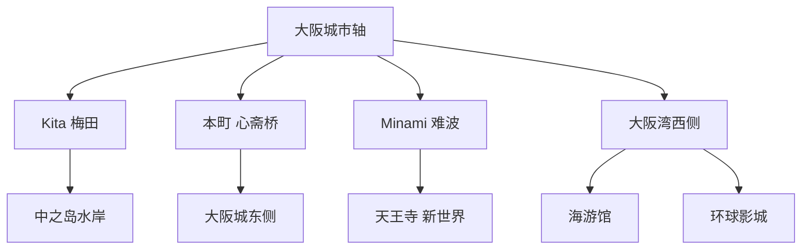
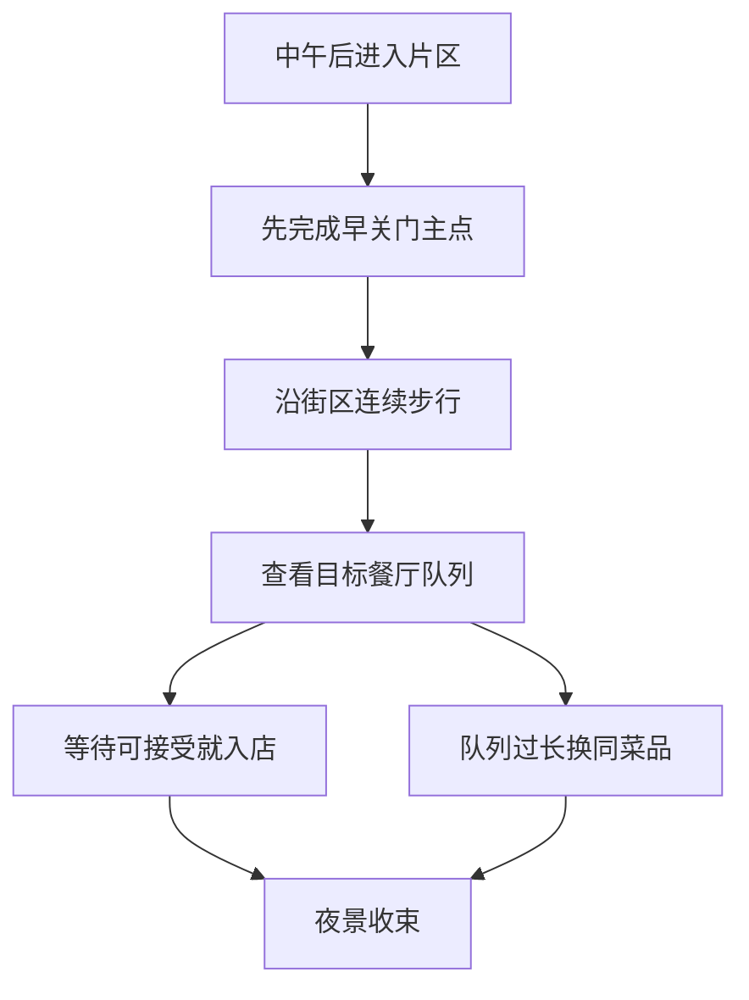

# 大阪市

> 一句话定位：大阪最值得体验的是城堡与商都历史、水岸和现代建筑、密集街区与平民饮食共同形成的城市性格，而不只是道顿堀广告牌。  
> 建议停留：首访 2–4 天；若加入环球影城、海游馆深度或周边城市，4–6 天。  
> 对用户的主要匹配：高密度街区漫游、夜景摄影、一人食、临场加点和低决策成本；历史景点数量不如京都，但城市生活感更强。  
> 本页用途：离线选择“城与水”“Minami 街区”“湾区”中的一个模块，再按当日体力加餐，不把全城写成固定课表。

## 先判断大阪是否适合这次旅行

大阪非常适合出门后连续巡航。难波、黑门、道具屋筋、法善寺、道顿堀、心斋桥之间可以长时间步行，移动本身就是餐饮招牌、商店街、人群和城市摄影。中之岛则用河道、桥梁、近代建筑和美术馆提供另一种更松弛的走法。拉面、乌冬、串炸、寿司、定食和铁板料理普遍容易单人落座。

它的短板也明确：道顿堀和黑门市场商业化、拥挤且价格离散；环球影城会吞掉整天并产生预约与排队压力；大阪城天守阁是 1931 年复兴、内部作为历史博物馆使用，不能把它误想成完整保留的古代宫殿。若真正偏好寺院庭园，京都更强；若想体验活跃街区、饮食和夜间城市，大阪更直接。

| 偏好或约束 | 匹配度 | 实际含义 |
|---|---:|---|
| 街区漫游与随机发现 | 很高 | Minami、天满、中崎町、空堀等可持续加点 |
| 一人食 | 很高 | 吧台、小份粉物、面馆、定食和串炸都容易单人完成 |
| 摄影 | 高 | 中之岛水岸、城壕、霓虹招牌、高架铁路和展望台类型丰富 |
| 历史与文化 | 中高 | 大阪城、难波宫、四天王寺、文乐和商都史值得看，但分布不如京都密 |
| 海边与水系 | 中高 | 中之岛河道和大阪湾稳定加分，湾区更多是城市海港而非自然海岸 |
| 慢启动、高巡航 | 很高 | 商店街和夜间街区关门较晚；早关馆点集中在博物馆与寺院 |
| 不喜欢过度排队 | 中 | 普通街区容易替代；USJ、热门餐厅和部分展望台风险高 |

## 大阪由哪些游览片区组成

御堂筋把北部梅田、中央本町、南部心斋桥与难波串成一条城市轴。大阪城在轴线东侧，中之岛横卧河道之间，海游馆和环球影城则在西侧湾区，不能靠市中心步行顺带完成。

主轴上的片区适合临场串联；大阪城和湾区要重新乘车。环球影城虽在大阪市内，却是独立全天项目，不应和海游馆、难波夜游强行同日清完。

| 片区 | 稳定看点 | 适合怎样串联 | 边界提醒 |
|---|---|---|---|
| 梅田—大阪站 | 立体车站、商业高楼、空中庭园、地下街 | 适合抵离日、雨天或夜景 | 车站商业体不因“经过”计入景点清单 |
| 中之岛—北滨 | 河道、桥梁、中央公会堂、图书馆、美术馆 | 从淀屋桥或北滨沿水岸连续走 | 美术馆各有休馆日；夜间水岸活动随季节变化 |
| 大阪城—谷町四丁目 | 城壕、复兴天守、历史博物馆、难波宫遗址 | 历史博物馆与城公园组合最完整 | 公园很大，从车站到天守仍需步行 |
| 心斋桥—美国村 | 御堂筋、商店街、青年文化与街头视觉 | 可向南自然走到道顿堀 | 主商店街拥挤时走支路，不必只看连锁店 |
| 难波—道顿堀—黑门 | 霓虹、河岸、餐饮、市场、剧场与厨具街 | 白天从黑门向难波走，夜间以道顿堀收束 | 热门店排队和游客价差异大，需要同菜品替代 |
| 新世界—天王寺—阿倍野 | 通天阁、串炸、寺院、公园与高层夜景 | 四天王寺和新世界可同日，阿倍野作夜景候补 | 夜间独行保持普通城市警觉，不跟街头揽客 |
| 鹤桥 | 韩日饮食、烧肉、市场与高架街巷 | 作为美食半日，不与湾区强接 | 店休日和午晚营业差异大 |
| 大阪湾—天保山 | 海游馆、港景、摩天轮与室内商业 | 海游馆为硬锚点，其余按天气加减 | 与市中心有明显移动成本 |
| 此花—环球影城 | 主题乐园与娱乐区 | 单独一整天 | 入园票不等于热门区域和项目都能自由进入 |

## 主要景点

表中的层级不是“名气排名”，而是为首次城市旅行冻结合理分母。餐饮街区以复合点计数，避免把每块招牌和商店重复算景点。

| 景点 | 片区 | 类型 | 为什么去 | 典型用时 | 室内外 | 预约/排队 | 清图层级 |
|---|---|---|---|---:|---|---|---|
| 大阪城天守阁与核心城郭 | 大阪城 | 城址与博物馆 | 读取丰臣、德川与现代大阪叠加的城市史 | 2–3 小时 | 混合 | 建议线上购票；旺季天守入口排队，公园本身开放更久 | A |
| 大阪历史博物馆 | 谷町四丁目 | 城市史博物馆 | 从难波宫到商都的 1400 年历史，并有俯瞰大阪城的视角 | 2–3 小时 | 室内 | 通常现场购票；周二等休馆规则须复核 | A |
| 中之岛建筑与水岸走廊 | 中之岛 | 水岸与建筑复合点 | 河流、桥梁、中央公会堂和近代公共建筑适合长走摄影 | 2–3 小时 | 混合 | 公共空间无需预约；馆舍和活动各自核验 | A |
| 梅田—大阪站立体城市 | Kita | 现代城市街区 | 观察铁路、商业、地下街和高楼如何叠成立体枢纽 | 2–3 小时 | 室内为主 | 无统一预约；通勤和周末人流大 | A |
| 心斋桥—美国村 | Minami | 商业与青年街区 | 从御堂筋品牌建筑过渡到支路潮流与街头文化 | 1.5–3 小时 | 混合 | 无预约；主街拥挤 | A |
| 道顿堀—戎桥—河畔步道 | Minami | 夜间街区复合点 | 招牌、河道、剧场史和大阪饮食能量的集中场景 | 1.5–3 小时 | 室外为主 | 无预约；夜间和节假日持续拥挤 | A |
| 黑门市场—道具屋筋 | 日本桥至难波 | 市场与专业街区 | 从食材、熟食走到厨具与餐饮行业底盘 | 1.5–2.5 小时 | 有顶棚街区 | 无统一预约；各店营业不同，午前后更合适 | A |
| 新世界—Janjan 横丁 | 新世界 | 老娱乐街区 | 复古招牌、通天阁视角、串炸和市井氛围集中 | 1.5–3 小时 | 混合 | 无预约；热门串炸店排队 | A |
| 四天王寺 | 天王寺 | 寺院与历史遗址 | 补足大阪古代史与宗教空间，不只看近现代商业 | 1–1.5 小时 | 混合 | 通常无需预约；伽蓝、庭园与法会时段须复核 | A |
| 海游馆 | 天保山 | 水族馆 | 以太平洋环流为结构的大体量室内馆，是湾区主锚点 | 2.5–4 小时 | 室内 | 建议提前购票并选择入馆时段；假日易满 | A |
| 梅田蓝天大厦空中庭园 | 梅田 | 建筑与展望台 | 双塔顶部结构和城市北向视野辨识度高 | 1–1.5 小时 | 室内外 | 日落时段排队；营业与天气须复核 | B |
| 大阪中之岛美术馆或国立国际美术馆 | 中之岛 | 美术馆 | 给水岸路线增加内容型室内主点 | 2–3 小时 | 室内 | 展期、票务和休馆各自核验；二选一即可 | B |
| 法善寺横丁 | 难波 | 小巷与寺院 | 从道顿堀高亮广告切换到小尺度石巷 | 30–60 分钟 | 室外 | 无预约；巷窄，拍照不堵路 | B |
| 难波八阪神社 | 难波南侧 | 神社 | 巨型狮子殿具有强视觉识别度 | 30–45 分钟 | 室外 | 无预约；法会和摄影边界须尊重 | B |
| 国立文乐剧场 | 日本桥 | 表演艺术 | 大阪是人形净琉璃文乐的重要城市 | 2–4 小时 | 室内 | 演出日、字幕服务和座位强依赖当期排期 | B |
| 通天阁 | 新世界 | 展望塔与娱乐设施 | 从塔内外观察大阪大众娱乐符号 | 45–90 分钟 | 室内外 | 可排队；滑梯和户外展望有附加规则 | B |
| 阿倍野 HARUKAS 展望台 | 阿倍野 | 高层展望台 | 南大阪与城市网格视角开阔 | 1–1.5 小时 | 室内 | 日落时段可能排队；与梅田展望台选一即可 | B |
| 天王寺公园与庆泽园 | 天王寺 | 公园与庭园 | 在高密街区之间恢复体力 | 1–1.5 小时 | 室外 | 庭园开放与休园日须复核 | B |
| 鹤桥市场与韩国城 | 鹤桥 | 市场与饮食街区 | 大阪移民史、烧肉与韩日饮食文化的生活样本 | 2–3 小时 | 混合 | 无统一预约；具体店休日不同 | B |
| 大阪生活今昔馆与天神桥筋 | 天满 | 博物馆与商店街 | 室内复原城市街景，再接生活型长商店街 | 2–4 小时 | 混合 | 馆内时段、休馆和活动须复核 | B |
| 住吉大社 | 大阪南部 | 神社与历史建筑 | 以独特住吉造和古代海运信仰扩展城市南部 | 1.5–2.5 小时 | 室外为主 | 无常规预约；正月强拥挤 | C |
| 环球影城日本 | 此花 | 主题乐园 | 大型 IP、游乐设施与沉浸主题区 | 1 天 | 混合 | 强购票与排队；部分区域可能需定时入场券，快速票另购 | C |
| 大阪市立长居植物园夜间数字艺术 | 长居 | 植物园与夜间艺术 | 夜间户外光影与植物结合，适合特定兴趣 | 2 小时左右 | 室外 | 日期票、天气、维护与季节内容须核验 | C |

大阪府内的万博纪念公园、箕面、堺市古坟群不属于大阪市普通清图范围。2025 年大阪·关西世博会已经结束，也不应作为 2026 年后的常规景点写入分母；若遗址产生新用途，应按当期官方公告另建项目。

## 代表性美食与一人食

大阪“吃倒”的关键是多样和随时可替代，不是每样都去排最长队。把食物放回其街区，路线才不会被餐厅绑架。

| 食物或体验 | 为什么有代表性 | 适合在哪个片区吃 | 独食友好 | 常见风险与替代 |
|---|---|---|---:|---|
| 章鱼烧 | 大阪最典型的街头粉物，小份、快速、易比较 | 难波、道顿堀、新世界 | 很高 | 河边榜首店队长；走一两个街口找同类店 |
| 大阪烧 | 高丽菜、山药、出汁与铁板形成的本地日常主食 | 心斋桥、难波、梅田 | 高 | 部分店要求自己烤；独行先确认单份和是否由店员制作 |
| 串炸 | 新世界大众饮食符号，适合少量多种 | 新世界、梅田地下街 | 很高 | 名店排队；吧台普通店更省时，遵守酱料卫生规则 |
| 土手烧 | 味噌炖牛筋，常与串炸和酒搭配 | 新世界 | 高 | 味重、偏咸；点小份而非当完整正餐 |
| 大阪乌冬与狐乌冬 | 以昆布、鲣鱼出汁和较柔软面条为特点 | 难波、船场、梅田 | 很高 | 网红店午间排队；同片区普通老店替代性强 |
| 箱寿司或大阪寿司 | 压制成形，体现江户前握寿司之外的上方传统 | 船场、难波、百货地下 | 高 | 老店整盒分量可能大；百货地下买小份组合 |
| 肉吸 | 去掉面条的肉乌冬汤演变成的大阪小吃 | 难波周边 | 很高 | 热门本店排队；可找提供肉吸定食的分店或附近店 |
| 烧肉与内脏 | 鹤桥饮食和移民文化的重要部分 | 鹤桥 | 高 | 烤肉按份量和最低点单不同；找吧台或午间套餐 |
| 豚馒 | 大阪常见便携小吃和伴手礼 | 难波、车站 | 很高 | 热门门店队列明显；非必要不为外带品牺牲主路线 |
| 文乐或落语前后的街区晚餐 | 把表演文化和城市饮食结合 | 日本桥、难波、天满 | 高 | 演出时间是硬锚点，晚餐要选零等待备选 |

独食优先级可以写成：当地特色吧台或单份料理 → 同菜品附近第二选择 → 地铁站与地下街稳定定食。大阪烧、串炸和烧肉并不天然排斥一人，但要先看是否有吧台、单人炉和最低点单。道顿堀某家店若要等 60–90 分钟，就换成同片区另一家，把时间留给街区。

## 怎样把景点串起来

### 首访主线：白天看城与水，晚上进入 Minami

首访不需要一口气走完，使用两个能独立成立的模块：

- **城与水模块**：`大阪历史博物馆 → 大阪城天守阁与城壕 → 地铁前往北滨 → 中之岛水岸`。历史博物馆先建立背景，再看复兴天守和城郭会更有内容；中之岛负责傍晚放松。
- **Minami 模块**：`黑门市场 → 道具屋筋 → 法善寺横丁 → 道顿堀 → 心斋桥或美国村`。从白天营业更集中的市场开始，最后把不受博物馆关门影响的霓虹街区留到晚上。

如果中午才启动，城与水只保留博物馆或天守其中一个；Minami 则可以完整展开。硬锚点只有博物馆停止入馆与演出票，餐厅不要成为不可移动锚点。

### 摄影与连续步行线：中之岛到道顿堀

`大阪市中央公会堂 → 中之岛公园 → 难波桥 → 北滨 → 本町建筑街区 → 心斋桥支路 → 道顿堀河畔`

- 约 6–8 公里，纯走约 1.5–2 小时，拍摄和吃东西后适合用半天。
- 前半段是河面、桥梁和近代建筑，后半段逐渐变为商店街、人流、广告和夜色，视觉变化明确。
- 淀屋桥、北滨、本町、心斋桥均可退出；高温或暴雨时不必完整走。
- 最适合午后到蓝调时刻；若想拍中之岛玫瑰或季节灯光，需另查花期和活动。

### 雨天线：大阪历史与有顶棚街区

`大阪历史博物馆 → 地铁 → 黑门市场 → 道具屋筋 → 难波地下街`

历史博物馆是室内主馆，黑门和道具屋筋有顶棚，难波地下空间可承担补给与晚餐。若已买海游馆时段票，也可以把整天改成 `海游馆 → 天保山室内商业 → 返回难波晚餐`。不要在大雨天临时把海游馆当候补：湾区有移动成本，热门日期也可能没有理想入馆时段。

## 清图范围怎么定

- **A 级建议分母，共 10 项**：大阪城核心、历史博物馆、中之岛走廊、梅田立体城市、心斋桥—美国村、道顿堀复合点、黑门—道具屋筋、新世界、四天王寺、海游馆。
- **两日短版分母，共 8 项**：若明确只有两天，在出发前从上述清单剔除四天王寺与海游馆；旅后不要再把它们补回分母制造“未完成”。
- **B 级兴趣池**：梅田或阿倍野展望台二选一、中之岛一座美术馆、法善寺、难波八阪、文乐、通天阁、天王寺公园、鹤桥、生活今昔馆与天神桥筋。
- **C 级独立项目**：住吉大社、环球影城、长居植物园夜间艺术；大阪府其他城市与箕面另算。
- **不计入**：车站换乘、普通商场、酒店、纯餐厅和只为拍照经过的招牌。
- **父子规则**：道顿堀、戎桥和河畔步道合计 1 项；大阪城公园、城壕与天守核心合计 1 项，只有真正进入历史博物馆才另计 1 项；新世界和 Janjan 横丁合计 1 项，通天阁购票登塔可另计 B。

## 慢启动、高巡航怎么用

大阪最适合把“想吃什么”降级为路线内选择，而不是让一家餐厅控制整天。片区密度够高，目标店排队时可以立刻切换。

- 中午后启动优先选 Minami 或中之岛；大阪城、历史博物馆、四天王寺和海游馆要先查停止入场。
- 每天设置一项付费主点，旁边准备 2–4 个零预约候补。博物馆刷得快，就加城壕或水岸；不是跨城追另一座馆。
- 路线内休息可放中之岛河边、百货咖啡层、难波地下街或天王寺公园，不回酒店重启。
- 晚餐按菜品准备两三家同片区选择；排队超过心理上限立即替换。
- 环球影城当天不要追加城市清图任务。园区定时票、项目停运和体力消耗会让任何晚间刚性安排变脆弱。

## 出发前只复核这些

- [ ] 大阪城天守阁线上票、停止入馆、特展和城郭内临时活动。
- [ ] 大阪历史博物馆、中之岛各美术馆、生活今昔馆和文乐剧场的休馆与排期。
- [ ] 海游馆日期时段票、当天营业、维护与馆内项目。
- [ ] 环球影城入园票、官方 App、定时入场券、快速票、项目停运和不可再入园规则。
- [ ] 梅田蓝天大厦、阿倍野 HARUKAS、通天阁的营业、天气和附加体验票。
- [ ] 黑门、道具屋筋、鹤桥与具体餐厅的营业日；不使用旧攻略推断店铺仍在。
- [ ] 花火、演出、体育赛事、黄金周和大型展会对住宿、铁路与街区人流的影响。
- [ ] 台风、酷暑、暴雨及大阪湾水上交通的临时调整。
- [ ] 本页核验日之后的票价、交通、闭馆、整修与新设施变化。

## 来源

以下均在 2026-07-30 核验；具体票价、开放和预约只在出发日重新确认。

- [OSAKA-INFO：大阪基础与片区](https://www.osaka-info.jp/en/osaka/basic/)：Kita、Minami、大阪城、天王寺与湾区的官方划分。
- [OSAKA-INFO：主要旅游设施清单](https://osaka-info.jp/en/information/to-tourist/news-spot-osakacity/)：交叉核对大阪市主要场馆及“休馆以各馆官网为准”的边界。
- [大阪城天守阁官网](https://www.osakacastle.net/)：确认现天守为 1931 年复兴并从建成时即承担博物馆功能，支持提前购票；[OSAKA-INFO 景点页](https://osaka-info.jp/en/spot/osaka-castle-main-keep/)用于典型用时与交通。
- [大阪历史博物馆官方旅游页](https://osaka-info.jp/en/spot/osaka-museum-history/)：展览覆盖约 1400 年大阪史，且与大阪城相邻。
- [中之岛官方旅游页](https://osaka-info.jp/en/spot/nakanoshima/)与[中之岛公园](https://www.osaka-info.jp/en/spot/nakanoshima-park/)：河道、近代建筑、文化设施与步行关系。
- [道顿堀官方旅游页](https://osaka-info.jp/en/spot/dotonbori/)：河道、剧场史、招牌与餐饮街区属性。
- [黑门市场官方旅游页](https://osaka-info.jp/en/spot/gastronomy-kuromon/)：市场规模、食材与熟食结构；具体商户营业另查。
- [新世界官方旅游页](https://osaka-info.jp/en/spot/shinsekai/)与[通天阁页面](https://www.osaka-info.jp/en/spot/tsutenkaku/)：Janjan 横丁、串炸、娱乐史和展望塔关系。
- [大阪官方饮食指南](https://osaka-info.jp/en/gourmet/gastronomy-okonomiyaki/)：大阪烧、章鱼烧、串炸、乌冬、箱寿司等饮食骨架。
- [大阪海游馆开放页](https://pop3.kaiyukan.com/language/eng/hours.html)与[票务页](https://pop3.kaiyukan.com/language/eng/ticket.html)：营业随日期季节变化，建议通过官方渠道购票。
- [环球影城日本票务](https://www.usj.co.jp/web/en/us/tickets)与[定时入场说明](https://www.usj.co.jp/web/en/us/enjoy/numbered-ticket)：入园票、快速票和区域定时票不是同一权益，热门区域可能当日停止发券。

