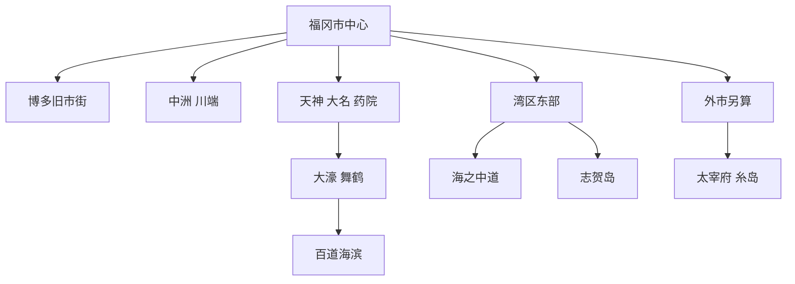
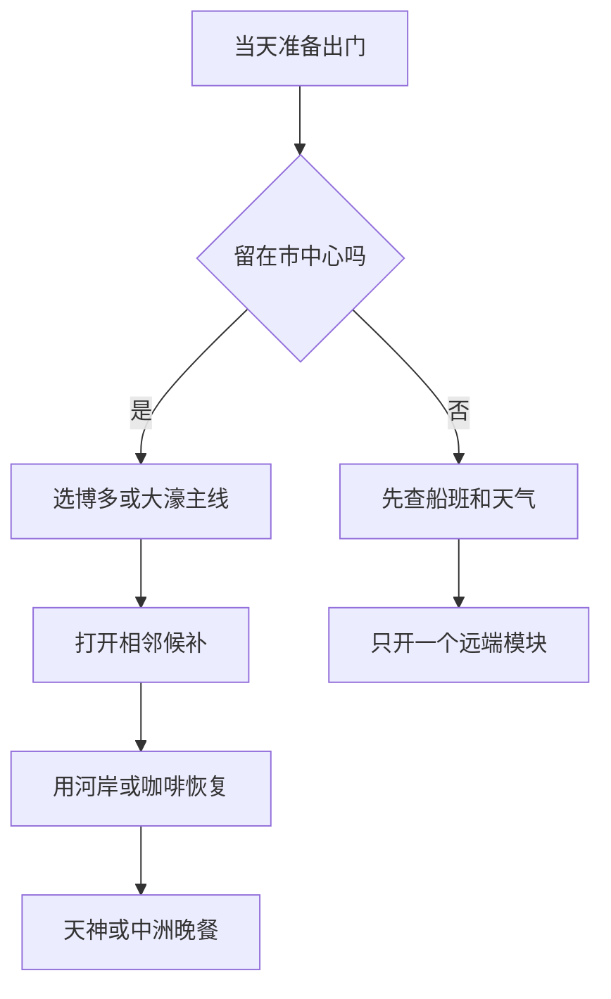

# 福冈市

> 一句话定位：福冈是一座把机场、双中心、古代港口史、街头饮食和海湾休闲压缩在很小半径内的城市，适合低压力落地后直接开始逛。  
> 建议停留：福冈市首访 2–3 天；加入海之中道、志贺岛、太宰府或糸岛，4–5 天更合理。  
> 对用户的主要匹配：湿润沿海、紧凑大城市、一人食、夜间街头体验、水岸散步、低规划门槛；古迹密度和都市规模小于东京、京都。  
> 本页用途：先离线决定留在市中心、去西侧海边还是开东部半日；太宰府和糸岛按外市项目另算。

## 先判断福冈是否适合这次旅行

福冈与用户的“沿海、好吃、交通方便、不要过度计划”高度匹配。博多与天神是两个主要城市中心，中洲位于二者之间；老城、商店街、河岸、屋台和购物可以在较小范围内串联。地铁降低了临场换片区的成本，豚骨拉面、乌冬、明太子饭、胡麻鲭和屋台都容易独食。

它也不是“景点堆满”的城市。代表体验更像城市生活：大濠公园走一圈、在博多旧市街看寺社、去百道看海、晚上短暂坐进屋台。若只按宏大古迹打分，福冈会弱于京都；若重视舒服底盘、食物、海风和周边探索，它会很强。海之中道、志贺岛虽行政上仍属福冈市，却已经需要专门交通和半天以上；太宰府、糸岛则是别的城市。

| 偏好或约束 | 匹配度 | 实际含义 |
|---|---:|---|
| 海边、水系与湿润感 | 高 | 百道、博多湾、大濠与东部海岸提供多种水景 |
| 一人食 | 很高 | 拉面、乌冬、鱼料理和屋台天然适合单人，锅物需筛单人店 |
| 慢启动、高巡航 | 很高 | 市中心半径小，午后仍可完成老城—中洲—天神连续线 |
| 街区漫游 | 高 | 博多旧市街、川端、天神、大名、药院各有不同生活层次 |
| 历史纵深 | 中高 | 古代对外交流、港口、寺町、福冈城与祭典值得看，但地标尺度较克制 |
| 摄影 | 中高 | 水岸、寺町、城墙、屋台与海边日落有潜力，极端宏大城市景观较少 |
| 周边扩展 | 很高 | 太宰府、糸岛及九州各城方便接入，但必须另建清单 |

## 福冈由哪些游览片区组成

市中心的核心是“博多—中洲—天神”短轴；大濠与百道向西展开，海之中道和志贺岛在博多湾东侧。图中虚线概念不用路线距离替代：东部仍要重新安排交通。

博多、中洲和天神可以在一天内按兴趣来回增删；大濠与百道适合做西侧水岸模块。海之中道、志贺岛不是逛完天神后的随手加点，太宰府与糸岛更不属于福冈市分母。

| 片区 | 稳定看点 | 适合怎样串联 | 边界提醒 |
|---|---|---|---|
| 博多站—寺町 | 承天寺、圣福寺、东长寺、博多千年门与小巷 | 从博多站步行进入寺町，再向栉田神社推进 | 寺院是宗教空间；部分堂内不开放或禁止摄影 |
| 栉田—川端—中洲 | 栉田神社、山笠文化、商店街、亚洲美术馆与河岸 | 白天老城，傍晚沿河走，夜间短坐屋台 | 屋台是否出摊受天气和店休日影响 |
| 天神—大名—药院 | 商业、地下街、咖啡、音乐与夜间饮食 | 天神作交通与购物底盘，向大名药院支路展开 | 商场是配套，只有主动游览街区才计完成 |
| 大濠—舞鹤—六本松 | 湖面步道、福冈城石垣、美术馆和文化设施 | 大濠环湖后进舞鹤公园，再向赤坂或六本松退出 | 公园范围大；花期与活动会改变动线 |
| 百道—西新 | 海滩、福冈塔、福冈市博物馆、城市西部生活 | 博物馆与海边组合，日落或夜景收束 | 海滨人工建设感强，强风和暴晒明显 |
| 海之中道 | 大型海滨公园、季节花海、水族馆 | 公园或水族馆选一个主锚点，体力足再组合 | 园区巨大，步行不能按普通公园估计 |
| 志贺岛 | 海岸骑行、金印发现地、海神信仰与眺望 | 适合晴天半日至一天 | 船班、公交、自行车、风雨和日落后交通须复核 |
| 能古岛 | 渡轮、岛屿花景与海湾视角 | 季节合适时单开半天 | 花期和船班决定价值，不是全年同质景点 |

## 主要景点

福冈的 A 级分母强调“城市为何是福冈”，不是搜到多少商业设施。用时为常见量级；寺社、博物馆、塔与船班仍要看当天公告。

| 景点 | 片区 | 类型 | 为什么去 | 典型用时 | 室内外 | 预约/排队 | 清图层级 |
|---|---|---|---|---:|---|---|---|
| 博多寺町走廊 | 博多旧市街 | 历史街区复合点 | 从博多千年门、承天寺、圣福寺到东长寺读取中世港口与寺町 | 2–3 小时 | 混合 | 无统一预约；个别堂内、活动与朱印有时段 | A |
| 栉田神社与山笠文化 | 栉田 | 神社与祭典 | 博多总镇守，是理解博多祇园山笠和城市身份的核心 | 45–75 分钟 | 室外为主 | 无常规预约；七月祭典期动线和人流特殊 | A |
| 川端商店街—中洲河岸 | 中洲川端 | 商店街与水岸复合点 | 从生活型有顶棚街区过渡到那珂川夜景和屋台 | 1.5–3 小时 | 混合 | 无预约；夜间人流和天气影响大 | A |
| 天神—大名街区 | 天神 | 城市街区 | 观察九州最大级别商业中心与支路青年文化 | 2–3 小时 | 混合 | 无预约；周末与活动时拥挤 | A |
| 大濠公园 | 大濠 | 水景公园 | 约 2 公里环湖步道、桥岛和坐点非常适合恢复与摄影 | 1–2 小时 | 室外 | 无预约；船艇和庭园另有营业规则 | A |
| 福冈城遗址—舞鹤公园 | 舞鹤 | 城址与公园 | 石垣、城门遗存和城市高点补足福冈藩历史 | 1.5–2.5 小时 | 室外为主 | 公园无统一预约；樱花季与活动拥挤 | A |
| 百道海滨 | 百道 | 城市海岸 | 把海风、沙滩、塔景和博多湾加入城市体验 | 1–2 小时 | 室外 | 无预约；强风、酷暑、雨天影响大 | A |
| 福冈市博物馆 | 百道 | 城市史博物馆 | 从国宝金印、对外交流到近现代福冈建立完整历史骨架 | 1.5–2.5 小时 | 室内 | 通常现场购票；周一等休馆和特展须复核 | A |
| 福冈亚洲美术馆 | 中洲川端 | 美术馆 | 以亚洲近现代艺术回应福冈面向大陆与亚洲的城市位置 | 1.5–2.5 小时 | 室内 | 展期、休馆、活动与票务须复核 | B |
| 福冈市美术馆 | 大濠 | 美术馆 | 与大濠公园无缝组合，适合雨热天气加入内容型主馆 | 1.5–2.5 小时 | 室内 | 展期、馆藏轮换与休馆须复核 | B |
| 福冈塔 | 百道 | 展望塔 | 从海滨高处同时看城市和博多湾，日落价值高 | 1–1.5 小时 | 室内 | 活动日、日落时段和营业须复核 | B |
| 鸿胪馆遗址展示馆 | 舞鹤 | 遗址博物馆 | 直接解释古代外交与贸易设施，和城址形成时代对照 | 45–75 分钟 | 室内 | 休馆与开放须复核 | B |
| 东长寺 | 博多寺町 | 寺院 | 福冈大佛、五重塔与寺町信仰空间 | 30–60 分钟 | 混合 | 无常规预约；堂内时段和摄影规则须遵守 | B |
| 圣福寺 | 博多寺町 | 禅寺 | 被视为日本首座正式禅寺，庭院氛围安静 | 30–60 分钟 | 室外为主 | 寺域部分不对外，避免把不可入区域写成打卡项 | B |
| 住吉神社 | 博多南侧 | 神社 | 古代海上交通信仰与住吉造，可作抵离日补点 | 45–75 分钟 | 室外 | 无常规预约；法会时尊重动线 | B |
| 博多运河城 | 栉田站附近 | 商业与建筑 | 大型中庭、商业与喷泉演出，适合雨天和补给 | 1–2 小时 | 室内为主 | 无统一预约；商店与演出调整频繁 | B |
| 博多町家故乡馆 | 栉田 | 民俗馆 | 以较小体量补充博多町人生活、工艺和节庆 | 45–75 分钟 | 室内 | 休馆和演示须复核 | B |
| 海之中道海滨公园 | 东区 | 国家公园 | 砂洲两侧临海、季节花田、骑行与大尺度绿地 | 半天至 1 天 | 室外 | 花期、闭园日、自行车和交通须复核 | C |
| 海洋世界海之中道 | 东区 | 水族馆 | 以九州近海生态为重点，可与海滨公园组合 | 2.5–4 小时 | 室内 | 建议提前查票与表演；旺季可能拥挤 | C |
| 志贺岛 | 东区 | 海岛与海岸路线 | 骑行、海景、金印故事和海神信仰 | 半天至 1 天 | 室外 | 船班、公交、租车、风雨和天黑时间须复核 | C |
| 能古岛 | 西区 | 海岛与花景 | 从近岸岛屿看博多湾，季节花田适合轻度度假 | 半天至 1 天 | 室外 | 渡轮、接驳和花期须复核 | C |
| 太宰府天满宫—九州国立博物馆 | 太宰府市 | 神社与博物馆 | 学问信仰、古代九州对外交往与大型国博 | 半天至 1 天 | 混合 | 不属福冈市；展馆休馆、神社工程与交通须复核 | C 外市 |
| 糸岛海岸 | 糸岛市 | 海岸与自驾路线 | 玄界滩、二见浦日落、咖啡与乡野海岸 | 半天至 1 天 | 室外 | 不属福冈市；公共交通分散，自驾、天气和日落须复核 | C 外市 |

福冈机场虽靠近市区，但只承担抵离与换乘，不计景点。国内、国际航站楼的地铁接续方式不同，出发日仍应核对航站楼与接驳，不用“机场很近”替代实际预留。

## 代表性美食与一人食

福冈餐饮密度高，但真正高价值的是把“本地特色”和“单人便利”同时做到。屋台是体验，不必每晚去；锅物是代表菜，也不必强迫一人吃大锅。

| 食物或体验 | 为什么有代表性 | 适合在哪个片区吃 | 独食友好 | 常见风险与替代 |
|---|---|---|---:|---|
| 博多豚骨拉面 | 细面、豚骨汤与替玉构成最广为人知的福冈食物 | 博多、天神、长滨 | 很高 | 榜首店长队；同街区普通专门店或非高峰时段替代 |
| 博多乌冬 | 福冈人日常频率很高，面较柔软、出汁温和 | 博多旧市街、祇园、天神 | 很高 | 名店午间排队；普通乌冬店替代性极强 |
| 辛子明太子 | 福冈最具识别度的加工海产，可配饭或做多种料理 | 博多、天神 | 很高 | 网红明太重门店排队；改吃明太子定食或买小份 |
| 胡麻鲭 | 生鲭鱼配芝麻酱汁，体现玄界滩海产 | 天神、博多、居酒屋 | 高 | 生食受渔获和安全影响；当天无货就换刺身或烧鱼 |
| 牛杂锅 | 战后发展成的福冈代表锅物，常以蔬菜、牛杂和收尾面组成 | 博多、天神 | 中 | 许多店按两人份起点；找一人锅、午市或小份店 |
| 水炊鸡锅 | 以鸡汤、鸡肉和蔬菜体现博多锅物传统 | 中洲、博多、药院 | 中 | 老店常需预约且适合多人；午间套餐或单人店更稳 |
| 一口饺子 | 小份、下酒、方便多店跳吃 | 博多、祇园、天神 | 很高 | 晚高峰可能满座；附近居酒屋通常有替代 |
| 屋台 | 不只吃饭，也是福冈夜间社交与街道文化 | 天神、中洲、长滨 | 很高 | 出摊受天气影响、座位少、不可外带；先看官方实时信息 |
| 屋台烧拉面、关东煮、烤串 | 比只在屋台吃一碗拉面更能体验多样菜单 | 屋台集中区 | 高 | 不同摊位菜单和价格不同；入座先看明码菜单 |
| 梅枝饼 | 太宰府门前代表点心 | 太宰府市 | 很高 | 属外市项目；不必在福冈市中心追仿制店 |

屋台对独行反而友好：小空间容易与摊主和邻座交流，官方指南也明确把单人视为合适方式。实用规则是先看菜单和价格、简短停留、不要把它当长时间占座酒吧；外带因卫生规定通常不允许。天气不好或没有出摊时，直接转天神、博多站或中洲川端的固定店，不要原地等待。

## 怎样把景点串起来

### 首访主线：从博多旧城走到天神夜晚

`博多千年门 → 承天寺或圣福寺 → 东长寺 → 栉田神社 → 川端商店街 → 福冈亚洲美术馆候补 → 中洲河岸 → 天神屋台或固定店晚餐`

主线约 4–6 公里，寺町、祭典文化、商店街、艺术、河景和夜间饮食连续变化。硬锚点是寺院和美术馆的开放；屋台不是硬锚点，因为天气和出摊状态会变。

- 中午后启动：保留东长寺、栉田神社、川端和河岸，圣福寺或美术馆二选一。
- 提前刷完：向天神、大名打开咖啡、商店或晚餐候补。
- 下雨：沿川端有顶棚商店街前进，减少河岸停留。
- 退出点：祇园、栉田神社前、中洲川端、天神都有地铁，不需要走回原路。

### 摄影与连续步行线：大濠到中洲

`大濠公园环湖 → 福冈市美术馆外部或入馆 → 福冈城石垣 → 舞鹤公园 → 赤坂 → 大名支路 → 天神 → 中洲河岸`

- 全线约 7–9 公里；只走大濠—舞鹤核心约 3–5 公里。
- 前半段是水面、桥岛、石墙与绿地，后半段逐渐进入小店、商业和夜景，适合从午后走到傍晚。
- 大濠公园、赤坂、天神、中洲川端均可退出；夏季应把美术馆或咖啡放在中段降温。
- 如果更想看海，把当天替换为 `百道海滨 → 福冈塔外观或登塔 → 福冈市博物馆 → 西新晚餐`，不要把两条水岸线同时塞满。

### 雨天线：中洲川端到博多站

`福冈亚洲美术馆 → 川端商店街 → 栉田神社短停 → 博多运河城 → 地铁或步行到博多站室内餐饮`

这条线以美术馆为内容锚点，商店街与商业体减少淋雨。若博物馆休馆，可改用福冈市博物馆作为单馆主线，再直接回天神地下街；不要在大雨天去海之中道、志贺岛或糸岛赌海景。

## 清图范围怎么定

- **A 级建议分母，共 8 项**：博多寺町复合点、栉田神社、川端—中洲复合点、天神—大名、大濠公园、福冈城—舞鹤、百道海滨、福冈市博物馆。
- **B 级兴趣池**：福冈亚洲美术馆、福冈市美术馆、福冈塔、鸿胪馆、东长寺或圣福寺深度入内、住吉神社、运河城、博多町家故乡馆。
- **C 级市内独立项目**：海之中道海滨公园、海洋世界、志贺岛、能古岛；行政上属于福冈市，但每次纳入行程时单开半天至一天分母。
- **C 级外市项目**：太宰府、糸岛；以后分别建立太宰府市、糸岛市 Markdown，不回填福冈市清图率。
- **不计入**：福冈机场、博多站换乘、普通商场、酒店、纯餐厅和只为吃饭经过的街道。
- **父子规则**：博多寺町走廊计 1 项，不把千年门、每座小寺和每条巷重复计；大濠公园与福冈城遗址分别计，因为一个是水景公园、一个是城址内容；百道海滨计 1 项，真正进入市博物馆可另计 1 项，登福冈塔只计 B。

## 慢启动、高巡航怎么用

福冈市中心允许很晚才决定路线，但越向海湾东部和外市移动，越需要提前锁定交通边界。

- 中午后才出门时，博多旧市街—中洲—天神最稳；大濠—舞鹤也能在半天内成立。
- 海之中道、志贺岛、能古岛、太宰府和糸岛必须在离开酒店前决定，不作为下午四点临时加点。
- 每天只锁一座博物馆、一个日落或一班船；其余都用相邻候补扩展。
- 恢复点优先大濠湖边、百道海滩、天神咖啡馆或地下街，不必回酒店。
- 屋台只是晚间候选之一。官方实时信息显示未出摊、队列过长或天气不适合时，立即切换固定店。
- 住宿选博多更方便跨城与机场，选天神更方便夜间饮食与街区；两者都不需要为了“绝对中心”反复换酒店。

## 出发前只复核这些

- [ ] 福冈市博物馆、亚洲美术馆、市美术馆、鸿胪馆及町家馆的休馆与当期展览。
- [ ] 福冈塔营业、活动日、日落时刻、风雨与能见度。
- [ ] 屋台官方实时营业、店休日、天气、支付和预约；具体摊位不能凭旧榜单判断。
- [ ] 海之中道公园花期、闭园、园内交通和自行车；海洋世界票务与表演。
- [ ] 志贺岛、能古岛的市营渡轮、公交、租车与末班时间。
- [ ] 太宰府神社工程、九州国立博物馆休馆、糸岛交通与海边日落，且确认它们属于外市行程。
- [ ] 七月博多祇园山笠、五月博多咚打鼓、十一月九州场所等大型活动的日期与交通影响。
- [ ] 台风、暴雨、酷暑、海风和冬季海况。
- [ ] 本页核验日之后的店铺停业、场馆整修、票价和地铁公交变化。

## 来源

以下均在 2026-07-30 核验；具体营业、班次和价格以出发日官方页面为准。

- [福冈市官方旅游指南](https://www.gofukuoka.jp/)与[片区指南](https://www.gofukuoka.jp/area-guide.html)：确认博多、中洲川端、天神药院、大濠、百道、东部和周边的内容结构。
- [福冈市官方推荐路线目录](https://gofukuoka.jp/en/route)：核对各片区可连续组合的景点与步行关系。
- [博多旧市街摄影路线](https://gofukuoka.jp/en/route/detail/1b704108-4a91-4bc7-aba2-2ca25129a548)：博多千年门、寺町、栉田神社与亚洲美术馆的连续路径。
- [福冈初访官方指南](https://www.gofukuoka.jp/en/articles/detail/fd2b889b-7457-493b-b5e4-49e274ed87bb)：旧市街、运河城、亚洲美术馆与城市入门结构。
- [大濠公园官方旅游说明](https://www.gofukuoka.jp/en/articles/detail/47671a52-cfa5-4b5c-92be-4ebf6c1e9bc5)：约 2 公里环湖步道、城壕历史、坐点及周边馆舍。
- [福冈城与鸿胪馆区域](https://www.gofukuoka.jp/en/articles/detail/cb84bbc2-ad57-47f0-bfc3-9caf610a3f9d)：舞鹤公园内两段不同时代遗址的关系。
- [百道海滨官方路线](https://gofukuoka.jp/en/route/detail/374fbd9f-eccd-497a-853c-1d51723505f6)：福冈塔、市博物馆与海滨的相邻关系。
- [福冈市博物馆官网](https://museum.city.fukuoka.jp/en/)：国宝金印、对外交流史、开放与休馆；时段只作当期信息。
- [福冈塔官网](https://www.fukuokatower.co.jp/)：营业、活动和现场公告；日落与活动日出发前复核。
- [福冈市官方水系专题](https://www.gofukuoka.jp/en/articles/detail/f590b215-77b4-4324-8fc8-eb189717744d)：大濠、志贺岛、海之中道和博多湾水岸的差异。
- [海之中道官方旅游说明](https://www.crossroadfukuoka.jp/en/articles/uminaka)：确认公园位于福冈市东区砂洲、园区尺度和季节花景。
- [太宰府官方推荐路线](https://gofukuoka.jp/route/detail/b52dd2dd-a009-4291-ae76-7bff8f61144a)：太宰府天满宫与九州国立博物馆可组合，但行政上属于太宰府市。
- [福冈县官方糸岛指南](https://www.crossroadfukuoka.jp/en/articles/new_itoshima)：糸岛海岸属于外市、点位分散，适合独立半日或一日。
- [福冈本地饮食专题](https://www.gofukuoka.jp/en/articles/detail/d773d813-d160-4b3f-8092-8f7c2fe5d17d)：明太子、屋台及城市餐饮文化；[锅物专题](https://www.gofukuoka.jp/en/articles/detail/f8bce646-da5f-4661-8339-8c6764e76a2e)支持牛杂锅与水炊鸡锅。
- [福冈屋台入门](https://www.gofukuoka.jp/en/articles/detail/ff5d9c6d-860e-4ec5-952f-366c1b2b60fe)：实时营业查询、单人适配、座位与禁止外带等规则。

