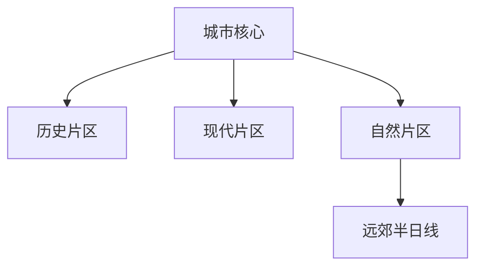

# 城市名

> 一句话定位：这座城市最值得为什么而去。  
> 建议停留：首访 X–Y 天；深度 X–Y 天。  
> 对用户的主要匹配：海边、历史、城市漫游、摄影、独行、国际化等。  
> 本页用途：先离线完成目的地判断和路线拼装；出发前只复核文末时变项目。

## 先判断这座城市适不适合本次旅行

说明最强体验、明显短板、适合谁、不适合什么时段或旅行方式。

## 城市由哪些游览片区组成

先用一张图说明片区关系，不按行政区机械罗列。

图后用文字说明哪些片区可步行串联，哪些需要跨区交通。

## 主要景点

| 景点 | 片区 | 类型 | 为什么去 | 典型用时 | 室内外 | 预约/排队 | 清图层级 |
|---|---|---|---|---:|---|---|---|
| 示例 | 示例片区 | 博物馆 | 核心看点 | 2–3 小时 | 室内 | 出发前复核 | A |

景区内部需要拆分时，在表后解释父子计数方式。

## 代表性美食

| 食物或体验 | 为什么有代表性 | 适合在哪个片区吃 | 独食友好 | 常见风险 |
|---|---|---|---:|---|
| 示例 | 本地传统 | 核心片区 | 高 | 网红店长队 |

稳定的菜品与饮食文化优先；具体店名可以列，但必须注明最后核验日期和替代逻辑。

## 怎样把景点串起来

### 首次到访主线

`片区 A → 片区 B → 路线内休息 → 片区 C`

说明为什么顺、硬锚点是什么、可以删什么。

### 摄影或连续步行线

标注沿途景观、最佳大致时段、退出点和体力成本。

### 雨天或高温线

用博物馆、商场、室内街区等组成替代模块。

## 清图范围怎么定

- A 级：首次旅行应优先完成的城市核心；
- B 级：同片区补充；
- C 级：远郊、季节性或需要单独半天以上；
- 不计入：交通、普通商业配套和仅用于换乘的节点。

## 对用户旅行方式的适配

说明慢启动、高巡航、单人旅行、路线内休息、摄影和一人食的实际用法。

## 出发前只复核这些

- [ ] 核心景点开放与预约；
- [ ] 季节性活动和自然风险；
- [ ] 远郊交通；
- [ ] 具体餐厅是否仍营业；
- [ ] 本页最后研究日期之后发生的重大变化。

## 来源

优先列官方旅游局、场馆/景区官网、政府文化机构和可靠开放资料。每个链接旁标明用于支持什么信息及核验日期。

