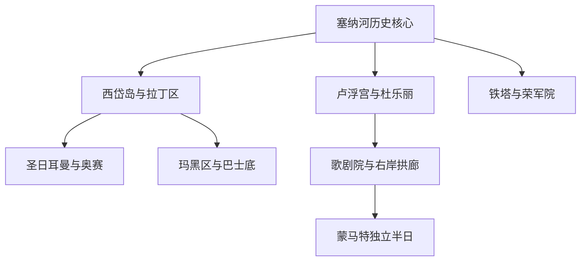
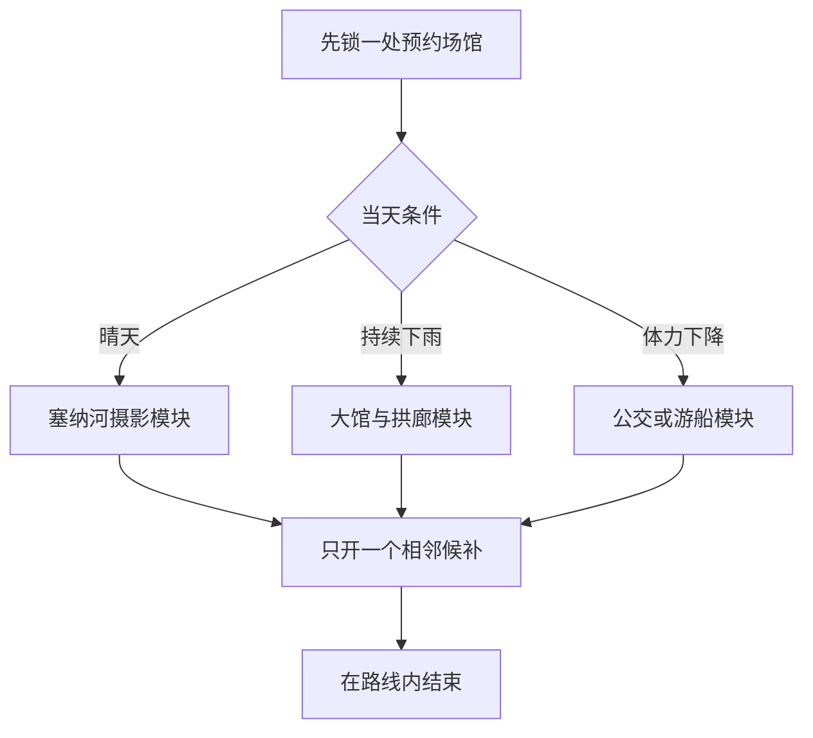

# 巴黎

> 一句话定位：巴黎最强的体验是把世界级艺术、塞纳河两岸、历史街区、咖啡馆和日常城市审美压缩在可步行的中央区域里。  
> 建议停留：第一次到访 **4–5 个完整游览日**；加入凡尔赛并放慢博物馆节奏，建议 **6–7 日**。  
> 对你的主要匹配：历史与街区漫游、建筑摄影、河岸步行、内容型大馆、国际化和“路线内坐下来”都很强；摩擦点是热门票难抢、老地铁楼梯多、旅游区拥挤、部分老酒店设施不稳定。  
> 本页用途：先离线决定片区、清图分母和路线模块；票价、开放时间、预约、罢工与临时闭馆在出发前复核。

## 先判断巴黎适不适合这次旅行

巴黎适合第一次欧洲旅行，因为最经典的内容不只是一组孤立地标。卢浮宫、杜乐丽花园、塞纳河、西岱岛、拉丁区和圣日耳曼能连续步行；埃菲尔铁塔、凯旋门和蒙马特则是三个需要主动切换交通的独立模块。你喜欢可摄影的移动过程，巴黎中央河岸、桥梁和街区会比“打车到门口拍完就走”更有价值。

与妈妈同行时，巴黎的难点不是景点数量，而是石板路、地铁楼梯、大馆久站和热门点安检叠加。合理版本应每天只安排一个大馆或一个登高点，其余用公园、咖啡馆、游船和街区外观补齐。凡尔赛、吉维尼和迪士尼都不算巴黎市区的顺路景点，只有明确拿出完整一天才加入。

巴黎四季都可作为城市目的地；夏季长日照适合河岸，冬季更依赖室内馆。极端高温、塞纳河水位、交通罢工、大型活动和馆舍工程会显著改变当天体验，不能在长期文件里写成固定保证。

## 城市由哪些游览片区组成

先抓住塞纳河历史核心，再看向西的铁塔轴、向北的歌剧院与蒙马特。下图表示游览关系，不是行政区地图。

- **西岱岛—拉丁区—圣日耳曼**：巴黎圣母院、圣礼拜堂、塞纳河桥、大学街巷和咖啡馆；最适合首访历史步行。
- **卢浮宫—杜乐丽—协和广场**：艺术馆、宫殿轴线和花园连续；向西可接香榭丽舍与凯旋门，但全程走完会很长。
- **埃菲尔铁塔—特罗卡德罗—荣军院**：巴黎封面摄影区；与卢浮宫并非“隔壁”，应独立成半日。
- **玛黑区—孚日广场**：中世纪街巷、贵族府邸、犹太文化和当代商店混合；适合没有硬预约时自由漫游。
- **歌剧院—大街区—拱廊**：巴黎歌剧院、老百货和有顶拱廊集中；雨天比蒙马特稳。
- **蒙马特**：圣心堂、坡道、石板路和城市制高点；应视为独立半日，从高处往低处走更省体力。

西岱岛、拉丁区和圣日耳曼可连续步行；卢浮宫和奥赛隔河相望，但两个馆同日全量不合理。埃菲尔铁塔、凯旋门和蒙马特之间优先公共交通切换，不为了“地图上都在市中心”强行走成一条线。

## 主要景点怎样分层

表中“典型用时”是拼装路线的规划估算，不是官方承诺；包含正常安检和短休，不包含极端排队。A 是首访清图分母，B 是兴趣补充，C 需要单独半日至一日。

### A 级：第一次到访优先完成

| 景点或体验 | 片区 | 为什么去 | 典型用时 | 室内外 | 预约与排队 | 体力 |
|---|---|---|---:|---|---|---|
| 埃菲尔铁塔—特罗卡德罗 | 巴黎西侧 | 城市封面、结构细节和跨河视角一次完成 | 只拍外观 1.5–2 小时；登塔 2.5–3.5 小时 | 混合 | 登塔强烈建议官方时段票；仍有安检和电梯等待 | 外观中；登顶中高 |
| 卢浮宫 | 右岸核心 | 从古代文明到欧洲绘画的超大馆，首访内容锚点 | 核心 2.5–3 小时；全量远超半天 | 室内 | 官方强烈建议预约时段；旺季可能强制预约 | 高，馆大且久站 |
| 巴黎圣母院—西岱岛核心 | 西岱岛 | 哥特教堂、城市原点和塞纳河桥景 | 1.5–2.5 小时 | 混合 | 教堂免费；官方免费预约只用于减排队，不要购买第三方“快速票” | 中 |
| 圣礼拜堂 | 西岱岛 | 高密度彩窗，是巴黎最值得主动排时段的室内建筑之一 | 45–75 分钟 | 室内 | 建议预订；法院区域安检可能增加等待 | 低到中 |
| 奥赛博物馆 | 左岸 | 印象派与后印象派主线集中，规模比卢浮宫易控制 | 2.5–4 小时 | 室内 | 建议官网购票；热门展和免费日规则需复核 | 中高 |
| 凯旋门—香榭丽舍轴 | 巴黎西侧 | 城市放射轴线和高处街景 | 外观 45 分钟；含登顶 1.5–2 小时 | 混合 | 登顶可提前购票；官方仪式或天气可能临时关闭 | 登顶高，常规 284 级台阶 |
| 蒙马特—圣心堂 | 巴黎北部 | 山城感、街巷、教堂和俯瞰巴黎的组合 | 3–4 小时 | 以室外为主 | 教堂参观规则和穹顶另查；热门时段拥挤 | 高，坡道和石板路多 |
| 玛黑区—孚日广场 | 右岸东段 | 历史街区、庭院、商店与日常巴黎混合 | 2.5–4 小时 | 混合 | 街区不预约；小馆各自查票 | 中高 |
| 拉丁区—圣日耳曼漫游 | 左岸核心 | 大学、教堂、书店、咖啡馆和小街连续 | 3–4 小时 | 混合 | 街区不预约；先贤祠等内部点另算 | 中高 |
| 塞纳河步行或游船 | 两岸 | 把桥梁、立面和城市尺度串起来，也是低体力恢复模块 | 步行 2–3 小时；游船约 1–1.5 小时 | 室外或半室内 | 游船班次和码头需复核 | 步行中；游船低 |

### B 级：按兴趣和天气补充

| 景点或体验 | 片区 | 为什么去 | 典型用时 | 室内外 | 预约与排队 | 体力 |
|---|---|---|---:|---|---|---|
| 橘园美术馆 | 杜乐丽西端 | 莫奈《睡莲》空间明确，适合大馆后的短馆 | 1–1.5 小时 | 室内 | 建议订时段 | 低到中 |
| 巴黎歌剧院 | 歌剧院区 | 第二帝国建筑、楼梯与室内装饰摄影 | 1.5–2 小时 | 室内 | 演出、排练会改变自助参观区域，先查时段 | 中 |
| 皇家宫殿—有顶拱廊 | 右岸核心 | 柱廊、庭院和 19 世纪商业空间，雨天好用 | 1.5–2.5 小时 | 半室内 | 街区不预约 | 低到中 |
| 罗丹美术馆 | 荣军院附近 | 雕塑、宅邸与花园尺度舒适 | 1.5–2.5 小时 | 混合 | 热门展建议订 | 中 |
| 荣军院与军事博物馆 | 巴黎西侧 | 法国军事史、穹顶与拿破仑墓 | 2–3.5 小时 | 室内为主 | 建议查票和展厅关闭 | 中高 |
| 先贤祠 | 拉丁区 | 法国名人纪念空间和穹顶建筑 | 1–1.5 小时 | 室内 | 可提前购票；登高另查 | 中 |
| 卢森堡公园 | 左岸 | 大馆与街区之间的低决策休息 | 1–2 小时 | 室外 | 无需预约；天气敏感 | 低到中 |
| 拉雪兹神父公墓 | 巴黎东部 | 墓园景观、名人墓与城市绿地 | 2–3 小时 | 室外 | 无需预约 | 高，路面和坡度 |
| 巴黎地下墓穴 | 南部 | 独特城市地下史 | 1.5–2 小时 | 室内地下 | 容量有限，建议官方时段票 | 高，楼梯多且空间封闭 |
| 圣马丁运河 | 巴黎东北 | 水边日常和住宅区漫游 | 2–3 小时 | 室外 | 无需预约 | 中 |

**当前重要状态**：蓬皮杜中心巴黎主楼已在 2025 年完全闭馆，官方预计 2030 年重开。2026 年不能把它当雨天室内馆；可看建筑外观和周边街区，临时展应跟随官方“Constellation”项目另查，不计入默认清图分母。

### C 级：只在本次明确纳入时计数

| 目的地 | 与巴黎的关系 | 建议占用 | 室内外 | 预约与排队 | 体力 |
|---|---|---:|---|---|---|
| 凡尔赛宫与庄园 | 法兰西岛独立城市 | 一整日 | 混合 | 宫殿需指定时段；花园活动、交通和票种另复核 | 很高，园区巨大 |
| 吉维尼莫奈故居花园 | 诺曼底方向季节性目的地 | 一整日 | 以室外为主 | 季节开放，建议提前订并查接驳 | 中高 |
| 枫丹白露宫 | 法兰西岛远郊 | 一整日 | 混合 | 建议查铁路、接驳和票务 | 中高 |
| 巴黎迪士尼 | 法兰西岛东部 | 一至两日 | 混合 | 日期票和园区规则需单独规划 | 很高 |

## 大馆和登高点怎样控制体力

卢浮宫不是靠“多留两小时”就能全看完。更适合你的版本是：

- **核心版**：提前选一个主题走廊加 6–10 件重点作品，约 2–2.5 小时；
- **扩展版**：状态好时再加相邻翼，增加 60–90 分钟；
- **退出后候补**：皇家宫殿、杜乐丽花园或塞纳河坐休，不再临时去奥赛全量。

奥赛同样准备“印象派核心版”和“全馆版”。埃菲尔铁塔二层、顶层和塔下花园只计一个景点；凯旋门外观和登顶也只计一次。妈妈不登顶并不等于这个景点没有完成，外观与轴线已经构成首访核心体验。

巴黎圣母院目前进入教堂本体免费。官方明确提示免费预约只在临近参观时开放，用于减轻排队，并非强制；任何第三方出售的教堂“免排队票”都不应购买。

## 代表性美食怎样选

巴黎的代表性不只来自昂贵法餐。面包店、市场、老式 bouillon、大众小酒馆和移民饮食，才更适合连续游览中的一人或两人用餐。

| 食物或体验 | 适合片区 | 一人友好 | 两人友好 | 怎样避免踩坑 |
|---|---|---:|---:|---|
| 可颂、法棍与咖啡早餐 | 住处附近的独立面包店 | 很高 | 高 | 看现场出炉和本地客流，不必跨城追同一家 |
| Jambon-beurre 火腿黄油法棍 | 市场、面包店 | 很高 | 高 | 适合路线上快速补给；与甜点分开买更易控量 |
| Bouillon 大众食堂 | 大街区、共和国广场等 | 高 | 高 | 菜单传统、价格清楚；热门店仍可能长队，设放弃线 |
| 小酒馆经典菜 | 圣日耳曼、玛黑外围、住宅街 | 中高 | 很高 | 洋葱汤、油封鸭、牛排薯条等按兴趣选，不必一顿全点 |
| 可丽饼与荞麦咸饼 | 蒙帕纳斯、拉丁区 | 很高 | 高 | 一份完整度高，适合独食；景点口即做即走店质量差异大 |
| 奶酪与熟食拼盘 | 市场、葡萄酒店 | 中 | 很高 | 两人分享优势明显；确认生乳、咸度和酒精接受度 |
| 法式甜点 | 各区可靠 pâtisserie | 很高 | 很高 | 选巴黎布雷斯特、千层、法式布丁或季节款，少量分次吃 |
| 北非 couscous 与塔吉锅 | 巴黎东北、拉丁区外围 | 中高 | 很高 | 是巴黎移民城市的一部分；两人更便于分享 |
| 越南粉与东南亚简餐 | 十三区及多元街区 | 很高 | 高 | 适合作为连续法餐后的低决策恢复餐 |
| 市场采购加公园简餐 | 玛黑、拉丁区、住宅区市场 | 很高 | 很高 | 先确认公园规则、天气和洗手间，不在炎热天气久放乳制品 |

独行时优先面包店、bouillon、吧台座、小酒馆午餐和可丽饼；两人同行的增益主要在拼盘、整瓶酒、甜点分享和正式晚餐。具体餐厅可能在午晚餐之间停厨，不能把“地图显示营业”直接理解成随时可点正餐。

## 怎样把景点串起来

巴黎适合一条连续主线加一个硬锚点。下雨、体力和预约情况决定当天使用哪种模块，而不是要求每条路线从头走到尾。

### 首次到访主线：西岱岛到卢浮宫

`圣礼拜堂 → 巴黎圣母院 → 拉丁区 → 圣日耳曼 → 塞纳河左岸 → 新桥 → 卢浮宫庭院或内部`

- **硬锚点**：圣礼拜堂或卢浮宫时段二选一；如果卢浮宫做全量，路线到卢浮宫就结束。
- **为什么顺**：哥特教堂、旧城、大学街区、咖啡馆和宫殿轴线连续，约 4–5 公里，不需频繁换乘。
- **删减规则**：出门晚就保留圣礼拜堂、圣母院和左岸漫游；卢浮宫只看庭院。若已订卢浮宫，则圣礼拜堂改外观或另日。
- **休息点**：圣日耳曼咖啡馆、塞纳河坐席、杜乐丽花园。与妈妈同行，经过新桥后可乘公交，不必硬走到协和广场。

### 摄影连续步行线：铁塔到塞纳河西段

`特罗卡德罗 → 埃菲尔铁塔外观 → 战神广场 → 比尔哈凯姆桥 → 塞纳河岸 → 亚历山大三世桥 → 荣军院外观`

- **摄影价值**：远景、塔下结构、桥梁框景、河岸立面和金色穹顶连续出现。
- **体力成本**：完整约 5–6 公里；如果已经登塔，默认在比尔哈凯姆桥或战神广场结束，不再全走。
- **大致时段**：清晨人少，傍晚到蓝调光线层次更丰富；具体日落、灯光和闪灯规则出发前查。
- **退出点**：Trocadéro、Bir-Hakeim、Invalides 一带均可转地铁、RER、公交或出租车。妈妈体力下降时，用游船替代后半段河岸步行。

### 雨天线：卢浮宫到右岸有顶拱廊

`卢浮宫核心版 → 皇家宫殿柱廊 → Galerie Vivienne → Passage des Panoramas → 巴黎歌剧院外观或预约参观`

- **硬锚点**：卢浮宫或巴黎歌剧院内部二选一作为主场馆。
- **为什么顺**：大馆、庭院和有顶拱廊连续，户外暴露段较短；沿途咖啡馆多，容易坐休。
- **删减规则**：卢浮宫看满三小时就只走皇家宫殿，不再追歌剧院内部。大雨伴大风时直接用公交连接，不为了“线路完整”淋雨。
- **当前边界**：蓬皮杜中心主楼在 2026 年关闭，不能作为这条雨天线的候补馆。

### 与妈妈同行的低体力线：奥赛到杜乐丽

`奥赛博物馆核心版 → 塞纳河短段 → 杜乐丽花园坐休 → 橘园美术馆可选 → 协和广场公交离开`

只把奥赛设为必完成项。橘园有票且妈妈状态好再进入；否则在花园坐下、吃简餐后结束。这个模块把一座内容馆、短步行和可坐休空间放在一起，适合作为前一天高强度后的恢复日。

## 清图范围怎么定

### 默认分母

- **A 级 10 项**：埃菲尔铁塔—特罗卡德罗；卢浮宫；巴黎圣母院—西岱岛核心；圣礼拜堂；奥赛博物馆；凯旋门—香榭丽舍轴；蒙马特—圣心堂；玛黑区—孚日广场；拉丁区—圣日耳曼漫游；塞纳河步行或游船。
- **B 级**：橘园、歌剧院、皇家宫殿与拱廊、罗丹、荣军院、先贤祠、卢森堡公园、拉雪兹、地下墓穴、圣马丁运河等，按本次兴趣加入。
- **C 级**：凡尔赛、吉维尼、枫丹白露、巴黎迪士尼；必须在出发前明确拿出独立日期才计入。
- **不计入**：机场、火车站、普通百货、酒店、纯换乘站、关闭中的博物馆内部，以及只在车上看到的地标。

### 父子项目怎样计数

- 埃菲尔铁塔外观、二层、顶层和塔下花园合计 1 项；是否登顶不影响 A 项完成。
- 卢浮宫各翼和名作不单独计数；奥赛、橘园是独立场馆，可分别计。
- 巴黎圣母院广场、教堂本体和西岱岛短环线按 1 项；圣礼拜堂因独立购票和体验明确，另计 1 项。
- 蒙马特街区与圣心堂按一个路线型项目；缆车、画家广场不重复计数。
- 塞纳河步行与普通观光游船默认二选一完成同一个 A 项；若本次特别研究桥梁或航运，再另建主题分母。
- 凡尔赛宫、花园、特里亚农庄园在城市级清图中合计 1 个 C 项，不用园区子点把完成率拉高。

因此，首访完成 8/10 个 A 项已经是高完成度。凡尔赛不应挤占市区 A 项后再反过来降低巴黎清图率。

## 与妈妈同行时怎样安排住宿和交通

### 住宿先看地面环境和酒店硬件

- **Opéra／Madeleine**：中央、公交多、去卢浮宫和右岸方便，适合作为第一次到访底盘；价格高，主路房可能吵。
- **Saint-Germain／Odéon**：左岸步行体验好，去西岱岛和卢森堡公园方便；老楼电梯、空调和浴室要逐项确认。
- **Louvre／Palais Royal**：最省中央景点交通，但旅游客流和房价都高，房间可能小。
- **Montparnasse／十五区北部**：住宅感和房型通常更稳，去左岸方便；到蒙马特和玛黑区要跨区。
- **不建议把蒙马特山坡当默认亲子基地**：风景好，但拖行李、石板路和坡度会持续消耗。喜欢蒙马特可以半日游，不必住在坡上。

订房时明确确认：客房电梯是否从街面直达、是否有空调、双床间真实床宽、浴缸还是步入式淋浴、夜间噪音、前台是否 24 小时。巴黎老楼“有电梯”可能只是很小的轿厢，不能自动等同于行李和行动便利。

### 公共交通的关键规则

- 2026 年法兰西岛票制把地铁／火车／RER与公交／有轨电车分成不同单程票；机场铁路使用专门机场票。具体价格、通票是否划算和手机兼容性，到行前用 Île-de-France Mobilités 官方页面计算，不在本页固化。
- 每位乘客都要持有并验证自己的票或设备，保存到行程结束以备查验。机场票与普通票不能想当然互换。
- 巴黎历史地铁网无障碍程度有限。RATP 资料显示，**14 号线**可提供完整无障碍路径，公交、部分 RER 和有轨电车通常更适合行动不便者，但仍要检查具体车站、站点和电梯状态。
- Châtelet–Les Halles、Gare du Nord、Auber／Opéra 等大型节点内部距离可能很长。与妈妈同行时，宁可多坐一段直达公交或短途出租车，也不要为了少花一次票做复杂换乘。
- 蒙马特优先从高处进入、向下走，或使用公交和缆车削减爬坡；凡尔赛花园面积很大，不能按普通城市公园估体力。

### 景点里的体力底线

- 卢浮宫和奥赛不要同日全量；每个大馆先在平面图上定核心路线和出口。
- 埃菲尔铁塔官方说明：顶层和楼梯不适合行动受限者。妈妈若腿脚疲劳，二层电梯或纯外观已经足够。
- 凯旋门常规登顶约 284 级台阶；确有需要者可向现场询问电梯。无论是否登顶，都从地下通道进入，**不要横穿环岛车流**。
- 蒙马特默认高处下行，遇雨时石板路更滑；圣心堂外观加一段街巷即可，不强求穹顶。
- 凡尔赛单独留一整日，宫殿、花园和特里亚农不要全部列为必完成。官方也提示花园对行动不便者并不轻松。
- 每 90–120 分钟嵌入咖啡馆、公园座椅或游船坐休；时间敏感晚餐或夜景前不先回酒店躺下。

## 对独行和两人同行的适配

独行时，巴黎的面包店、市场、bouillon、小馆午餐、博物馆和河岸线都很友好；真正的决策成本来自订票和热门餐厅。最适合你的版本是中午前后进入一个预约馆，退出后沿同一街区高巡航，不临时跨区追第二个大馆。

两人同行的优势在于分享甜点、奶酪拼盘和晚餐，也能在地铁换乘、看包和语言沟通时互相照应。与妈妈同行时，以她的体力为白天基线；你还有余力，可在她回酒店后追加住处附近夜景，不把她的休息需求变成“少玩了”的亏损感。

旅游区和公共交通要防扒窃。官方旅游机构建议把包闭合并置于身前，不响应假请愿、街头赌博和无牌兜售；护照复印件与原件分开保存。警惕即可，不需要因此放弃正常夜间街区活动。

## 出发前只复核这些

- [ ] 申根签证、护照有效期、旅行保险和入境材料；
- [ ] 卢浮宫、埃菲尔铁塔、圣礼拜堂、奥赛、歌剧院、凯旋门的官方时段票与退改规则；
- [ ] 巴黎圣母院免费预约的最新开放窗口，确认没有购买第三方收费“快速票”；
- [ ] 蓬皮杜中心主楼关闭与 2030 重开计划是否有变化，临时展实际在哪个合作场馆；
- [ ] 凡尔赛宫殿指定时段、花园音乐喷泉／音乐花园日期、RER 或铁路中断；
- [ ] Île-de-France Mobilités 当前票价、机场票、手机或 Navigo Easy 的兼容规则；
- [ ] RATP 罢工、施工、无障碍电梯和目的车站出口；
- [ ] 妈妈是否需要无台阶路线、场馆优先入口、轮椅或陪同票证明；
- [ ] 塞纳河水位、极端高温、大风、降雨和当日日落时间；
- [ ] 具体餐厅是否仍营业、正餐停厨时段、是否需要订位；
- [ ] 本页研究日 2026-07-30 之后的重大场馆关闭或安全提示。

## 来源

以下均于 **2026-07-30** 核验；票价和每日开放时间没有固化为永久事实。

- [Paris je t’aime：首次到访重点路线](https://parisjetaime.com/eng/article/50-top-sights-and-attractions-in-a-weekend-a1012)：用于核对首访地标和按地理片区组合的官方旅游建议。
- [Paris je t’aime：住宿片区指南](https://parisjetaime.com/eng/article/where-to-stay-in-paris-guide-and-directory-of-accommodation-by-neighbourhood-and-arrondissement-a1964)：用于核对各区定位；本页住宿建议另结合亲子同行体力判断。
- [卢浮宫票务与开放信息](https://www.louvre.fr/en/visit/hours-admission/tickets-and-prices)：用于核对时段预约、免费条件、出馆后不能凭原票再次进入等动态规则。
- [卢浮宫无障碍参观](https://www.louvre.fr/en/visit/accessibility)：用于核对预约建议、优先入口和推荐舒适路线。
- [埃菲尔铁塔参观准备](https://www.toureiffel.paris/en/planning-smooth-visit)：用于核对官方票、指定时段、安检和现场排队结构。
- [埃菲尔铁塔无障碍说明](https://www.toureiffel.paris/en/disabled)：用于核对二层、顶层、楼梯和行动受限者的边界。
- [巴黎圣母院免费预约](https://www.notredamedeparis.fr/en/visit/reservation-free/)：用于核对教堂免费、预约非强制、临近时段放出及第三方收费票无效。
- [圣礼拜堂实用信息](https://www.sainte-chapelle.fr/en/visite/informations-pratiques)：用于出发前复核季节开放、票务、临时天气关闭和入场规则。
- [奥赛博物馆票务](https://www.musee-orsay.fr/en/Visit/rates)：用于出发前复核官方票、免费日预约和当前展览规则。
- [凯旋门实用信息](https://www.paris-arc-de-triomphe.fr/en/visite/informations-pratiques)：用于核对地下通道、常规 284 级台阶、天气或仪式临时关闭。
- [RATP 无障碍网络说明](https://www.ratp.fr/en/registreaccessibilite)：用于核对巴黎公交、RER、历史地铁和 14 号线的无障碍边界。
- [Île-de-France Mobilités：票种与票价](https://www.iledefrance-mobilites.fr/en/titres-et-tarifs)：用于出发前复核普通铁路票、公交票、机场票及通票；价格会变，不在正文永久化。
- [凡尔赛宫 2026 票务说明](https://en.chateauversailles.fr/2026-ticketing)：用于核对宫殿指定时段、花园季节票务和庄园父子关系。
- [凡尔赛宫无障碍说明](https://en.chateauversailles.fr/accessibility-for-all)：用于核对宫殿、花园和行动不便者的现实边界。
- [蓬皮杜中心 2030 改造项目](https://www.centrepompidou.fr/en/centre-pompidou-is-transforming-itself/renovation-project-centre-pompidou-2030)：用于核对巴黎主楼 2025 年闭馆、2026 年施工和官方预计 2030 年重开。
- [Paris je t’aime：游客安全建议](https://parisjetaime.com/eng/article/tips-for-enjoying-paris-while-staying-safe-a757)：用于核对扒窃、假请愿和证件备份等基础提醒。

