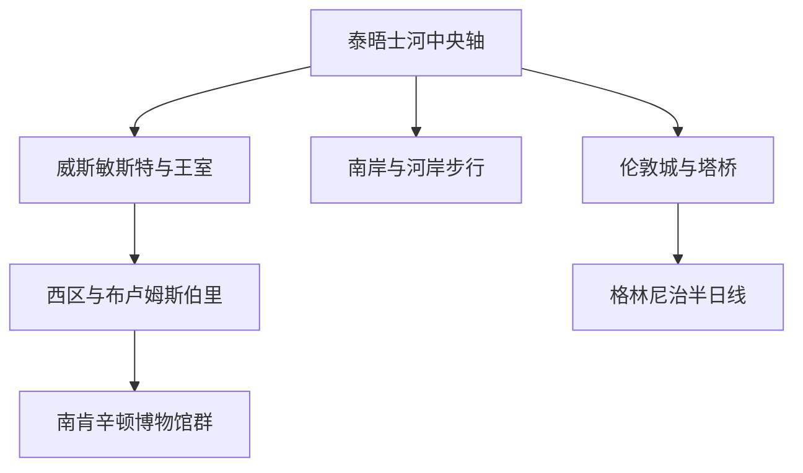
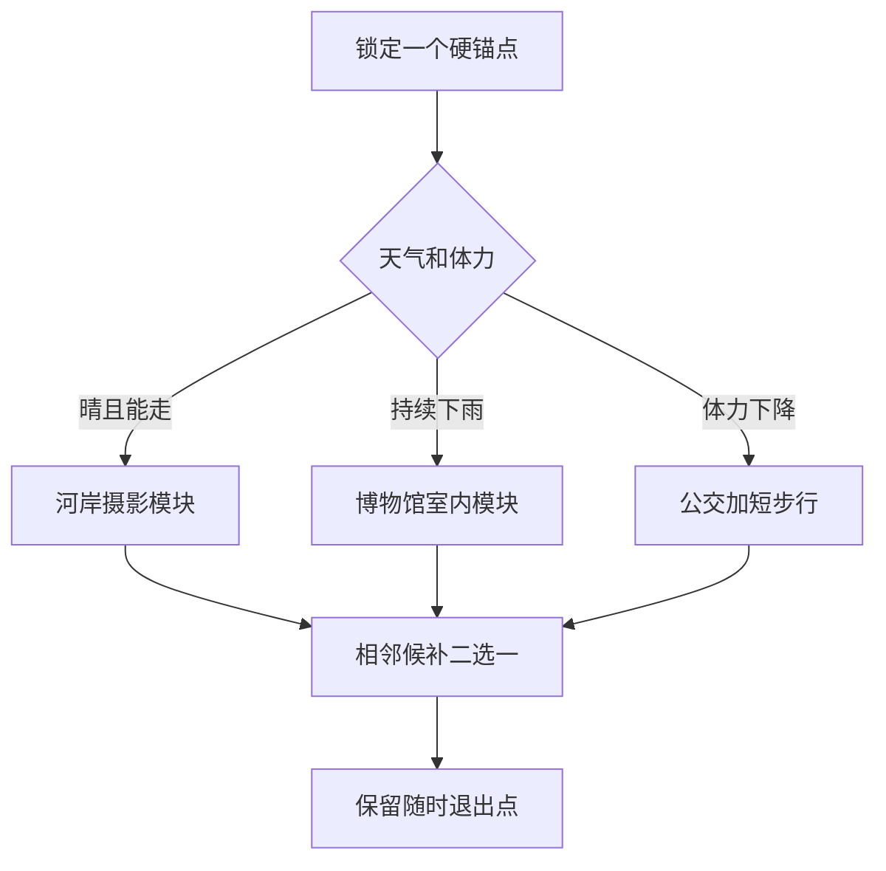

# 伦敦

> 一句话定位：伦敦的强项不是一座“必看建筑”，而是王室与国家史、世界级博物馆、泰晤士河景观、成熟公共交通和高度国际化街区能连续组合。  
> 建议停留：第一次到访 **5–6 个完整游览日**；若加入格林尼治和一个远郊日，建议 **7–8 日**。  
> 对你的主要匹配：国际化、历史密度、内容型博物馆、连续摄影步行、轻社交和多元饮食都很强；摩擦点是高票价、热门点预约、换乘站步行量和阴雨天气。  
> 本页用途：先离线决定住哪、看哪些片区、怎样拼模块；开放时间、票价、预约和交通中断只作为出发前复核项。

## 先判断伦敦适不适合这次旅行

如果第一次欧洲旅行要兼顾“经典打卡”和真实城市体验，伦敦很适合作为一站：威斯敏斯特、伦敦塔和圣保罗大教堂提供清晰的英国历史主线；大英博物馆、国家美术馆和南肯辛顿博物馆群适合你较快的内容阅读节奏；泰晤士河南岸又能把移动本身变成摄影体验。

它不适合用“早上一个远点、下午一个远点、晚上再回市中心”的方式硬塞。地图上相邻不等于站内换乘轻松，深层地铁、长通道、安检和排队会持续消耗体力。与妈妈同行时，合理版本不是少看，而是每天只设一个重内容场馆或高体力地标，再接一条能随时退出的街区线。

季节上没有绝对不能去的月份，但冬季日照短、春秋多变、暑期客流高。雨通常更适合用博物馆模块吸收；真正要防的是大风、极端高温、铁路罢工或大型活动造成的临时调整，而不是为长期资料写死一个“最佳月”。

## 城市由哪些游览片区组成

先看泰晤士河这条轴：核心地标主要分布在河两岸，西区和博物馆群向西、向北展开，格林尼治则是独立的下游模块。

- **威斯敏斯特与王室轴**：议会大厦、大本钟、威斯敏斯特教堂、圣詹姆斯公园、白金汉宫；适合第一次到访，但内部参观和外观步行要分清。
- **西区与布卢姆斯伯里**：特拉法加广场、国家美术馆、考文特花园、苏活区、大英博物馆；步行连续，餐饮和演出选择最多。
- **伦敦城与塔桥**：圣保罗大教堂、伦敦城街巷、伦敦塔、塔桥；历史建筑和现代天际线混在一起。
- **南岸**：伦敦眼、皇家节日大厅、国家剧院、泰特现代、千禧桥、博罗市场；最适合连续摄影步行，也最吃天气。
- **南肯辛顿**：V&A、自然历史博物馆、科学博物馆集中；下雨时最好用，但三个馆不应同日全量刷完。
- **格林尼治**：海事博物馆、女王宫、皇家天文台、公园和旧皇家海军学院形成独立半日至一日模块；从市中心跨区前往，不算“顺路小点”。

威斯敏斯特—特拉法加—考文特花园可连续走；伦敦城—塔桥—博罗市场也可连续走。南肯辛顿、格林尼治和卡姆登应分别用公共交通切入，不要从市中心一路步行过去。

## 主要景点怎样分层

表中“典型用时”是用于拼模块的规划估算，不是场馆承诺；包含正常安检和短休，不包含极端排队。A 是首访清图分母，B 是同片区补充，C 需要单列半日至一日。

### A 级：第一次到访优先完成

| 景点或体验 | 片区 | 为什么去 | 典型用时 | 室内外 | 预约与排队 | 体力 |
|---|---|---|---:|---|---|---|
| 威斯敏斯特教堂 | 威斯敏斯特 | 加冕、王室墓葬、诗人角串起英国国家史 | 1.5–2 小时 | 室内 | 工作中的教堂，建议预订；特殊礼拜会变更参观 | 中，久站为主 |
| 议会大厦与大本钟河岸外观 | 威斯敏斯特 | 最直观的伦敦城市封面 | 30–60 分钟 | 室外 | 外观无需预约；内部导览另算 | 低 |
| 白金汉宫—圣詹姆斯公园轴 | 王室区 | 王室城市空间、林荫与公园景观 | 1.5–2.5 小时 | 以室外为主 | 宫内开放有季节性；换岗日期和客流须复核 | 中，连续步行 |
| 大英博物馆 | 布卢姆斯伯里 | 世界文明内容密度极高，适合你的快速看展能力 | 核心 2 小时；全量 4 小时以上 | 室内 | 常设展免费；官方建议预订免费时段，旺时无票入场可能久等 | 中高，久站且馆大 |
| 国家美术馆—特拉法加广场 | 西区 | 欧洲绘画主线和城市公共空间可一次完成 | 核心 1.5 小时；全量 3 小时 | 室内加室外 | 常设展免费；官方建议预订免费时段 | 中 |
| 伦敦塔 | 伦敦城东缘 | 王权、城堡、监狱和王冠珠宝集中在一个历史现场 | 2.5–4 小时 | 混合 | 旺季建议锁定时段；王冠珠宝可能另排队 | 中高，石路和楼梯多 |
| 塔桥 | 塔桥区 | 工程地标和泰晤士河东段摄影锚点 | 外观过桥 45–60 分钟；展览 1.5 小时 | 混合 | 过桥不预约；高层步道展览另购票 | 中 |
| 圣保罗大教堂 | 伦敦城 | 穹顶、国家仪式和伦敦城天际线的核心 | 1.5–2 小时 | 室内为主 | 观光时段会受礼拜影响，建议提前查票 | 中；登穹顶为高 |
| 南岸泰晤士河步行 | 南岸 | 把大本钟、伦敦眼、泰特现代和桥梁串成摄影走廊 | 2–4 小时 | 室外 | 无需预约；个别内部点另算 | 中高，约 4–6 公里 |
| 考文特花园—苏活区城市漫游 | 西区 | 街头氛围、国际化人群、餐饮和演出最集中 | 2–4 小时 | 混合 | 演出和热门餐厅另预约 | 中，人多且久走 |

### B 级：按兴趣和天气补充

| 景点或体验 | 片区 | 为什么去 | 典型用时 | 室内外 | 预约与排队 | 体力 |
|---|---|---|---:|---|---|---|
| 泰特现代美术馆 | 南岸 | 现代艺术、工业建筑和河景休息点 | 1.5–3 小时 | 室内 | 常设展通常免费；特展另订 | 中 |
| 博罗市场 | 南岸东段 | 历史市场和高密度一人食候选 | 1–1.5 小时 | 半室外 | 不预约；午餐高峰拥挤 | 低到中 |
| 伦敦眼 | 南岸西段 | 低体力获得中央伦敦高空视角 | 约 45 分钟，另加排队 | 舱内 | 热门时段建议预订；天气影响视野 | 低 |
| V&A 博物馆 | 南肯辛顿 | 设计、装饰艺术、时尚和建筑内容强 | 核心 2 小时；全量 4 小时以上 | 室内 | 常设展免费且通常无需预约；特展另订 | 中高，馆大 |
| 自然历史博物馆 | 南肯辛顿 | 建筑本身和自然史展陈都值得看 | 2–4 小时 | 室内 | 常设展免费；官方建议订免费票以保证入场 | 中高，亲子客流大 |
| 海德公园—肯辛顿花园 | 西伦敦 | 为高密度场馆日提供水面、草地和低决策休息 | 1.5–3 小时 | 室外 | 无需预约 | 中，距离可控 |
| 丘吉尔战时办公室 | 威斯敏斯特 | 二战时期地下决策空间，叙事完整 | 1.5–2.5 小时 | 室内 | 容量有限，建议提前订 | 中，空间较窄 |
| 格林尼治历史核心 | 格林尼治 | 海事史、本初子午线、古典建筑和公园制高点 | 4–6 小时 | 混合 | 付费点建议订；免费馆也可提前锁定 | 高，天文台在坡上 |
| 卡姆登市场—摄政运河 | 北伦敦 | 亚文化、街头餐饮和水边漫游 | 2.5–4 小时 | 以室外为主 | 不预约；周末拥挤 | 中高 |

### C 级：只在本次明确纳入时计数

| 景点或目的地 | 与伦敦的关系 | 建议占用 | 室内外 | 预约与排队 | 体力 |
|---|---|---:|---|---|---|
| 邱园 | 伦敦西南远端 | 半日至一日 | 以室外为主 | 建议查季节活动和票务 | 中高，园区大 |
| 汉普顿宫 | 大伦敦西南边缘 | 半日至一日 | 混合 | 建议提前订票并复核铁路 | 中高 |
| 温莎城堡 | 伦敦外独立城镇 | 一日 | 混合 | 王室活动会影响开放，建议提前订 | 中高 |
| 华纳兄弟哈利·波特影城 | 伦敦外 | 一日 | 以室内为主 | 必须先拿到指定时段票，再安排接驳 | 中 |
| 牛津或剑桥 | 独立城市 | 一日 | 混合 | 学院开放和铁路需另查 | 高，步行为主 |

## 大馆不要按“全刷”来估时

大英博物馆、国家美术馆和 V&A 都足以单独占用半天。更适合你的方式是先准备三档：

- **核心版**：选 6–10 个重点展厅或作品，约 90–120 分钟；
- **扩展版**：状态好时再加一个相邻楼层或主题，增加 60–90 分钟；
- **退出后候补**：提前刷完就接同片区街区，不临场跨城找新点。

伦敦塔的王冠珠宝、白塔和城墙都属于同一个父景区，清图时只计“伦敦塔”一次；圣保罗的教堂主体与登穹顶也只计一次。免费不等于零时间成本，安检和入场队仍要纳入。

## 代表性美食怎样选

伦敦餐饮的代表性有两层：英国传统，以及由移民城市形成的南亚、加勒比、中东和东亚饮食。具体店铺变化快，本页先保留稳定的“吃什么＋在哪类片区找”。

| 食物或体验 | 适合片区 | 一人友好 | 两人友好 | 怎样避免踩坑 |
|---|---|---:|---:|---|
| Full English 英式早餐 | 住处附近、布卢姆斯伯里、苏活 | 高 | 高 | 不必追网红店；当作早午餐更符合慢启动 |
| Fish and chips | 市中心老式炸鱼店、河岸外围 | 高 | 高 | 选现炸、流动稳定的店；景点门口溢价常见 |
| Sunday roast 周日烤肉 | 住宅区或伦敦城传统酒馆 | 中 | 高 | 周日热门时段宜订位；分量大，不再叠加下午茶 |
| Pie and mash 肉派配土豆泥 | 伦敦城东侧、传统市场周边 | 高 | 高 | 比下午茶更接近日常；鳗鱼冻是可选项，不必强求 |
| Afternoon tea | 西区、梅费尔、肯辛顿 | 低到中 | 很高 | 把它当完整一餐；提前订并查着装、取消条款 |
| 南亚咖喱与小食 | 布里克巷、白教堂、苏活周边 | 高 | 高 | 优先菜单清楚、翻台正常的店；两人更方便多点分享 |
| 酒馆餐与本地啤酒 | 伦敦城、西区外围、住宅街区 | 中高 | 高 | 吧台点单对独行友好；演出散场区会突然拥挤 |
| 市场型午餐 | 博罗、斯皮塔菲尔德、卡姆登 | 很高 | 高 | 适合低决策成本，但设好“队伍超过多少人就换摊” |

独行时，早餐店、市场摊位、酒馆吧台和咖喱饭都容易处理；两人同行最值得利用的增益是分享菜、周日烤肉和下午茶。与妈妈同行，不要为了“经典”连续安排炸物、烤肉和甜点，博物馆日中间用汤、沙拉或亚洲餐把节奏拉回去。

## 怎样把景点串起来

路线不是分钟课表。先锁一个会关门、要预约或有固定时刻的硬锚点，再从相邻模块中选一条；天气和妈妈体力决定当日使用哪个版本。

### 首次到访主线：威斯敏斯特到西区

`威斯敏斯特教堂 → 议会广场与大本钟 → 圣詹姆斯公园 → 白金汉宫外观 → 特拉法加广场 → 国家美术馆或考文特花园`

- **硬锚点**：威斯敏斯特教堂入场时段，或国家美术馆免费时段，二选一作为主场馆。
- **为什么顺**：整条线约 4–5 公里，英国政治、王室、公园和西区自然接上，不需地铁换乘。
- **删减规则**：出门晚就保留教堂、议会外观和圣詹姆斯公园；国家美术馆改核心版，白金汉宫只拍外观。不要同时追换岗、教堂全量和美术馆全量。
- **休息点**：圣詹姆斯公园座椅、特拉法加广场周边咖啡馆；到这里仍累，就乘公交回住处，不再穿越苏活区。

### 摄影连续步行线：沿泰晤士河向东

`威斯敏斯特桥南端 → 伦敦眼外观 → 南岸艺术区 → 泰特现代 → 千禧桥观圣保罗 → 博罗市场 → 塔桥`

- **摄影价值**：大本钟河景、桥梁透视、工业建筑、圣保罗穹顶和塔桥夜景连续出现。
- **体力成本**：完整约 5–6 公里，加拍照和场馆会显著增加久站；只走到泰特现代约为半程。
- **大致时段**：晴天可从下午走到蓝调时刻；具体日落时间、桥梁灯光和场馆闭馆必须当次查。
- **退出点**：Waterloo、Blackfriars、London Bridge 一带均可转公共交通。与妈妈同行默认在泰特现代或博罗市场结束，塔桥改乘车抵达。

### 雨天室内线：南肯辛顿博物馆群

`南肯辛顿站 → V&A 或自然历史博物馆主馆 → 馆内午餐与坐休 → 另一馆核心版 → 雨停后肯辛顿花园边缘`

- **硬锚点**：若选自然历史博物馆，先订免费入场；V&A 常设展通常可直接进入，但特展另算。
- **为什么顺**：多个大型馆集中，天气突变时不用跨城；内容型景点也符合你的高吞吐能力。
- **删减规则**：一天只把一个馆当全量馆，第二个只看建筑和一个主题。妈妈腰腿疲劳时不要把科学博物馆再加成第三个完整馆。
- **提醒**：南肯辛顿站并非所有路径都适合行动不便者；若需无台阶路线，出发前用 TfL 的 step-free 选项重算入口。

### 可选历史线：伦敦塔到圣保罗

`伦敦塔 → 塔桥 → 过桥看城市天际线 → 博罗市场 → 千禧桥 → 圣保罗外观或内部`

伦敦塔和圣保罗都做内部全量会过重。更合理的是“伦敦塔内部＋圣保罗外观”，或“塔桥外观＋圣保罗内部”。妈妈不适合登圣保罗穹顶时，教堂主体仍然值得，登高不作为清图必要条件。

## 清图范围怎么定

### 默认分母

- **A 级 10 项**：威斯敏斯特教堂；议会大厦与大本钟外观；白金汉宫—圣詹姆斯公园轴；大英博物馆；国家美术馆—特拉法加广场；伦敦塔；塔桥；圣保罗大教堂；南岸泰晤士河步行；考文特花园—苏活区漫游。
- **B 级**：泰特现代、博罗市场、伦敦眼、南肯辛顿各馆、海德公园、战时办公室、格林尼治、卡姆登等，按本次兴趣加入分母。
- **C 级**：邱园、汉普顿宫、温莎、影城、牛津或剑桥。只有在行程开始前明确拿出半日至一日时才加入。
- **不计入**：机场、火车站、酒店、普通商场、单纯换乘点、仅路过的桥和同一景区内部展厅。

### 父子项目怎样计数

- 伦敦塔内部各塔楼和王冠珠宝合计 1 项；塔桥是独立城市地标，可另计 1 项。
- 南肯辛顿三馆各是独立场馆，不把“博物馆群”再额外加 1 项。
- 白金汉宫外观、林荫道和圣詹姆斯公园按一条王室轴计 1 项；季节性国事厅若单独购票，可在当次行程中升级为独立 B 项，但不反向抬高默认 A 分母。
- 南岸步行是一条路线型项目；沿线进入泰特现代或伦敦眼时，内部体验才可另计。

因此，首访完成 8/10 个 A 项已经是高完成度；不需要为了数字在同一天把伦敦塔、塔桥和圣保罗都全量参观。

## 与妈妈同行时怎样安排住宿和交通

### 住宿先看“真实步行成本”

- **布卢姆斯伯里／Russell Square 一带**：靠近大英博物馆，去西区和国王十字方便，晚间相对容易收束；老楼酒店要确认电梯和空调。
- **Victoria／Westminster 一带**：经典地标和公交密度高，适合首访；房价通常高，车站周边街道体验差异大。
- **Paddington／Bayswater 一带**：往返 Heathrow 可利用 Elizabeth line，靠近海德公园；要确认房间是否临主路或铁路线。
- **South Kensington／Gloucester Road 一带**：博物馆和住宅感强；地铁无台阶条件不能凭“有电梯”想当然，且 2026–2027 年 Piccadilly line 工程可能造成中断。

订房时把“离站 300 米”拆成五个问题：是否平路、是否要过大路、车站从街面到站台是否无台阶、酒店是否有直达客房的电梯、双床房和淋浴是否真的适合两位成年人。与妈妈同行，宁可少一次换乘，也不要只按地图中心点选房。

### 公共交通的关键规则

- TfL 官方建议游客使用同一张感应银行卡／同一台设备或 Oyster 按次付费；地铁、DLR、Elizabeth line 和多数铁路进出都要刷，公交只在上车刷。**同一张实体卡和它绑定的手机钱包会被视为不同介质，不要混刷。**
- 海外银行卡可能有手续费；两个人不能共用同一张卡连续刷闸机，应各自准备支付介质。
- 大型换乘站内部可能走很久。妈妈体力下降时，地面公交、正规出租车和短段河船常比“少两站地铁”舒服。
- TfL 的 step-free 只表示特定路线的无台阶条件，电梯故障和施工仍可能临时破坏路线；当天再查一次。
- 机场到市区不要预设唯一答案。Heathrow、Gatwick、Stansted、Luton 和 City Airport 的线路完全不同，等航班和酒店确定后再比较直达、换乘、行李和落地时间。

### 体力和节奏底线

- 每天最多一个“大馆全量”或一个“历史建筑＋登高”；圣保罗穹顶、格林尼治山坡、伦敦塔石路都不是必需完成项。
- 连续步行模块每 90–120 分钟嵌入一次坐休；不要先回酒店躺下再赶晚上演出。
- 西区演出、下午茶、宫殿时段和日落观景属于硬锚点。每个半天最多保留一个，其他景点按状态开关。
- 伦敦气温不高也可能因风雨、湿衣和久站造成疲劳。随身轻便雨具比来回取伞更实用。

## 对独行和两人同行的适配

独行时，伦敦的免费博物馆、市场、酒馆吧台和长河岸线都很友好；缺点是热门付费景点和演出无法分摊决策压力。最适合你的独行版本是中午前后启动一个预约锚点，之后沿河或沿街区高巡航。

两人同行的主要收益不是“多打卡”，而是可以分享市场食物、选择下午茶或周日烤肉，并在复杂换乘和夜间步行时相互照应。与妈妈同行时，以她的步速为路线基线；你若仍有余力，可在她回酒店后追加附近夜景，不把她白天的休息当作拖慢行程。

## 出发前只复核这些

- [ ] 英国入境与签证要求、护照有效期、电子旅行许可是否适用于本次身份；
- [ ] 威斯敏斯特教堂、伦敦塔、圣保罗、白金汉宫国事厅的开放日、时段和特殊礼拜／王室活动；
- [ ] 大英博物馆、国家美术馆、自然历史博物馆的免费预约，以及临时展是否单独售票；
- [ ] 西区演出、下午茶、伦敦眼或观景台的具体时段、退改规则和最晚到场时间；
- [ ] TfL 线路施工、罢工、step-free 电梯状态；South Kensington 一带的 Piccadilly line 工程影响；
- [ ] 机场—酒店线路是否仍直达，海外银行卡能否正常感应支付及手续费；
- [ ] 妈妈是否需要无台阶路线、轮椅／手杖借用、优先入口或陪同票证明；
- [ ] 当日日落、大风、强降雨或极端高温预警；
- [ ] 具体餐厅仍营业，周日烤肉、下午茶和热门店是否需要订位；
- [ ] 本页研究日 2026-07-30 之后的重大场馆关闭或票务调整。

## 来源

以下均于 **2026-07-30** 核验；票价和每日开放时间没有固化为永久事实。

- [Visit London：第一次到访伦敦](https://www.visitlondon.com/things-to-do/visiting-london-for-the-first-time)：用于核对首访地标、片区组合和官方旅游定位。
- [Visit London：按片区组织的观光路线](https://www.visitlondon.com/things-to-do/sightseeing/best-london-sightseeing-route)：用于核对南岸、中央伦敦、南肯辛顿和格林尼治的组合关系。
- [TfL：游客支付方式](https://tfl.gov.uk/travel-information/visiting-london/getting-around-london/best-ways-for-visitors-to-pay)：用于核对 contactless／Oyster、同一介质刷卡、进出站与公交规则。
- [TfL：无台阶出行](https://tfl.gov.uk/transport-accessibility/wheelchair-access-and-avoiding-stairs)：用于核对 step-free 的定义、路线规划和临时中断提醒。
- [大英博物馆参观页](https://www.britishmuseum.org/visit)：用于核对常设展免费、免费时段预约建议、无预约入场和旺时排队规则。
- [国家美术馆参观页](https://www.nationalgallery.org.uk/visiting/plan-your-visit)：用于核对常设展免费、免费预约和入场方式。
- [威斯敏斯特教堂参观页](https://www.westminster-abbey.org/visit-us)：用于核对工作教堂属性、特殊礼拜可能改变开放和核心看点。
- [伦敦塔参观页](https://www.hrp.org.uk/tower-of-london/visit/)：用于核对官方建议至少预留约两小时、时段票和临时路线关闭。
- [V&A South Kensington 参观页](https://www.vam.ac.uk/south-kensington/visit)：用于核对常设展免费、一般无需预约、无台阶入口和 2026–2027 年 Piccadilly line 工程提醒。
- [自然历史博物馆参观页](https://www.nhm.ac.uk/visit.html)：用于核对常设展免费、免费票可保证入场和高峰排队风险。
- [Royal Museums Greenwich 参观页](https://www.rmg.co.uk/plan-your-visit)：用于核对格林尼治四个场馆的父子关系、在线预约建议和步行关系。
- [Royal Collection Trust：白金汉宫](https://www.rct.uk/visit/buckingham-palace)：用于出发前复核宫内季节性开放和票务，不把当前安排写成永久规则。
- [圣保罗大教堂参观页](https://www.stpauls.co.uk/visit)：用于出发前复核观光时段、礼拜影响、登穹顶与无障碍安排。

